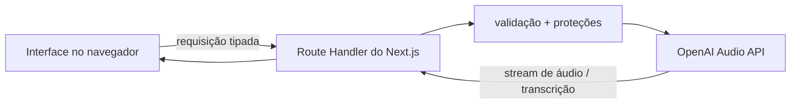

<div align="center">

# OpenAI Voice Playground

**Um laboratório educacional, com padrão de produção, para geração de voz e transcrição.**

[](https://nextjs.org/)
[](https://www.typescriptlang.org/)
[](https://github.com/openai/openai-node)
[](https://github.com/glaucia86/openai-voice-playground/actions/workflows/ci.yml)
[](LICENSE)

[English](README.md) · **Português (Brasil)**

[Experimente o playground](#execute-localmente) · [Leia o tutorial](tutorial/tutorial.md) · [Faça deploy na Vercel](#deploy-na-vercel) · [Contribua](CONTRIBUTING.md)

</div>

O OpenAI Voice Playground demonstra como desenvolver recursos de text-to-speech e speech-to-text sem expor credenciais do provedor nem esconder trade-offs de produção atrás de uma interface bem-acabada. A aplicação é deliberadamente pequena o bastante para ser compreendida e estruturada o bastante para evoluir com segurança.

> Este é um projeto educacional independente, não um produto oficial da OpenAI. A interface identifica claramente que as vozes geradas são produzidas por inteligência artificial.

## O que você pode explorar

- Gerar voz expressiva com `gpt-4o-mini-tts`, 13 vozes integradas, instruções de interpretação, controle de velocidade e saída em MP3, WAV ou Opus.
- Gravar ou enviar áudios com limites definidos e transcrevê-los com `gpt-4o-mini-transcribe` ou `gpt-4o-transcribe`.
- Observar o streaming dos bytes de TTS, IDs de requisição, envelopes de erro estáveis, validação e metadados de rate limit.
- Entender por que a chave da API deve permanecer no servidor e por que uma transcrição delimitada não é automaticamente um caso de uso para Realtime.
- Reproduzir o mesmo ciclo de qualidade usado na construção do repositório: tipos estritos, testes, lint, build, CI e decisões documentadas.

## Arquitetura



O navegador nunca recebe `OPENAI_API_KEY`. As duas chamadas ao provedor são executadas em Route Handlers do Node.js, dentro de `src/app/api`. Essa fronteira adiciona validação de schemas, limites de entrada, verificações de mesma origem, token de acesso compartilhado opcional, rate limiting leve, IDs de requisição e logs estruturados sem conteúdo do usuário.

## Execute localmente

### Pré-requisitos

- Node.js 20 ou mais recente
- npm 10 ou mais recente
- Um projeto na OpenAI Platform com acesso à API

### Configuração

```bash
git clone https://github.com/glaucia86/openai-voice-playground.git
cd openai-voice-playground
npm install
cp .env.example .env.local
```

Adicione sua chave ao `.env.local`:

```dotenv
OPENAI_API_KEY=your_project_key
```

O `.env.local` é ignorado pelo Git. Nunca renomeie a variável para `NEXT_PUBLIC_OPENAI_API_KEY`: esse prefixo exporia a chave ao código executado no navegador.

Inicie a aplicação:

```bash
npm run dev
```

Acesse [http://localhost:3000](http://localhost:3000).

## Variáveis de ambiente

| Variável | Obrigatória | Finalidade |
| --- | --- | --- |
| `OPENAI_API_KEY` | Sim | Credencial da OpenAI Platform, disponível somente no servidor. |
| `PLAYGROUND_ACCESS_TOKEN` | Não | Protege as rotas públicas da API com um bearer token compartilhado, informado pelo visitante. |
| `APP_ORIGIN` | Não | Fixa a origem canônica usada pela proteção de mesma origem. Útil atrás de proxies ou domínios personalizados. |

O token de acesso opcional é uma proteção útil para workshops ou demonstrações privadas, mas não constitui um sistema de identidade completo. Um produto público e multiusuário deve adicionar autenticação real, cotas por usuário e um rate limiter distribuído.

## Comandos de qualidade

```bash
npm run lint           # Oxlint; o preset ESLint do Next 15 é anterior ao TypeScript 7
npm run typecheck      # verificações estritas com TypeScript 7
npm test               # testes unitários focados
npm run test:coverage  # limites mínimos de cobertura
npm run build          # bundle de produção; execute o typecheck antes (veja a nota)
npm run check          # todos os gates, na ordem correta
```

O bootstrap de build do Next.js 15 ainda importa a API JavaScript do pacote chamado literalmente `typescript`, cuja superfície mudou no TypeScript 7. Por isso, o repositório mantém o TypeScript 5.8 sob esse nome canônico **somente como adaptador de compatibilidade do Next.js** e instala o TypeScript 7 com o alias npm `typescript7`. O arquivo `scripts/typecheck.mjs` executa diretamente a versão 7.0.2; o código da aplicação nunca é validado pela 5.8. O `next.config.mjs` ignora as passagens duplicadas de typecheck e lint do Next, enquanto `npm run check` e a CI exigem Oxlint e TypeScript 7 antes do bundle. Portanto, executar apenas `npm run build` não representa o gate de qualidade completo.

## Deploy na Vercel

[](https://vercel.com/new/clone?repository-url=https%3A%2F%2Fgithub.com%2Fglaucia86%2Fopenai-voice-playground&env=OPENAI_API_KEY&envDescription=Server-only%20OpenAI%20Platform%20credential)

1. Importe o repositório na Vercel.
2. Adicione `OPENAI_API_KEY` em **Project Settings → Environment Variables** para os ambientes Production, Preview e Development, conforme necessário.
3. Para uma URL pública, também configure um `PLAYGROUND_ACCESS_TOKEN` forte ou habilite o Vercel Deployment Protection.
4. Opcionalmente, defina `APP_ORIGIN` com a origem final `https://…`.
5. Faça o deploy, acesse `/api/health` e confirme que `configured` é `true`. O endpoint nunca retorna a chave.

A Vercel armazena variáveis de ambiente fora do controle de versão e as criptografa em repouso. Depois de alterar uma variável, é necessário fazer um novo deploy para que as funções existentes recebam o valor atualizado.

## Limites importantes para produção

- **O rate limiter incluído é local ao processo.** Instâncias serverless não compartilham seu mapa. Para um produto público, substitua-o por Redis ou outro armazenamento distribuído.
- **Streaming de transporte não é o mesmo que Realtime conversacional.** Os bytes de TTS atravessam o servidor em streaming; visando maior compatibilidade, o player web aguarda o Blob completo. Para interrupções, detecção de turnos e deltas de transcrição ao vivo, use a Realtime API por WebRTC.
- **Os arquivos são limitados, não persistidos.** A aplicação encaminha o arquivo enviado ou gravado à API de transcrição e não o grava em disco nem em banco de dados. Avalie seus próprios requisitos de retenção, consentimento e conformidade.
- **Verificações de mesma origem são defesa em profundidade, não autenticação.** Scripts fora do navegador podem falsificar headers. Use o token opcional ou autenticação apropriada antes de expor uma API que gera custos.
- **Não registre texto do usuário, transcrições, nomes de arquivo, tokens ou áudio.** Os logs incluídos contêm somente metadados operacionais.

## Mapa do projeto

```text
src/
├── app/
│   ├── api/health/route.ts
│   ├── api/speech/route.ts
│   ├── api/transcribe/route.ts
│   └── page.tsx
├── components/
│   ├── speech-studio.tsx
│   ├── transcription-studio.tsx
│   └── voice-playground.tsx
└── lib/
    ├── errors.ts
    ├── openai.ts
    ├── rate-limit.ts
    ├── request-guard.ts
    └── schemas.ts

tutorial/tutorial.md   # guia detalhado e incremental de construção
tests/                 # testes unitários de contratos e proteções
AGENTS.md              # instruções duráveis para Codex e contribuidores
```

## Aprenda o raciocínio, não apenas as chamadas de API

O [tutorial completo em português](tutorial/tutorial.md) explica a implementação em fatias verticais, incluindo:

- escolha entre APIs de áudio baseadas em requisição e Realtime;
- construção da fronteira de servidor antes do refinamento visual;
- trade-offs entre streaming e buffering no navegador;
- validação, erros, cotas, observabilidade, privacidade e identificação de voz gerada por IA;
- uso do Codex com contexto explícito, restrições, definição de pronto e gates de validação;
- decisão de compatibilidade entre as ferramentas do TypeScript 7 e do Next.js 15;
- deploy na Vercel e o trabalho ainda necessário para um produto verdadeiramente público.

## Contribuição e segurança

Leia [CONTRIBUTING.md](CONTRIBUTING.md) antes de abrir um pull request. Relate vulnerabilidades de forma privada, conforme descrito em [SECURITY.md](SECURITY.md). Nunca inclua credenciais reais, gravações privadas ou transcrições de clientes em issues, fixtures ou capturas de tela.

## Licença

[MIT](LICENSE) © Glaucia Lemos.
