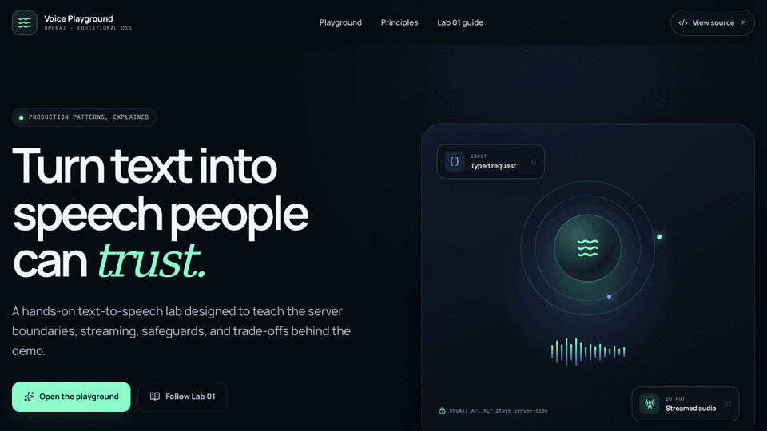

<a id="readme-top"></a>

<div align="center">

<h1>🎙️ OpenAI Voice Labs</h1>

<h3>Open-source workshops for building production-minded voice experiences</h3>

<p>Learn OpenAI Voice, TTS, Realtime, WebRTC, and the Agents SDK by building complete applications with security, accessibility, tests, and architectural decisions explained.</p>

<p>
  <a href="README-PT-BR.md">Português</a>
  ·
  <a href="docs/README.md">Workshop path</a>
  ·
  <a href="docs/workshop-guide.md">How to follow</a>
  ·
  <a href="docs/github-pages.md">Documentation site</a>
  ·
  <a href="#-labs">Labs</a>
  ·
  <a href="#-quick-start">Run</a>
  ·
  <a href="#-deploy-to-vercel">Deploy</a>
  ·
  <a href="#-about-the-author">About</a>
</p>

<p>
  <a href="https://github.com/glaucia86/openai-voice-playground/actions/workflows/ci.yml">
    
  </a>
  <a href="https://github.com/glaucia86/openai-voice-playground/actions/workflows/codeql.yml">
    
  </a>
  <a href="LICENSE"></a>
  <a href="https://github.com/glaucia86/openai-voice-playground/stargazers"></a>
  <a href="https://github.com/glaucia86/openai-voice-playground/network/members"></a>
</p>

<p>
  
  
  
  
  
  
  
  
  
</p>

<p><em>Independent educational project. It is not an official OpenAI product.</em></p>

</div>

---

## ✨ See the labs in action

<div align="center">
  
  <br>
  <sub>Real captures of the Lab 01 and Lab 02 front ends. No OpenAI API call was made while recording.</sub>
</div>

---

## 🧭 Contents

- [Why this repository exists](#-why-this-repository-exists)
- [Workshop path](#-workshop-path)
- [Labs](#-labs)
- [Repository architecture](#%EF%B8%8F-repository-architecture)
- [Prerequisites](#-prerequisites)
- [Quick start](#-quick-start)
- [Command summary](#%EF%B8%8F-command-summary)
- [Environment variables](#-environment-variables)
- [Quality and CI/CD](#-quality-and-cicd)
- [Deploy to Vercel](#-deploy-to-vercel)
- [Responsible use](#%EF%B8%8F-responsible-use)
- [Contributing](#-contributing)
- [About the author](#-about-the-author)

## 💡 Why this repository exists

A voice API call can fit in a few lines. A trustworthy application requires considerably more.

**OpenAI Voice Labs** is an incremental collection of workshops for engineers who want to understand not only _which endpoint to call_, but how to design a solution that a real team can explain, test, deploy, and evolve.

Every lab provides:

- a complete, independent Next.js application;
- server Route Handlers that protect the standard OpenAI key;
- strict contracts, Zod validation, and sanitized errors;
- responsive, accessible UI with explicit operational states;
- automated tests that make no paid OpenAI calls;
- CI/CD, Vercel instructions, and documented production boundaries;
- standalone workshops in English and Portuguese, each starting from an empty folder;
- decisions, trade-offs, pitfalls, and extension exercises.

## 🧭 Workshop path

New to the OpenAI API or running the repository for the first time? Start with the **[workshop index](docs/README.md)**. It follows the same progressive idea used by hands-on engineering workshops: prepare the environment once, complete one bounded module at a time, verify a checkpoint, and then move forward.

| Module | Start here | Result |
| --- | --- | --- |
| **00 — Shared environment and API setup** | **[Optional Portuguese setup guide](docs/00-configuracao-do-ambiente.md)** | Tools, OpenAI API project, local secret, health check, and quality gate validated |
| **01 — Text to Speech** | **[TTS workshop](labs/lab-01-text-to-speech/tutorial/tutorial-en.md)** | A bounded, streamed, and protected speech-generation application |
| **02 — Realtime voice agent** | **[Realtime workshop](labs/lab-02-realtime-voice-agent/tutorial/tutorial-en.md)** | A live WebRTC conversation with explicit session and security states |

Both labs have standalone English and Portuguese tutorials. You can run the finished solution, build from a compilable starter—the recommended hands-on route—or reconstruct the project from an empty folder. **[How to follow the workshops](docs/workshop-guide.md)** explains checkpoints, comparisons, and safe recovery. The README below remains the concise operational reference.

The workshops are ready for a bilingual **[GitHub Pages documentation site](docs/github-pages.md)**. Pages hosts the static teaching material; deploy the Next.js applications separately because their server routes require protected runtime credentials.

## 🧪 Labs

| Lab | What you build | Model and transport | Workshop | Status |
| --- | --- | --- | --- | :---: |
| **[Lab 01 — Text to Speech](labs/lab-01-text-to-speech)** | An accessible interface that turns text into expressive, downloadable audio | `gpt-4o-mini-tts` · HTTP · streamed audio | **[English](labs/lab-01-text-to-speech/tutorial/tutorial-en.md)** · [Português](labs/lab-01-text-to-speech/tutorial/tutorial.md) · [Starter](https://github.com/glaucia86/openai-voice-playground/tree/workshop/lab-01-v1-starter) | ✅ |
| **[Lab 02 — Realtime Voice Agent](labs/lab-02-realtime-voice-agent)** | A fluid speech-to-speech agent with semantic turns, mute, interruption, and text fallback | `gpt-realtime-2.1` · WebRTC · Agents SDK | **[English](labs/lab-02-realtime-voice-agent/tutorial/tutorial-en.md)** · [Português](labs/lab-02-realtime-voice-agent/tutorial/tutorial.md) · [Starter](https://github.com/glaucia86/openai-voice-playground/tree/workshop/lab-02-v1-starter) | ✅ |

### Lab 01 — Text to Speech

Treat TTS as a bounded request, keep credentials on the server, validate a small product contract, and forward the upstream audio stream without buffering the entire file in the Route Handler.

**Topics:** streaming, cancellation, voices, delivery instructions, formats, speed, playback, download, AI disclosure, quotas, and accessible errors.

### Lab 02 — Realtime Voice Agent

Understand why a live conversation is a stateful session and separate the authorization path from the media path. The server mints a short-lived client secret; the browser negotiates WebRTC without receiving the standard key.

**Topics:** Realtime, Agents SDK, WebRTC, ephemeral client secrets, semantic VAD, barge-in, mute, in-memory transcripts, consent, and cleanup.

## 🏗️ Repository architecture

```text
openai-voice-playground/
├── labs/
│   ├── lab-01-text-to-speech/
│   │   ├── src/                  # TTS application
│   │   ├── tests/                # contracts and safeguards
│   │   └── tutorial/
│   │       ├── tutorial.md       # Portuguese: empty folder to deployment
│   │       └── tutorial-en.md    # English: standalone equivalent
│   └── lab-02-realtime-voice-agent/
│       ├── src/                  # Realtime agent
│       ├── tests/                # session contracts and safeguards
│       └── tutorial/
│           ├── tutorial.md       # Portuguese: empty folder to deployment
│           └── tutorial-en.md    # English: standalone equivalent
├── docs/
│   ├── README.md                 # workshop index and learning paths
│   ├── 00-configuracao-do-ambiente.md
│   ├── workshop-guide.md         # English starter/checkpoint workflow
│   ├── workshop-guide-pt-br.md   # Portuguese starter/checkpoint workflow
│   └── assets/                   # documentation media
├── .github/workflows/ci.yml      # CI matrix for both labs
├── AGENTS.md                     # durable rules for people and Codex
└── package.json                  # repository orchestration commands
```

Each lab owns its package manifest and lockfile. This is intentional: every workshop can be installed, taught, tested, and deployed without depending on the other lab's runtime.

Workshop references keep `main` as the final solution. `workshop/lab-01-v1-starter` and `workshop/lab-02-v1-starter` are compilable starting points; versioned `workshop/*-step-*` branches are read-only recovery checkpoints.

## 📋 Prerequisites

- Node.js 22 or newer;
- npm and Git;
- an OpenAI project API key;
- a modern browser;
- microphone and WebRTC support for Lab 02;
- headphones recommended for the Realtime agent.

## 🚀 Quick start

For a first run—including how to create an OpenAI API project, protect the local key, check `/api/health`, and troubleshoot setup—follow **[Module 00](docs/00-configuracao-do-ambiente.md)**. The condensed commands are:

```bash
git clone https://github.com/glaucia86/openai-voice-playground.git
cd openai-voice-playground
npm run install:labs
```

Create the selected lab's local configuration:

```bash
cp labs/lab-01-text-to-speech/.env.example \
   labs/lab-01-text-to-speech/.env.local
```

Add your project key to that untracked file:

```dotenv
OPENAI_API_KEY=your_project_key
```

Start Lab 01:

```bash
npm run dev:lab01
```

Open <http://localhost:3000>. For Lab 02, create `.env.local` inside `labs/lab-02-realtime-voice-agent` and run `npm run dev:lab02`.

## ▶️ Command summary

Run these commands from the repository root:

| Goal | Command |
| --- | --- |
| Install every lab | `npm run install:labs` |
| Run Lab 01 | `npm run dev:lab01` |
| Run Lab 02 | `npm run dev:lab02` |
| Check Lab 01 | `npm run check:lab01` |
| Check Lab 02 | `npm run check:lab02` |
| Check the repository | `npm run check` |

Run one development server at a time unless you explicitly assign different ports.

## 🔐 Environment variables

```dotenv
# Required and server-only
OPENAI_API_KEY=

# Required in production; optional for local development
PLAYGROUND_ACCESS_TOKEN=

# Required in production
APP_ORIGIN=

# Required in production: shared serverless quota
UPSTASH_REDIS_REST_URL=
UPSTASH_REDIS_REST_TOKEN=

# Required outside Vercel; use a header overwritten by your trusted proxy
CLIENT_IP_HEADER=
```

Never commit `.env` or `.env.local`, expose a key through `NEXT_PUBLIC_`, or put a real value in `.env.example`. Verify the ignore rule with `git check-ignore -v path/.env.local`.

## ✅ Quality and CI/CD

The [CI workflow](.github/workflows/ci.yml) runs an independent matrix for both labs on every push to `main` and every pull request:

```text
npm ci
  ├── dependency audit (high/critical)
  ├── Oxlint
  ├── TypeScript 7 type-check
  ├── tests with coverage
  └── Next.js 15 production build
```

Dependencies are updated through [Dependabot](.github/dependabot.yml), and the pinned-action [CodeQL workflow](.github/workflows/codeql.yml) performs scheduled static analysis.

Run the same gate locally:

```bash
npm run check
```

[](https://github.com/glaucia86/openai-voice-playground/actions/workflows/ci.yml)

## ▲ Deploy to Vercel

Create a separate Vercel project for each lab and select its **Root Directory**:

| Project | Root Directory |
| --- | --- |
| Lab 01 — TTS | `labs/lab-01-text-to-speech` |
| Lab 02 — Realtime | `labs/lab-02-realtime-voice-agent` |

Keep `main` as the production branch and configure every variable shown above through encrypted Environment Variables. On Vercel, `CLIENT_IP_HEADER` defaults to the platform-overwritten `x-vercel-forwarded-for`; outside Vercel it is mandatory and must name a header overwritten by your trusted proxy. Both apps deliberately return `503` rather than issue a billable request when production security configuration or the distributed limiter is unavailable. Lab 02 requires HTTPS for microphone use outside localhost.

## 🛡️ Responsible use

- Synthetic voices are clearly disclosed as AI-generated.
- Do not impersonate real people or mislead listeners.
- Prompts, instructions, audio, transcripts, and credentials do not belong in application logs.
- Realtime client secrets reduce exposure but remain bearer credentials.
- Production uses a distributed Upstash Redis quota; local development falls back to a process-local limiter.
- The Lab 02 UI ends workshop sessions after 15 minutes. Because WebRTC goes directly to OpenAI, this client timer is not an authoritative boundary against a modified client.
- The apps do not persist content, but provider-side abuse-monitoring logs may be retained for up to 30 days under the default API data controls.

Before a public SaaS launch, replace the shared workshop token with user identity and authorization, add per-user/concurrent-session quotas, OpenAI project budgets and alerts, consent, a reviewed retention policy, observability, abuse response, and human approval for consequential tools. Read [SECURITY.md](SECURITY.md).

## 🤝 Contributing

Contributions that improve clarity, security, accessibility, tests, or educational value are welcome. Read [CONTRIBUTING.md](CONTRIBUTING.md) and [AGENTS.md](AGENTS.md), update code and workshop together, run `npm run check`, and explain the decision and validation in your pull request.

If this project helped you, consider leaving a ⭐ so other engineers can find the labs.

---

## 👩🏽‍💻 About the author

<div align="center">

<a href="https://github.com/glaucia86">
  
</a>

<h3>Glaucia Lemos</h3>

<p><strong>Principal Software Engineer · Forward Deployed Engineering Manager</strong></p>

<p>Software engineer, educator, and content creator passionate about JavaScript, TypeScript, Node.js, Cloud, Artificial Intelligence, and open-source communities.</p>

<p>
  <a href="https://github.com/glaucia86"></a>
  <a href="https://www.linkedin.com/in/glaucialemos/"></a>
  <a href="https://twitter.com/glaucia_lemos86"></a>
  <a href="https://www.youtube.com/user/l32759"></a>
  <a href="https://www.twitch.tv/glaucia_lemos86"></a>
  <a href="https://dev.to/glaucia86"></a>
</p>

<p><em>“Sharing knowledge multiplies possibilities.”</em></p>

</div>

---

<div align="center">

<p>Made with 💚, TypeScript, and curiosity by <a href="https://github.com/glaucia86">Glaucia Lemos</a>.</p>

<p><a href="LICENSE">MIT License</a> · <a href="SECURITY.md">Report a vulnerability</a> · <a href="#readme-top">Back to top</a></p>

</div>
