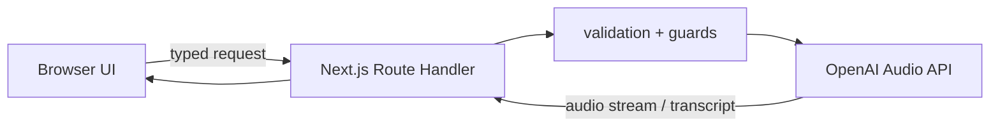

<div align="center">

# OpenAI Voice Playground

**A production-minded, educational lab for speech generation and transcription.**

[](https://nextjs.org/)
[](https://www.typescriptlang.org/)
[](https://github.com/openai/openai-node)
[](https://github.com/glaucia86/openai-voice-playground/actions/workflows/ci.yml)
[](LICENSE)

**English** · [Português (Brasil)](README-PT-BR.md)

[Try the playground](#run-locally) · [Read the tutorial](tutorial/tutorial.md) · [Deploy to Vercel](#deploy-to-vercel) · [Contribute](CONTRIBUTING.md)

</div>

OpenAI Voice Playground demonstrates how to build text-to-speech and speech-to-text features without leaking provider credentials or hiding production trade-offs behind a polished UI. The app is deliberately small enough to understand and structured enough to extend safely.

> This is an independent educational project, not an official OpenAI product. Generated voices are identified as AI-generated in the interface.

## What you can explore

- Generate expressive speech with `gpt-4o-mini-tts`, 13 built-in voices, voice direction, speed, and MP3/WAV/Opus output.
- Record or upload bounded audio and transcribe it with `gpt-4o-mini-transcribe` or `gpt-4o-transcribe`.
- Observe streamed TTS bytes, request IDs, stable error envelopes, validation, and rate-limit metadata.
- Learn why the API key belongs on the server and why bounded transcription is not automatically a Realtime use case.
- Follow the same quality loop used to build the repository: strict types, tests, lint, build, CI, and documented decisions.

## Architecture



The browser never receives `OPENAI_API_KEY`. Both provider calls run in Node.js Route Handlers under `src/app/api`. The boundary adds schema validation, input limits, same-origin checks, an optional shared access token, lightweight rate limiting, request IDs, and content-free structured logs.

## Run locally

### Prerequisites

- Node.js 20 or newer
- npm 10 or newer
- An OpenAI Platform project with API access

### Setup

```bash
git clone https://github.com/glaucia86/openai-voice-playground.git
cd openai-voice-playground
npm install
cp .env.example .env.local
```

Add your key to `.env.local`:

```dotenv
OPENAI_API_KEY=your_project_key
```

`.env.local` is ignored by Git. Never rename the variable to `NEXT_PUBLIC_OPENAI_API_KEY`: that prefix would expose it to browser code.

Start the app:

```bash
npm run dev
```

Open [http://localhost:3000](http://localhost:3000).

## Environment variables

| Variable | Required | Purpose |
| --- | --- | --- |
| `OPENAI_API_KEY` | Yes | Server-only OpenAI Platform credential. |
| `PLAYGROUND_ACCESS_TOKEN` | No | Protects public API routes with a shared bearer token entered by the visitor. |
| `APP_ORIGIN` | No | Pins the canonical origin used by the same-origin guard. Useful behind proxies or custom domains. |

The optional access token is a useful guard for a workshop or private demo, not a complete identity system. A public, multi-user product should add real authentication, per-user quotas, and a distributed rate limiter.

## Quality commands

```bash
npm run lint           # Oxlint; chosen because the Next 15 ESLint preset predates TypeScript 7
npm run typecheck      # TypeScript 7 strict checks
npm test               # focused unit tests
npm run test:coverage  # coverage thresholds
npm run build          # production bundle; run typecheck first (see note below)
npm run check          # all gates, in order
```

Next.js 15's build bootstrap still imports the JavaScript API from the package literally named `typescript`, an API surface changed in TypeScript 7. The repository therefore keeps TypeScript 5.8 under that canonical name **only as a Next.js compatibility adapter** and installs TypeScript 7 as the `typescript7` npm alias. `scripts/typecheck.mjs` invokes 7.0.2 directly; application code is never type-checked by 5.8. `next.config.mjs` skips Next's duplicated type-check/lint passes, while `npm run check` and CI require Oxlint and TypeScript 7 before bundling. A standalone `npm run build` is not the complete quality gate.

## Deploy to Vercel

[](https://vercel.com/new/clone?repository-url=https%3A%2F%2Fgithub.com%2Fglaucia86%2Fopenai-voice-playground&env=OPENAI_API_KEY&envDescription=Server-only%20OpenAI%20Platform%20credential)

1. Import the repository into Vercel.
2. Add `OPENAI_API_KEY` in **Project Settings → Environment Variables** for Production, Preview, and Development as appropriate.
3. For a public URL, also set a strong `PLAYGROUND_ACCESS_TOKEN` or enable Vercel Deployment Protection.
4. Optionally set `APP_ORIGIN` to the final `https://…` origin.
5. Deploy, open `/api/health`, and confirm that `configured` is `true`. The endpoint never returns the key.

Vercel stores environment variables outside source control and encrypts them at rest. Changing a variable requires a new deployment before existing functions see the new value.

## Important production boundaries

- **The included rate limiter is process-local.** Serverless instances do not share its map. Replace it with Redis or another distributed store for a public product.
- **Transport streaming is not the same as conversational Realtime.** TTS bytes stream through the server; the compatibility-first web player waits for the complete Blob. For interruption, turn detection, and live transcript deltas, use the Realtime API over WebRTC.
- **Files are bounded, not persisted.** The app forwards an uploaded/recorded file to the transcription API and does not write it to disk or a database. Review your own retention, consent, and compliance requirements.
- **Same-origin checks are defense in depth, not authentication.** Scripts outside a browser can forge headers. Use the optional token or proper auth before exposing a billable API.
- **Do not log user text, transcripts, filenames, tokens, or audio.** The included logs contain operational metadata only.

## Project map

```text
src/
├── app/
│   ├── api/health/route.ts
│   ├── api/speech/route.ts
│   ├── api/transcribe/route.ts
│   └── page.tsx
├── components/
│   ├── speech-studio.tsx
│   ├── transcription-studio.tsx
│   └── voice-playground.tsx
└── lib/
    ├── errors.ts
    ├── openai.ts
    ├── rate-limit.ts
    ├── request-guard.ts
    └── schemas.ts

tutorial/tutorial.md   # the detailed, incremental build guide
tests/                 # unit tests for contracts and guards
AGENTS.md              # durable instructions for Codex and contributors
```

## Learn the reasoning, not only the API calls

The long-form [Portuguese tutorial](tutorial/tutorial.md) explains the implementation as vertical slices, including:

- choosing request-based Audio APIs versus Realtime;
- building a server boundary before adding polish;
- streaming and browser buffering trade-offs;
- validation, errors, quotas, observability, privacy, and voice disclosure;
- using Codex with explicit context, constraints, definition of done, and validation gates;
- the TypeScript 7 and Next.js 15 tooling compatibility decision;
- Vercel deployment and the work still required for a truly public product.

## Contributing and security

Read [CONTRIBUTING.md](CONTRIBUTING.md) before opening a pull request. Report vulnerabilities privately according to [SECURITY.md](SECURITY.md). Never include real credentials, private recordings, or customer transcripts in issues, fixtures, or screenshots.

## License

[MIT](LICENSE) © Glaucia Lemos.
