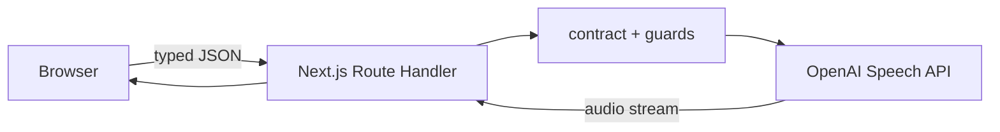

# Lab 01 — Text to Speech architecture article with OpenAI, Next.js 15, and TypeScript 7

> A standalone, incremental guide to request-based text to speech, server-side security boundaries, audio streaming, testing, Codex, and the engineering decisions that separate a polished demo from a responsible implementation.

**Author:** Glaucia Lemos
**Project:** [OpenAI Voice Labs](https://github.com/glaucia86/openai-voice-playground)
**Lab source:** [`labs/lab-01-text-to-speech`](https://github.com/glaucia86/openai-voice-playground/tree/main/labs/lab-01-text-to-speech)
**Last technically validated:** July 19, 2026

**Language:** [Leia o artigo em português](article.md) · English

- **Track:** Module 01 of 02
- **Estimated time:** 2–3 hours
- **Prerequisite module:** none; everything required to complete the lab is included here
- **Completion evidence:** the app runs and `npm run check:lab01` passes from the repository root

[Step-by-step workshop](tutorial-en.md) · [Portuguese article](article.md) · [Workshop index](../../../docs/README-en.md) · [Module 02 — Realtime →](../../lab-02-realtime-voice-agent/tutorial/tutorial-en.md)

---

## Before you begin

The shortest OpenAI speech request fits in a few lines. The engineering work lives around it:

- where the credential is allowed to exist;
- which values the browser is allowed to choose;
- what is rejected before a request can create cost;
- how failures remain useful without exposing provider internals;
- when streaming actually improves the system;
- what may be logged and what must never be logged;
- how another engineer—or Codex—can change the project without rediscovering every decision.

This lab deliberately solves one bounded problem: a text value enters, synthesized audio leaves, and the request ends. A live conversation is a different architecture; [Lab 02](../../lab-02-realtime-voice-agent/tutorial/tutorial-en.md) uses the Realtime API, WebRTC, and a stateful session.

By the end, you will have:

1. text-to-speech generation with `gpt-4o-mini-tts`;
2. an API key that never enters the browser bundle;
3. typed validation, request-size limits, stable errors, request IDs, and content-free logs;
4. a streamed server response and an honest browser playback model;
5. accessible loading, success, cancellation, and failure states;
6. local and distributed rate-limit modes;
7. tests and CI that make no paid OpenAI calls;
8. a repeatable Codex workflow with repository guidance and quality gates;
9. a Vercel deployment plan that fails closed when production security is incomplete.

### How this guide is self-contained

You do not need to read another module first. This article explains the difference between ChatGPT and the API, billing, projects, API keys, installation, architecture, implementation, validation, deployment, and troubleshooting.

Every major step answers five questions:

1. **What are we adding?** The observable behavior of the slice.
2. **Why does it exist?** The product or architecture decision.
3. **Where do we edit?** The exact terminal location and file path.
4. **How do we prove it?** A checkpoint and expected result.
5. **What can fail?** The likely diagnosis before moving on.

### Mental model

| Term | Meaning in this lab |
| --- | --- |
| Text to speech (TTS) | turning bounded text input into synthesized audio |
| Speech API | the request-based OpenAI endpoint that generates that audio |
| Route Handler | the Next.js server endpoint that validates input and calls OpenAI |
| Streaming | forwarding audio bytes without buffering the complete file on the server |
| Contract | the small, typed set of values the client may submit |
| Guard | an origin, access, size, or quota check before the billable call |
| Harness | repository rules, tests, and commands that make a change verifiable |

## Table of contents

0. [Prepare the account, machine, and project](#0-prepare-the-account-machine-and-project)
1. [Choose the architecture before the endpoint](#1-choose-the-architecture-before-the-endpoint)
2. [Define the contract and vertical slices](#2-define-the-contract-and-vertical-slices)
3. [Create a reproducible base](#3-create-a-reproducible-base)
4. [Establish the server–OpenAI boundary](#4-establish-the-serveropenai-boundary)
5. [Generate speech and stream the response](#5-generate-speech-and-stream-the-response)
6. [Consume the response honestly in the browser](#6-consume-the-response-honestly-in-the-browser)
7. [Design errors, observability, and privacy](#7-design-errors-observability-and-privacy)
8. [Protect cost and public usage](#8-protect-cost-and-public-usage)
9. [Test your rules, not OpenAI](#9-test-your-rules-not-openai)
10. [Use Codex as part of a harness](#10-use-codex-as-part-of-a-harness)
11. [Deploy to Vercel](#11-deploy-to-vercel)
12. [Review the production gap](#12-review-the-production-gap)
13. [Troubleshooting](#13-troubleshooting)

---

## 0. Prepare the account, machine, and project

You can follow one of three paths:

- **Path A — run and study:** clone the finished repository, install the lockfile, and inspect a working system. Choose this first if the OpenAI Audio API or Next.js Route Handlers are new to you.
- **Path B — build from the starter (recommended):** receive pinned configuration, a compilable page, and the first test, then implement the voice capabilities in article order.
- **Path C — rebuild absolutely from zero:** create every folder, install dependencies, and implement the scaffolding too. Choose this when project setup is part of the learning objective.

All three paths reach the same architecture. Pay attention to the terminal location printed in each section. The [workshop guide](../../../docs/workshop-guide.md) explains how to inspect checkpoints without erasing your attempt.

### 0.1 Verify local tools

Open a terminal and run:

```bash
node --version
npm --version
git --version
```

You need:

- Node.js 22 or newer;
- npm, installed with Node.js;
- Git;
- a current browser;
- an editor such as Visual Studio Code;
- an OpenAI API Platform account with project access and API billing or credits.

If `node` is not recognized, install a current LTS release and reopen the terminal before continuing.

### 0.2 Understand ChatGPT and API billing

This project uses the [OpenAI API Platform](https://platform.openai.com/). ChatGPT Free, Plus, Pro, Business, and Enterprise subscriptions are billed separately from API usage. A paid ChatGPT subscription does not automatically provide API credits.

Before generating a key:

1. sign in to [platform.openai.com](https://platform.openai.com/);
2. select an existing learning project or create one named `openai-voice-labs`;
3. confirm API billing or an available credit balance;
4. inspect the project's model permissions and usage limits;
5. configure budget alerts and monitor usage during the lab.

A project budget is an observability mechanism, not the only cost boundary. Your application still needs authentication, input limits, quotas, and operational monitoring.

### 0.3 Create and protect the API key

Inside the chosen project, open **API Keys**, select **Create new secret key**, and use a recognizable name such as `voice-labs-local`. Prefer the minimum permissions that support the exercise.

The full key is shown only when it is created. Store it in a secret manager or directly in the local file created below. Never paste it into source code, chat, screenshots, issues, logs, or `.env.example`.

If a key appears in a commit or message, treat it as compromised. Revoke it in the Platform, create a replacement, and update the environment. Deleting the text from Git does not revoke the credential.

### 0.4 Path A: clone and run the finished lab

From your projects directory:

```bash
git clone https://github.com/glaucia86/openai-voice-playground.git
cd openai-voice-playground/labs/lab-01-text-to-speech
npm ci
```

Use `npm ci` because the lab already has a `package-lock.json`. It installs the recorded dependency graph and fails when the manifest and lockfile disagree.

Create a local environment file.

macOS, Linux, or Git Bash:

```bash
cp .env.example .env.local
```

PowerShell:

```powershell
Copy-Item .env.example .env.local
```

Edit `.env.local` and set only the local key for the first checkpoint:

```dotenv
OPENAI_API_KEY=replace_with_your_project_key
```

Do not add quotes, do not use `NEXT_PUBLIC_`, and do not edit `.env.example`. Confirm that Git ignores the local file:

```bash
git check-ignore -v .env.local
```

The command must print the matching `.gitignore` rule. If it prints nothing, stop and fix the ignore rule before proceeding.

Start the app:

```bash
npm run dev
```

Open <http://localhost:3000>. In a second terminal, still inside the lab directory:

```bash
curl http://localhost:3000/api/health
```

Expected response characteristics:

- `ok` and `configured` are `true`;
- the speech model is `gpt-4o-mini-tts`;
- `streamedSpeech` is `true`;
- no key or credential value appears.

Generate one short sample, play it, download it, and stop the server with `Ctrl+C`.

### 0.5 Path B: build from the recommended starter

From your projects directory:

```bash
git clone --branch workshop/lab-01-v1-starter \
  https://github.com/glaucia86/openai-voice-playground.git
cd openai-voice-playground
git switch -c my-lab-01-solution
npm ci --prefix labs/lab-01-text-to-speech
npm run check:lab01
```

The first gate must pass without an API key or paid call. The starter contains a bilingual page, a health check with `stage: "starter"`, pinned dependencies, and one initial test. `/api/speech`, the product contract, and the functional interface do not exist yet; the workshop builds them.

Creating `my-lab-01-solution` prevents accidental commits on the starter reference. Read the `START-HERE.md` file included on that branch too.

#### Lab 01 checkpoint map

| Stage | Read-only reference | Evidence | Compare |
| --- | --- | --- | --- |
| Starter | `workshop/lab-01-v1-starter` | `npm run check:lab01` | starting point |
| 01 — contract | `workshop/lab-01-v1-step-01-contract` | contract schema and tests pass | [view changes](https://github.com/glaucia86/openai-voice-playground/compare/workshop/lab-01-v1-starter...workshop/lab-01-v1-step-01-contract) |
| 02 — server | `workshop/lab-01-v1-step-02-server` | route, guards, and server tests pass | [view changes](https://github.com/glaucia86/openai-voice-playground/compare/workshop/lab-01-v1-step-01-contract...workshop/lab-01-v1-step-02-server) |
| 03 — interface | `workshop/lab-01-v1-step-03-interface` | full `npm run check:lab01` passes | [view changes](https://github.com/glaucia86/openai-voice-playground/compare/workshop/lab-01-v1-step-02-server...workshop/lab-01-v1-step-03-interface) |
| Final solution | `main` | same lab code plus the published learning path | [open solution](https://github.com/glaucia86/openai-voice-playground/tree/main/labs/lab-01-text-to-speech) |

Inspect a checkpoint without replacing your files:

```bash
git fetch origin
git diff --stat HEAD..origin/workshop/lab-01-v1-step-01-contract
git show origin/workshop/lab-01-v1-step-01-contract:labs/lab-01-text-to-speech/src/lib/schemas.ts
```

Commit your progress before investigating a reference. Do not use `git reset --hard` as a workshop navigation mechanism.

### 0.6 Path C: build the base from an empty directory

The commands below use Bash, Git Bash, or WSL:

```bash
mkdir -p openai-voice-labs/labs/lab-01-text-to-speech
cd openai-voice-labs/labs/lab-01-text-to-speech
npm init -y
pwd
```

Confirm that the path ends in `labs/lab-01-text-to-speech`. Then install the validated runtime dependencies:

```bash
npm install next@15.5.20 react@19.2.7 react-dom@19.2.7 openai@^6.48.0 zod@^4.4.3 lucide-react@^1.25.0 @fontsource-variable/manrope@^5.2.8 @fontsource-variable/jetbrains-mono@^5.2.8 @upstash/ratelimit@2.0.8 @upstash/redis@1.38.0
```

Install the development tools:

```bash
npm install --save-dev @types/node@^26.1.1 @types/react@^19.2.17 @types/react-dom@^19.2.3 oxlint@^1.74.0 vitest@^4.1.10 @vitest/coverage-v8@^4.1.10 typescript@5.8.2 typescript7@npm:typescript@7.0.2
```

Create the initial tree:

```bash
mkdir -p scripts src/app/api/health src/app/api/speech src/components src/lib src/types tests tutorial
touch .env.example .gitignore next.config.mjs tsconfig.json vitest.config.ts scripts/typecheck.mjs
touch src/app/globals.css src/app/layout.tsx src/app/page.tsx
touch src/app/api/health/route.ts src/app/api/speech/route.ts
touch src/lib/constants.ts src/lib/openai.ts src/lib/schemas.ts
```

Use these scripts in `package.json`:

```json
{
  "scripts": {
    "dev": "next dev",
    "build": "next build",
    "start": "next start",
    "lint": "oxlint --deny-warnings src tests",
    "typecheck": "node scripts/typecheck.mjs --noEmit",
    "test": "vitest run",
    "test:watch": "vitest",
    "test:coverage": "vitest run --coverage",
    "check": "npm run lint && npm run typecheck && npm run test && npm run build"
  }
}
```

Protect local and generated files in `.gitignore`:

```gitignore
.env*
!.env.example
.next/
node_modules/
coverage/
*.tsbuildinfo
```

List names—but never values—in `.env.example`:

```dotenv
OPENAI_API_KEY=
PLAYGROUND_ACCESS_TOKEN=
APP_ORIGIN=
UPSTASH_REDIS_REST_URL=
UPSTASH_REDIS_REST_TOKEN=
CLIENT_IP_HEADER=
```

### 0.6 Prove the framework before adding OpenAI

Create a minimal `src/app/layout.tsx`:

```tsx
import type { Metadata } from "next";
import "./globals.css";

export const metadata: Metadata = { title: "Voice Lab 01" };

export default function RootLayout({ children }: Readonly<{ children: React.ReactNode }>) {
  return (
    <html lang="en">
      <body>{children}</body>
    </html>
  );
}
```

Create `src/app/page.tsx`:

```tsx
export default function HomePage() {
  return <main><h1>Lab 01: Text to Speech</h1></main>;
}
```

Run `npm run dev`. The title at <http://localhost:3000> proves the framework works before the API and UI introduce more variables.

---

## 1. Choose the architecture before the endpoint

“Voice application” does not identify one architecture.

| Need | Better fit | Example |
| --- | --- | --- |
| Bounded text becomes audio | request-based Speech API | narration or preview |
| A finished audio file becomes text | request-based Transcriptions API | recorded note |
| A microphone produces live captions | Realtime transcription | live dictation |
| A person and a model talk with low latency | Realtime speech-to-speech | conversational agent |

This lab receives one string of at most 4,096 characters and returns one audio resource, so a request-based Speech API is the smaller, clearer system.



The browser never calls `api.openai.com` with the standard key. It calls your Route Handler. The server authenticates the deployment, checks origin and quota, validates the body, chooses the model, calls OpenAI, and returns a stable response.

That boundary does more than hide a key. It prevents the client from selecting arbitrary models, sending unbounded text, or enabling options the product never approved.

**Checkpoint:** you should be able to explain why replacing the Route Handler with a browser-side SDK call would expose both credentials and cost decisions.

---

## 2. Define the contract and vertical slices

### Goal

Allow a person to turn text into speech and receive accessible feedback for idle, validation, loading, success, cancellation, and error states.

### Constraints

- Next.js 15 App Router;
- strict TypeScript 7 checking;
- the official OpenAI SDK only on the server;
- no application persistence of text or audio;
- no paid call in automated tests;
- visible disclosure that the voice is AI-generated;
- deployment compatible with Vercel Functions.

### Definition of done

- happy path and failure states are designed;
- `.env.local` is ignored;
- lint, type-check, tests, and build pass;
- docs and code agree;
- production limitations are explicit.

### Vertical slices

| Slice | Observable behavior | Gate |
| --- | --- | --- |
| 0. Base | app starts and health reports safe configuration metadata | type-check + build |
| 1. Minimal TTS | validated text returns MP3 through the server | schema test + manual call |
| 2. Usable TTS | voice, instructions, format, speed, cancellation, playback, download | accessibility + cleanup |
| 3. Hardening | access token, canonical origin, distributed quota, request IDs | guard tests |
| 4. Delivery | tutorial, READMEs, CI, and deployment guidance | `npm run check` |

Each slice crosses contract, server, browser, and validation. If work stops after a slice, the repository remains functional and explainable.

---

## 3. Create a reproducible base

The repository pins the important versions and commits `package-lock.json`. CI uses `npm ci`, so a green build is tied to a recorded dependency graph.

TypeScript 7 is installed under the alias `typescript7`, while the stable compiler remains available to framework tooling. The dedicated type-check script chooses the intended compiler explicitly. This avoids assuming that a framework build performs the same type analysis as your standalone gate.

Strict mode is not decoration. It protects the stream, error, DOM, and schema boundaries where unchecked values tend to become runtime failures.

The OpenAI client is created lazily in `src/lib/openai.ts`:

```ts
import OpenAI from "openai";
import { AppError } from "@/lib/errors";

const globalForOpenAI = globalThis as unknown as { openai?: OpenAI };

export function getOpenAIClient(): OpenAI {
  const apiKey = process.env.OPENAI_API_KEY;

  if (!apiKey) {
    throw new AppError(503, "configuration_error", "The voice service is not configured.");
  }

  globalForOpenAI.openai ??= new OpenAI({
    apiKey,
    maxRetries: 2,
    timeout: 45_000,
  });

  return globalForOpenAI.openai;
}
```

Why lazy initialization?

- a missing key becomes a controlled application error;
- importing a module does not immediately construct a provider client;
- local tests can import server modules without a real credential;
- development reloads reuse the client.

**Checkpoint:** run `npm run typecheck`. A missing runtime key must not prevent static analysis.

---

## 4. Establish the server–OpenAI boundary

### 4.1 Validate a small contract

`src/lib/schemas.ts` accepts only product-approved values:

```ts
export const speechRequestSchema = z
  .object({
    text: z.string().trim().min(1).max(MAX_SPEECH_CHARACTERS),
    voice: z.enum(VOICE_IDS),
    format: z.enum(AUDIO_FORMATS).default("mp3"),
    instructions: z.string().trim().max(MAX_INSTRUCTIONS_CHARACTERS).optional().default(""),
    speed: z.coerce.number().min(0.25).max(4).default(1),
  })
  .strict();
```

`.strict()` rejects unknown properties. Enumerated voices and formats keep model and cost choices on the server. The server repeats validation even though the form has limits because any HTTP client can bypass browser controls.

### 4.2 Bound the request before parsing JSON

Content validation alone is too late for an unbounded body. `readJsonBody` verifies `Content-Type`, checks an advertised length when available, reads the stream while counting bytes, cancels above the maximum, decodes strict UTF-8, and only then parses JSON.

This separates two limits:

- transport size protects memory and parsing work;
- schema size protects product behavior and provider cost.

### 4.3 Keep health useful but non-secret

`GET /api/health` reports booleans, model names, and safe limits. It never returns the key or an environment snapshot.

Use it locally:

```bash
curl http://localhost:3000/api/health
```

Use it in production to detect missing configuration, but protect the deployment itself; a health endpoint is not user authentication.

---

## 5. Generate speech and stream the response

The central Route Handler lives at `src/app/api/speech/route.ts`.

The order matters:

1. create a request ID;
2. run access, origin, and quota guards;
3. bound and parse the JSON body;
4. validate the product contract;
5. create the OpenAI client;
6. call the Speech API with server-selected model and client-approved values;
7. return `speech.body` directly;
8. normalize failures into the application error envelope.

The provider call is:

```ts
const speech = await openai.audio.speech.create(
  {
    model: "gpt-4o-mini-tts",
    input: payload.text,
    voice: payload.voice,
    ...(payload.instructions ? { instructions: payload.instructions } : {}),
    response_format: payload.format,
    speed: payload.speed,
    stream_format: "audio",
  },
  { signal: request.signal },
);
```

The request signal propagates cancellation. If the user leaves or cancels before the upstream request completes, the server does not deliberately keep unnecessary work alive.

Return the stream rather than an `ArrayBuffer`:

```ts
if (!speech.body) {
  throw new AppError(502, "empty_audio_stream", "OpenAI returned an empty audio stream.");
}

return new Response(speech.body, {
  status: 200,
  headers: {
    "Cache-Control": "no-store",
    "Content-Type": CONTENT_TYPES[payload.format],
    "X-Request-Id": requestId,
  },
});
```

This reduces server buffering. It does not automatically guarantee immediate playback in every browser; that is a separate client decision.

### Synthetic-voice disclosure

The interface must visibly tell the user that the output is AI-generated. Treat that as a product requirement, not a footer added after implementation.

**Checkpoint:** with the local app running, submit one short phrase. The network response should be audio, include `X-Request-Id`, and use `Cache-Control: no-store`.

---

## 6. Consume the response honestly in the browser

The client uses `fetch` so it can:

- send the typed JSON contract;
- attach the optional workshop access token;
- cancel with `AbortController`;
- read structured API errors;
- track download progress when a content length is available;
- create a `Blob`, then an Object URL for playback and download.

The server streams, but the current browser UI accumulates the response into a `Blob` before assigning it to `<audio>`. Therefore:

- server memory benefits from streaming;
- the browser still waits for the complete `Blob` before playback;
- the UI must not claim “instant streaming playback.”

For progressive playback, evaluate Media Source Extensions and format/browser compatibility as a separate slice.

### Object URL lifecycle

Every new `URL.createObjectURL(blob)` must eventually be paired with `URL.revokeObjectURL(url)`. Revoke the previous URL when replacing audio and revoke the active URL when the component unmounts.

### Required UI states

| State | User-visible behavior |
| --- | --- |
| idle | form is available and disclosure is visible |
| invalid | field-level guidance explains the correction |
| loading | button and live region announce generation |
| cancelling | request is aborted and controls settle safely |
| success | audio can be played and downloaded |
| error | stable message, error code, and request ID are available |

Keyboard focus, visible labels, reduced motion, and live regions are part of the feature.

---

## 7. Design errors, observability, and privacy

The browser should receive a stable application error, not the raw provider response:

```json
{
  "error": {
    "code": "rate_limit_exceeded",
    "message": "Too many requests. Please wait a moment and try again.",
    "requestId": "safe-correlation-id"
  }
}
```

### Request IDs

A request ID connects the browser error, server event, and deployment trace without recording the user's text. Return it in both the error payload and `X-Request-Id` when practical.

### Log metadata, not content

Allowed examples:

- event name;
- route;
- model identifier;
- response status;
- duration;
- input character count;
- hashed technical quota key;
- request ID.

Do not log:

- input text or instructions;
- API keys or access tokens;
- raw authorization headers;
- audio bytes or base64;
- full provider errors;
- raw IP addresses when a shorter hashed identifier is enough.

“The app does not persist data” is narrower than “no data is processed.” Text still travels through your server and OpenAI to generate speech. Document the actual flow and define retention, access, deletion, and incident policies for the production context.

---

## 8. Protect cost and public usage

The lab layers several controls:

1. bounded transport body;
2. strict schema and enumerated options;
3. same-origin checks;
4. an optional shared workshop token;
5. a separate authentication-attempt quota;
6. a speech-request quota;
7. a distributed Redis rate limiter in production;
8. fail-closed production configuration;
9. provider timeout and bounded retries.

### Development and production modes

Local development may use an in-memory limiter so the first exercise remains reproducible. In production, memory is not shared across serverless instances, so the app requires Upstash Redis.

Production also requires:

- `PLAYGROUND_ACCESS_TOKEN`;
- canonical `APP_ORIGIN`;
- Upstash URL and token;
- a trusted proxy identity header;
- the OpenAI API key.

If any requirement is missing, the service returns a controlled `503`. A safe deployment should not silently downgrade to a weaker mode.

### What these controls do not solve

- an IP is not a user identity;
- a shared token is not individual authentication;
- origin checks are defense in depth, not authorization;
- rate limits are not a complete abuse or budget system.

For a public product, add real identity, per-user quotas, spend controls, moderation appropriate to the use case, and operational response procedures.

---

## 9. Test your rules, not OpenAI

Unit tests must not make live provider calls. They should prove code you own:

- schema boundaries and unknown-property rejection;
- JSON body size and content type;
- same-origin behavior;
- access-token comparison;
- development versus production security configuration;
- local and distributed rate-limit behavior;
- stable error normalization;
- Object URL and cancellation helpers where extracted.

Run the lab gate:

```bash
npm run lint
npm run typecheck
npm test
npm run build
```

Or use the combined command:

```bash
npm run check
```

From the repository root:

```bash
npm run check:lab01
```

A controlled manual smoke test may call OpenAI with one short phrase. Keep that outside automated CI so tests remain deterministic and do not create hidden spend.

---

## 10. Use Codex as part of a harness

Good agentic coding starts with a bounded slice, not “build the whole app.”

Example task:

```text
Implement the request-body boundary for Lab 01.

Context:
- Next.js Route Handler in src/app/api/speech/route.ts
- strict TypeScript
- no live OpenAI call in tests
- do not log body contents

Acceptance criteria:
- require application/json
- reject advertised or streamed bodies above 16 KiB
- reject malformed JSON and invalid UTF-8 with stable AppError codes
- add focused Vitest coverage
- run lint, type-check, and the focused test file
```

`AGENTS.md` stores durable repository guidance: security rules, commands, lab ownership, documentation expectations, and definition of done. It is operational memory, not a replacement for task-specific acceptance criteria.

A practical loop is:

1. inspect the smallest relevant context;
2. implement one vertical slice;
3. run the narrow test;
4. inspect the diff;
5. run the lab gate;
6. update docs when behavior changed;
7. write a clean handoff before context becomes noisy.

The harness makes generated code reviewable. A model response is not evidence; passing gates and an understood diff are evidence.

---

## 11. Deploy to Vercel

### 11.1 Import the correct root

Import the GitHub repository and set the Vercel root directory to:

```text
labs/lab-01-text-to-speech
```

### 11.2 Configure protected variables

Set these in the deployment environment, never in source:

```dotenv
OPENAI_API_KEY=...
PLAYGROUND_ACCESS_TOKEN=...
APP_ORIGIN=https://your-canonical-domain.example
UPSTASH_REDIS_REST_URL=...
UPSTASH_REDIS_REST_TOKEN=...
CLIENT_IP_HEADER=x-vercel-forwarded-for
```

Use a long random workshop token. Do not reuse the OpenAI API key as the application access token.

### 11.3 Validate the deployment

1. open `/api/health` and confirm `configured: true`;
2. verify that no secret value is returned;
3. access the UI using the intended deployment protection;
4. generate one short sample;
5. inspect status, request ID, content type, and `no-store` headers;
6. confirm Redis quota behavior from more than one request;
7. review logs for metadata only.

### 11.4 Operate it

Configure usage and spend alerts in OpenAI, monitor error and latency rates, define key rotation, and document who can view logs. A successful deployment is the start of operation, not the end of engineering.

---

## 12. Review the production gap

### Product and experience

- Is the supported text length appropriate for the real use case?
- Does the UI disclose synthesized voice before generation?
- Are playback, download, retry, and cancellation accessible?
- Is progressive playback actually required?

### Security and abuse

- Is there individual authentication?
- Are quotas tied to a trusted identity?
- Are model, voice, format, speed, and body size server-controlled?
- Does production fail closed when Redis or required configuration is unavailable?
- Are keys rotated and permissions minimized?

### Data and compliance

- Are text, instructions, audio, and identifiers classified?
- Are retention and deletion policies explicit?
- Do logs remain content-free?
- Is the actual OpenAI data flow disclosed accurately?

### Reliability and cost

- Are latency, errors, generated characters, and cost observable?
- Are timeouts and retries bounded?
- Is there an incident runbook and kill switch?
- Are budget alerts and project limits reviewed?

### Explicit trade-offs

| Decision | Benefit | Remaining cost |
| --- | --- | --- |
| request-based TTS | small state model | not a live conversation |
| server-side stream | lower server buffering | current browser waits for a Blob |
| enumerated client options | predictable behavior and cost | fewer experimental controls |
| local limiter in development | reproducible onboarding | not distributed |
| Redis in production | shared quota across instances | external dependency |
| shared workshop token | quick access barrier | not individual identity |

---

## 13. Troubleshooting

### `configured` is `false`

Stop the dev server, confirm the filename is exactly `.env.local`, save it, and restart. Never print the key to diagnose it.

### `401 unauthorized`

The deployment expects `PLAYGROUND_ACCESS_TOKEN`. Enter the workshop token in the UI or attach the correct bearer token. Do not use the OpenAI key.

### `403 cross_origin_request`

Check `APP_ORIGIN`, protocol, host, and port. The canonical origin must match the browser origin exactly.

### `413 request_too_large`

The transport body or text exceeded a deliberate limit. Do not blindly increase it; confirm the product and cost requirement first.

### `429 rate_limit_exceeded`

Wait for the quota window. If this occurs unexpectedly in production, verify the trusted client-IP header and distributed limiter configuration.

### `503 security_configuration_incomplete`

Production is missing a required token, canonical origin, Redis credential, or trusted identity header. The failure is intentional.

### Audio downloads but does not play

Inspect the response `Content-Type`, selected format, browser support, and whether the Object URL was revoked too early.

### Build passes but type-check fails

Run the dedicated `npm run typecheck` command. The lab intentionally treats framework build and strict type analysis as separate gates.

---

## Quick glossary

| Term | Practical explanation |
| --- | --- |
| API key | secret that authorizes and attributes cost to an OpenAI project |
| Backend for Frontend | server layer that protects and narrows what the UI may do |
| CSP | browser policy that restricts allowed scripts, media, and connections |
| Object URL | temporary browser URL for an in-memory Blob |
| Rate limit | request quota for an identity or technical signal over time |
| Request ID | safe correlation value for diagnosing a failure without user content |
| Schema | executable contract for shape, type, and limits |
| Server-only | code or secrets that must never enter the client bundle |
| Vertical slice | small increment spanning contract, server, UI, and validation |

## Conclusion

The API call was the easy part. The transferable lesson is how to turn a powerful capability into bounded, observable, reviewable behavior.

In this lab:

- OpenAI sits behind a server-side boundary;
- the product contract is smaller than the provider's full capability;
- streaming reduces server buffering without overstating browser playback;
- security, cost, accessibility, privacy, and disclosure appear in the implementation;
- Codex operates inside a loop with context, rules, tests, and gates;
- the documentation records both decisions and unresolved production work.

That is the standard worth carrying into other AI projects: do not only show that the model responds; show that the system around it deserves trust.

## Official references

- OpenAI — [Audio and speech](https://developers.openai.com/api/docs/guides/audio)
- OpenAI — [Text to speech](https://developers.openai.com/api/docs/guides/text-to-speech)
- OpenAI — [GPT-4o mini TTS model](https://developers.openai.com/api/docs/models/gpt-4o-mini-tts)
- OpenAI — [TypeScript SDK reference](https://developers.openai.com/api/reference/typescript/)
- OpenAI — [Create speech reference](https://developers.openai.com/api/reference/resources/audio/subresources/speech/methods/create/)
- OpenAI — [Managing projects in the API Platform](https://help.openai.com/en/articles/9186755-managing-projects-in-the-api-platform)
- OpenAI — [API key safety](https://help.openai.com/en/articles/5112595-best-practices-for-api-key-safety)
- OpenAI — [ChatGPT and API billing are separate](https://help.openai.com/en/articles/8156019-i-want-to-move-my-chatgpt-subscription-to-the-api)
- OpenAI — [Codex best practices](https://developers.openai.com/codex/learn/best-practices)
- TypeScript — [Installation](https://www.typescriptlang.org/download/)
- Vercel — [Environment variables](https://vercel.com/docs/environment-variables)

---

[Step-by-step workshop](tutorial-en.md) · [Portuguese article](article.md) · [Workshop index](../../../docs/README-en.md) · [Module 02 — Realtime →](../../lab-02-realtime-voice-agent/tutorial/tutorial-en.md)
