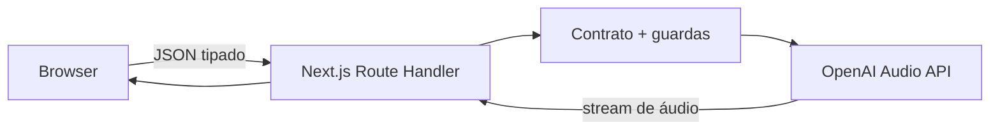
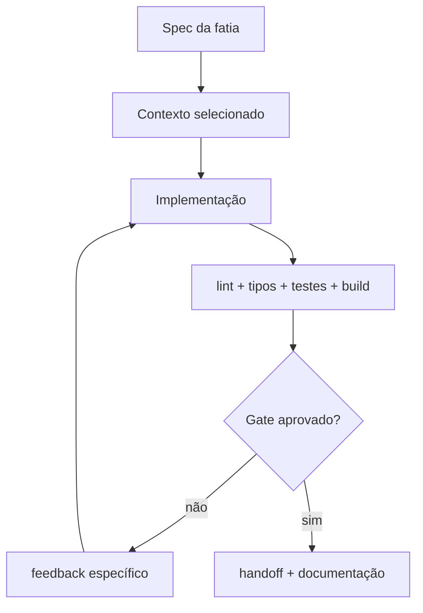

# Laboratório 01 — Artigo arquitetural de Text to Speech com OpenAI, Next.js 15 e TypeScript 7

> Um guia incremental e específico sobre TTS baseado em requisição, fronteiras de segurança, streaming, testes, Codex e as decisões que separam uma demonstração bonita de uma implementação responsável.

**Autora:** Glaucia Lemos<br>
**Projeto:** [OpenAI Voice Labs](https://github.com/glaucia86/openai-voice-playground)<br>
**Código deste lab:** [`labs/lab-01-text-to-speech`](https://github.com/glaucia86/openai-voice-playground/tree/main/labs/lab-01-text-to-speech)<br>
**Última validação técnica:** 19 de julho de 2026

**Idioma:** Português · [English](article-en.md)

- **Trilha:** Módulo 01 de 02
- **Tempo estimado:** 2–3 horas
- **Pré-requisito:** nenhum módulo anterior; este tutorial contém toda a preparação necessária
- **Evidência de conclusão:** aplicação executada e `npm run check:lab01` aprovado na raiz

[Workshop passo a passo](tutorial.md) · [English article](article-en.md) · [Índice do workshop](../../../docs/README.md) · [Módulo 02 — Realtime →](../../lab-02-realtime-voice-agent/tutorial/tutorial.md)

---

## Antes de começar

Este não é um artigo “copie quatro arquivos e diga que está pronto para produção”. A chamada mais curta para uma API de voz cabe em poucas linhas; o trabalho de engenharia está ao redor dela:

- onde a credencial fica;
- quais dados o cliente pode escolher;
- quais limites existem antes de a requisição gerar custo;
- como o sistema falha sem expor informações internas;
- quando streaming melhora de fato a experiência;
- o que é registrado e o que jamais deve aparecer nos logs;
- como outra pessoa — ou o Codex — consegue evoluir o código sem reaprender todas as decisões.

Este é o primeiro laboratório de uma série sobre diferentes formas de criar experiências de voz com o SDK da OpenAI. Aqui o recorte é propositalmente estreito: transformar texto em áudio com uma requisição delimitada. O [Laboratório 02](../../lab-02-realtime-voice-agent/tutorial/tutorial.md) trata de outro problema — um agente conversacional speech-to-speech ao vivo com Realtime e WebRTC.

O objetivo é construir uma aplicação pequena com um processo que poderia existir em um time real. Ao final teremos:

1. texto para voz com `gpt-4o-mini-tts`;
2. API key somente no servidor;
3. validação, erros, rate limit, request IDs e logs sem conteúdo sensível;
4. interface responsiva, acessível e honesta sobre voz gerada por IA;
5. testes, CI, build e deploy na Vercel;
6. um fluxo reprodutível para trabalhar com Codex.

O código completo está no repositório, mas minha recomendação é seguir as fatias na ordem. O valor didático está justamente em ver o sistema ganhar capacidade e proteção ao mesmo tempo.

### Como este tutorial se sustenta sozinho

Você não precisa ler outro documento para concluir o laboratório. O Módulo 00 continua existindo como uma referência compartilhada para quem fará a série inteira, mas tudo que é indispensável aparece novamente aqui: diferença entre ChatGPT e API, cobrança, projeto, API key, instalação, execução, código, testes, deploy e diagnóstico.

Cada etapa responde a cinco perguntas:

1. **O que estamos construindo?** O comportamento observável daquela fatia.
2. **Por que existe?** A decisão de arquitetura ou produto por trás do código.
3. **Onde editar?** O caminho exato do arquivo e do terminal.
4. **Como validar?** Um checkpoint com comando e resultado esperado.
5. **O que pode dar errado?** Falhas comuns antes de avançar.

Se você optar por reconstruir o projeto, não precisa adivinhar arquivos intermediários. Os blocos essenciais aparecem no momento em que passam a fazer sentido; o código final permanece disponível para comparação no link do início do artigo.

### Mapa mental do laboratório

| Conceito | Neste projeto significa |
| --- | --- |
| Text to speech (TTS) | converter uma entrada textual delimitada em áudio sintetizado |
| Speech API | endpoint request-based usado para gerar o áudio |
| Route Handler | backend do Next.js que valida a entrada e chama a OpenAI |
| Streaming | encaminhar bytes de áudio sem montar o arquivo inteiro no servidor |
| Contrato | conjunto pequeno e tipado de valores que o cliente pode enviar |
| Guardas | verificações de origem, acesso, tamanho e quota antes da chamada faturável |
| Harness | regras, testes e comandos que tornam a implementação verificável por pessoas e agentes |

## Sumário

0. [Escolha como acompanhar e prepare o computador](#0-escolha-como-acompanhar-e-prepare-o-computador)
1. [Escolha a arquitetura antes da API](#1-escolha-a-arquitetura-antes-da-api)
2. [Defina o contrato e as fatias verticais](#2-defina-o-contrato-e-as-fatias-verticais)
3. [Crie uma base reproduzível](#3-crie-uma-base-reproduzível)
4. [Estabeleça a fronteira servidor–OpenAI](#4-estabeleça-a-fronteira-servidoropenai)
5. [Implemente texto para voz com streaming](#5-implemente-texto-para-voz-com-streaming)
6. [Consuma o stream no navegador sem mentir sobre a UX](#6-consuma-o-stream-no-navegador-sem-mentir-sobre-a-ux)
7. [Projete erros, observabilidade e privacidade](#7-projete-erros-observabilidade-e-privacidade)
8. [Proteja custo e uso público](#8-proteja-custo-e-uso-público)
9. [Teste as regras, não a OpenAI](#9-teste-as-regras-não-a-openai)
10. [Use Codex como parte de um harness](#10-use-codex-como-parte-de-um-harness)
11. [Faça deploy na Vercel](#11-faça-deploy-na-vercel)
12. [O que ainda falta para o seu contexto de produção](#12-o-que-ainda-falta-para-o-seu-contexto-de-produção)

---

## 0. Escolha como acompanhar e prepare o computador

Este workshop oferece três caminhos. Escolha um antes de digitar comandos:

- **Caminho A — executar e estudar:** você clona o repositório, instala exatamente o lockfile e abre o projeto pronto. É o caminho recomendado para uma primeira leitura.
- **Caminho B — construir pelo starter (recomendado):** você recebe configuração, dependências, página compilável e primeiro teste, mas implementa as capacidades de voz na ordem dos capítulos.
- **Caminho C — reconstruir absolutamente do zero:** você cria cada pasta, instala as dependências e implementa também o scaffolding. Use quando configuração de projeto fizer parte do objetivo da aula.

Os três chegam à mesma arquitetura. Não misture comandos sem observar o bloco “terminal” de cada etapa. O [guia de acompanhamento](../../../docs/workshop-guide-pt-br.md) explica como comparar checkpoints sem apagar sua tentativa.

### 0.1 Confira os pré-requisitos

Abra um terminal e execute:

```bash
node --version
npm --version
git --version
```

Resultado esperado:

- Node.js `v20` ou superior;
- npm instalado junto com o Node;
- Git disponível;
- uma conta na plataforma OpenAI com um projeto e faturamento apropriado ao teste;
- um editor como Visual Studio Code.

Se `node` não for reconhecido, instale uma versão LTS pelo site do Node.js e **feche e reabra o terminal**. Não continue enquanto os três comandos falharem.

> A API key é um segredo. Este guia nunca pede para colá-la no código, no tutorial, no GitHub ou em `.env.example`.

#### 0.1.1 Entenda conta, cobrança e projeto antes de criar a chave

Uma assinatura ChatGPT Free, Plus, Pro, Business ou Enterprise não inclui automaticamente créditos da API. ChatGPT e [OpenAI API Platform](https://platform.openai.com/) são produtos com cobrança separada. Este laboratório faz chamadas pela API e, portanto, depende de faturamento ou créditos configurados na Platform.

Use esta sequência:

1. Entre em [platform.openai.com](https://platform.openai.com/) com a conta que será responsável pelo laboratório.
2. Abra o seletor de projeto. Use um projeto de estudo existente ou crie um chamado, por exemplo, `openai-voice-labs`.
3. Abra as configurações de cobrança da API e confirme que há um meio de pagamento ou saldo disponível.
4. No projeto, configure alertas de orçamento e confira quais modelos estão permitidos.

Um orçamento de projeto é um mecanismo de visibilidade e alerta; não trate a notificação como a única barreira contra gasto. O próprio app continuará precisando de autenticação, validação, rate limit e limites de sessão.

> Se você participa de mais de uma organização, confirme o nome da organização e do projeto antes de gerar a chave. Uso, permissões e orçamento são atribuídos a esse escopo.

#### 0.1.2 Crie uma chave específica e guarde-a uma única vez

Dentro do projeto escolhido, abra **API Keys** e selecione **Create new secret key**. Dê um nome identificável, como `voice-labs-local`, e use as permissões mínimas compatíveis com o exercício.

A chave completa é exibida somente na criação. Copie-a para um gerenciador de segredos ou diretamente para o arquivo local descrito na próxima etapa. Não envie a chave por chat, e-mail ou print; não a compartilhe com colegas; não a reutilize em aplicações públicas.

Se uma chave aparecer em um commit, log, gravação ou mensagem, considere-a comprometida: revogue-a na Platform, crie outra e atualize o ambiente. Apagar apenas o arquivo ou o commit não revoga a credencial.

#### 0.1.3 Saiba o que o navegador nunca deve receber

`OPENAI_API_KEY` é uma credencial de servidor. Neste projeto:

- ela fica em `.env.local` durante o desenvolvimento;
- entra como variável protegida no provedor de deploy;
- nunca recebe prefixo `NEXT_PUBLIC_`;
- nunca aparece em componente React, resposta de health check ou log;
- nunca é enviada ao navegador.

O browser chama `/api/speech`; essa rota chama a OpenAI. Esse limite será implementado e testado ao longo do artigo.

### 0.2 Caminho A: clone e execute o laboratório pronto

No diretório onde você guarda projetos:

```bash
git clone https://github.com/glaucia86/openai-voice-playground.git
cd openai-voice-playground/labs/lab-01-text-to-speech
npm ci
```

Por que `npm ci`, e não `npm install`? Porque o projeto já possui `package-lock.json`. `npm ci` instala o grafo registrado, falha se manifesto e lockfile divergirem e não reescreve versões silenciosamente.

Crie sua configuração local. Em macOS, Linux ou Git Bash:

```bash
cp .env.example .env.local
```

No PowerShell:

```powershell
Copy-Item .env.example .env.local
```

Abra `.env.local` no editor e preencha somente:

```dotenv
OPENAI_API_KEY=cole_a_sua_chave_de_projeto_aqui
```

Não adicione aspas, não use `NEXT_PUBLIC_` e não altere `.env.example`. Para o primeiro teste local, token, origem e Upstash podem ficar vazios; em produção eles são obrigatórios e a API falha com `503` se estiverem ausentes. Antes de iniciar, confirme que o Git ignora o arquivo:

```bash
git check-ignore -v .env.local
```

O comando deve imprimir uma regra de `.gitignore`. Se não imprimir nada, pare e corrija o ignore antes de continuar.

Inicie o servidor:

```bash
npm run dev
```

Abra <http://localhost:3000>. Em outro terminal, ainda dentro da pasta do Lab 01, valide o servidor:

```bash
curl http://localhost:3000/api/health
```

No PowerShell, você também pode usar:

```powershell
Invoke-RestMethod http://localhost:3000/api/health
```

O JSON deve conter `"ok":true`, `"configured":true`, `"speechModel":"gpt-4o-mini-tts"` e nunca deve conter a chave. Se `configured` for `false`, pare o servidor com `Ctrl+C`, confirme o nome `.env.local`, salve o arquivo e execute `npm run dev` novamente.

### 0.3 Caminho B: construa a partir do starter recomendado

No diretório onde você guarda projetos:

```bash
git clone --branch workshop/lab-01-v1-starter \
  https://github.com/glaucia86/openai-voice-playground.git
cd openai-voice-playground
git switch -c minha-solucao-lab-01
npm ci --prefix labs/lab-01-text-to-speech
npm run check:lab01
```

O primeiro gate deve passar sem API key e sem chamada paga. O starter contém uma página bilíngue, um health check com `stage: "starter"`, dependências fixadas e um teste inicial. A rota `/api/speech`, os contratos e a interface funcional ainda não existem: eles serão construídos no workshop.

Criar `minha-solucao-lab-01` evita commits acidentais na referência starter. Leia também o `START-HERE-PT-BR.md` incluído naquela branch.

#### Mapa de checkpoints do Lab 01

| Etapa | Referência somente de leitura | Evidência | Comparação |
| --- | --- | --- | --- |
| Starter | `workshop/lab-01-v1-starter` | `npm run check:lab01` | ponto inicial |
| 01 — contrato | `workshop/lab-01-v1-step-01-contract` | schema e testes do contrato passam | [ver mudanças](https://github.com/glaucia86/openai-voice-playground/compare/workshop/lab-01-v1-starter...workshop/lab-01-v1-step-01-contract) |
| 02 — servidor | `workshop/lab-01-v1-step-02-server` | rota, guardas e testes server-side passam | [ver mudanças](https://github.com/glaucia86/openai-voice-playground/compare/workshop/lab-01-v1-step-01-contract...workshop/lab-01-v1-step-02-server) |
| 03 — interface | `workshop/lab-01-v1-step-03-interface` | `npm run check:lab01` passa por completo | [ver mudanças](https://github.com/glaucia86/openai-voice-playground/compare/workshop/lab-01-v1-step-02-server...workshop/lab-01-v1-step-03-interface) |
| Solução final | `main` | mesmo código do lab, acrescido da trilha publicada | [abrir solução](https://github.com/glaucia86/openai-voice-playground/tree/main/labs/lab-01-text-to-speech) |

Para consultar um checkpoint sem substituir seus arquivos:

```bash
git fetch origin
git diff --stat HEAD..origin/workshop/lab-01-v1-step-01-contract
git show origin/workshop/lab-01-v1-step-01-contract:labs/lab-01-text-to-speech/src/lib/schemas.ts
```

Faça commit do seu progresso antes de investigar uma referência. Não use `git reset --hard` como mecanismo de acompanhamento.

### 0.4 Caminho C: crie a base a partir de uma pasta vazia

Os comandos abaixo usam Bash, Git Bash ou WSL. No PowerShell, `New-Item -ItemType Directory -Force caminho` equivale a `mkdir -p caminho`, e `New-Item -ItemType File caminho` cria um arquivo vazio.

Crie o diretório e entre nele:

```bash
mkdir -p openai-voice-labs/labs/lab-01-text-to-speech
cd openai-voice-labs/labs/lab-01-text-to-speech
npm init -y
```

Confira onde está antes de instalar qualquer coisa:

```bash
pwd
```

O caminho precisa terminar em `labs/lab-01-text-to-speech`. Isso evita instalar dependências na raiz errada.

Instale as dependências de runtime validadas pelo laboratório:

```bash
npm install next@15.5.20 react@19.2.7 react-dom@19.2.7 openai@^6.48.0 zod@^4.4.3 lucide-react@^1.25.0 @fontsource-variable/manrope@^5.2.8 @fontsource-variable/jetbrains-mono@^5.2.8 @upstash/ratelimit@2.0.8 @upstash/redis@1.38.0
```

Instale as ferramentas de desenvolvimento:

```bash
npm install --save-dev @types/node@^26.1.1 @types/react@^19.2.17 @types/react-dom@^19.2.3 oxlint@^1.74.0 vitest@^4.1.10 @vitest/coverage-v8@^4.1.10 typescript@5.8.2 typescript7@npm:typescript@7.0.2
```

Crie a árvore inicial:

```bash
mkdir -p scripts src/app/api/health src/app/api/speech src/components src/lib src/types tests tutorial
touch .env.example .gitignore next.config.mjs tsconfig.json vitest.config.ts scripts/typecheck.mjs
touch src/app/globals.css src/app/layout.tsx src/app/page.tsx
touch src/app/api/health/route.ts src/app/api/speech/route.ts
touch src/lib/constants.ts src/lib/openai.ts src/lib/schemas.ts
```

Neste ponto, a estrutura importante deve ser:

```text
lab-01-text-to-speech/
├── .env.example
├── .gitignore
├── package.json
├── package-lock.json
├── scripts/typecheck.mjs
├── src/
│   ├── app/
│   │   ├── api/health/route.ts
│   │   ├── api/speech/route.ts
│   │   ├── globals.css
│   │   ├── layout.tsx
│   │   └── page.tsx
│   ├── components/
│   ├── lib/
│   └── types/
├── tests/
└── tutorial/
```

Edite `package.json` e substitua a seção `scripts` por:

```json
{
  "scripts": {
    "dev": "next dev",
    "build": "next build",
    "start": "next start",
    "lint": "oxlint --deny-warnings src tests",
    "typecheck": "node scripts/typecheck.mjs --noEmit",
    "test": "vitest run",
    "test:watch": "vitest",
    "test:coverage": "vitest run --coverage",
    "check": "npm run lint && npm run typecheck && npm run test && npm run build"
  }
}
```

O trecho acima mostra somente `scripts`: preserve `name`, `version`, `dependencies` e `devDependencies` que o npm criou.

Em `.gitignore`, escreva estas regras **antes de criar um segredo**:

```gitignore
.env*
!.env.example
.next/
node_modules/
coverage/
*.tsbuildinfo
```

Em `.env.example`, registre apenas nomes vazios:

```dotenv
OPENAI_API_KEY=
PLAYGROUND_ACCESS_TOKEN=
APP_ORIGIN=
UPSTASH_REDIS_REST_URL=
UPSTASH_REDIS_REST_TOKEN=
CLIENT_IP_HEADER=
```

Agora crie `.env.local` a partir do exemplo e use `git check-ignore -v .env.local`, como no Caminho A. A única cópia com valor real deve continuar local.

### 0.4 Crie uma página mínima antes da integração

Começar pela API e pela UI complexa ao mesmo tempo torna qualquer erro ambíguo. Primeiro prove que o framework sobe.

Em `src/app/layout.tsx`:

```tsx
import type { Metadata } from "next";
import "./globals.css";

export const metadata: Metadata = { title: "Voice Lab 01" };

export default function RootLayout({ children }: Readonly<{ children: React.ReactNode }>) {
  return (
    <html lang="pt-BR">
      <body>{children}</body>
    </html>
  );
}
```

Em `src/app/page.tsx`:

```tsx
export default function HomePage() {
  return <main><h1>Lab 01: Text to Speech</h1></main>;
}
```

Em `src/app/globals.css`:

```css
* { box-sizing: border-box; }
body { margin: 0; font-family: system-ui, sans-serif; }
main { max-width: 72rem; margin: 0 auto; padding: 2rem; }
```

Execute:

```bash
npm run dev
```

Checkpoint: <http://localhost:3000> deve mostrar o título sem erro no terminal. Pare com `Ctrl+C`. A partir daqui, os capítulos seguintes substituem a base mínima por contratos, rota, componentes, segurança e testes do projeto final.

### 0.5 Como ler cada etapa sem se perder

Para cada capítulo, repita o mesmo ciclo:

1. confira o caminho do arquivo no título ou no parágrafo;
2. crie o arquivo se ele ainda não existir;
3. digite ou cole o bloco indicado;
4. salve;
5. execute o checkpoint daquele capítulo;
6. só avance quando o resultado esperado aparecer.

Se ocorrer um erro, leia **a primeira mensagem útil**, não apenas a última linha. Confirme nome do arquivo, diretório atual e extensão antes de reinstalar tudo. A seção de armadilhas ao final funciona como roteiro de diagnóstico.

---

## 1. Escolha a arquitetura antes da API

“Aplicação de voz” pode significar produtos muito diferentes. Antes de escolher endpoint ou SDK, classifique a interação.

| Necessidade | Arquitetura mais adequada | Exemplo |
| --- | --- | --- |
| Texto delimitado vira arquivo de áudio | Speech API request-based | Narração, acessibilidade, prévia de locução |
| Arquivo pronto vira texto | Transcriptions API request-based | Nota de voz, reunião gravada, legenda pós-processada |
| Microfone envia deltas enquanto a pessoa fala | Realtime transcription | Legenda ao vivo, ditado contínuo |
| Modelo escuta, raciocina e responde por voz com baixa latência | Realtime voice session | Agente conversacional |

A própria visão geral de [Audio and speech](https://developers.openai.com/api/docs/guides/audio) separa APIs request-based de sessões Realtime: entradas delimitadas são mais simples; áudio ao vivo exige uma conexão de baixa latência e eventos parciais.

### Nossa decisão

O recorte deste tutorial é uma interação delimitada: uma string de até 4.096 caracteres entra e um arquivo de áudio sai. Portanto, usaremos a Speech API. Não abriremos uma sessão Realtime somente para tornar o diagrama mais sofisticado.

Essa decisão reduz estado, custo operacional, tratamento de reconexão e superfície de erro. Ela também deixa explícito o próximo passo da série: quando o requisito é conversar por voz, com interrupções e turnos naturais, não devemos “esticar” TTS com gravações em loop; devemos adotar uma sessão Realtime. Essa é a arquitetura do Laboratório 02.

### A fronteira principal



O navegador não chama `api.openai.com` diretamente. Ele chama nossa aplicação. A Route Handler:

1. autentica a implantação, se configurado;
2. valida origem e quota;
3. valida o corpo;
4. escolhe modelo e parâmetros permitidos;
5. chama a OpenAI com a chave do servidor;
6. devolve um contrato estável para a interface.

Essa camada não existe apenas para “esconder a chave”. Ela impede que o cliente transforme qualquer string em um nome de modelo, envie texto arbitrariamente grande ou passe opções que o produto não decidiu suportar.

---

## 2. Defina o contrato e as fatias verticais

Antes de gerar arquivos, escreva uma definição curta de pronto.

### Objetivo

Permitir que uma pessoa transforme texto em voz, entenda o caminho da requisição e receba feedback acessível em todos os estados relevantes.

### Restrições

- Next.js 15 e App Router;
- TypeScript 7 em modo estrito;
- SDK oficial `openai` no servidor;
- nenhuma credencial, entrada de texto ou saída de áudio persistida;
- voz sintética identificada como gerada por IA;
- sem chamada paga em teste automatizado;
- deploy compatível com Vercel Functions.

### Definição de pronto

- happy path e erros desenhados;
- lint, type-check, testes e build aprovados;
- `.env.local` ignorado pelo Git;
- documentação coerente com o código;
- limitações de produção declaradas.

### Fatias verticais

Em vez de “fazer todo o backend” e depois “fazer todo o frontend”, entregamos capacidade verificável de ponta a ponta.

| Fatia | Comportamento observável | Gate |
| --- | --- | --- |
| 0. Base | Projeto sobe e `/api/health` informa configuração sem expor segredo | type-check + build |
| 1. TTS mínimo | Texto validado retorna MP3 pelo servidor | teste de schema + chamada manual |
| 2. TTS utilizável | Voz, instrução, formato, velocidade, stream e download | acessibilidade + cancelamento |
| 3. Hardening | Token obrigatório em produção, origem, quota distribuída, request ID e logs sanitizados | testes de guardas |
| 4. Entrega | README, tutorial, CI e Vercel | `npm run check` |

O ponto importante é que cada fatia atravessa interface, contrato, servidor e validação. Se o contexto acabar ou outra pessoa assumir, há um estado funcional e explicável para continuar.

---

## 3. Crie uma base reproduzível

### Versões usadas

O repositório fixa as versões principais no `package.json`:

```json
{
  "dependencies": {
    "next": "15.5.20",
    "openai": "^6.48.0",
    "react": "19.2.7",
    "zod": "^4.4.3"
  },
  "devDependencies": {
    "oxlint": "^1.74.0",
    "typescript": "5.8.2",
    "typescript7": "npm:typescript@7.0.2",
    "vitest": "^4.1.10"
  }
}
```

Usamos Node.js 22 ou superior. O `package-lock.json` entra no repositório e o CI usa `npm ci`. “Funcionou hoje na minha máquina com `latest`” não é reprodutibilidade.

### TypeScript 7 com Next.js 15: o detalhe que apareceu na validação

TypeScript 7 é a versão estável atual — a própria página de [instalação do TypeScript](https://www.typescriptlang.org/download/) informa a série 7.0. Todo o código do projeto é validado pelo compilador 7.0.2. Para gerar o bundle com Next.js 15, porém, precisamos registrar uma incompatibilidade real em vez de escondê-la.

Ferramentas auxiliares distribuídas com Next.js 15 foram publicadas antes da mudança interna do TypeScript 7. O parser TypeScript do preset ESLint falha antes de analisar nosso código; o carregador de `next.config.ts` usa uma API removida; e o bootstrap de build importa `typescript/lib/typescript.js` literalmente, mesmo com a checagem interna desabilitada. Instalar apenas o pacote 7 faz o Next tentar substituí-lo por 5.8 durante o build.

Adotamos uma toolchain dupla e explícita. O pacote canônico `typescript@5.8.2` existe somente para a infraestrutura interna do Next 15; o alias npm `typescript7` é a autoridade sobre o código. Um pequeno runner multiplataforma chama o binário correto sem depender de qual pacote ganhou o link `node_modules/.bin/tsc`:

```json
{
  "scripts": {
    "lint": "oxlint --deny-warnings src tests",
    "typecheck": "node scripts/typecheck.mjs --noEmit"
  },
  "devDependencies": {
    "typescript": "5.8.2",
    "typescript7": "npm:typescript@7.0.2"
  }
}
```

Trade-off: mantemos dois compiladores instalados e deixamos de usar algumas regras específicas do preset `next/core-web-vitals`. Isso aumenta um pouco as dependências, mas torna a fronteira honesta e verificável: `npm run typecheck` imprime e executa TypeScript 7; o pacote 5.8 nunca decide os tipos da aplicação. A configuração do framework fica em `next.config.mjs`, carregada pelo Node. Como o bundler do Next 15 também não interpreta corretamente o `paths` do TS 7, o alias `@` é declarado no callback `webpack`; o `tsconfig` continua sendo a fonte para o compilador e o editor. Desabilitamos o checker e o lint duplicados dentro de `next build`; `npm run check` e o CI exigem Oxlint e TS 7 antes do bundle. Rodar `npm run build` isoladamente não substitui esses gates. Quando o Next suportar integralmente TS 7, removemos o adaptador 5.8, o alias e o runner — compatibilidade deve ter prazo de validade.

No caminho “do zero”, `scripts/typecheck.mjs` ainda está vazio. Preencha-o agora:

```js
import { spawnSync } from "node:child_process";
import { existsSync } from "node:fs";
import { join } from "node:path";

const compilerPath = join(process.cwd(), "node_modules", "typescript7", "bin", "tsc");

if (!existsSync(compilerPath)) {
  console.error("TypeScript 7 não foi encontrado. Execute `npm install` antes do typecheck.");
  process.exit(1);
}

const result = spawnSync(process.execPath, [compilerPath, ...process.argv.slice(2)], {
  stdio: "inherit",
});

if (result.error) {
  console.error(`Não foi possível executar o TypeScript 7: ${result.error.message}`);
  process.exit(1);
}

process.exit(result.status ?? 1);
```

Crie `tsconfig.json`:

```json
{
  "compilerOptions": {
    "target": "ES2022",
    "lib": ["dom", "dom.iterable", "esnext"],
    "allowJs": false,
    "skipLibCheck": true,
    "strict": true,
    "noUncheckedIndexedAccess": true,
    "exactOptionalPropertyTypes": true,
    "noEmit": true,
    "esModuleInterop": true,
    "module": "esnext",
    "moduleResolution": "bundler",
    "resolveJsonModule": true,
    "isolatedModules": true,
    "jsx": "preserve",
    "incremental": true,
    "plugins": [{ "name": "next" }],
    "paths": { "@/*": ["./src/*"] }
  },
  "include": ["next-env.d.ts", "**/*.ts", "**/*.tsx", ".next/types/**/*.ts"],
  "exclude": ["node_modules"]
}
```

Execute o primeiro gate:

```bash
npm run typecheck
```

O projeto mínimo deve passar sem emitir arquivos. Se aparecer “TypeScript 7 não foi encontrado”, confirme que o comando de instalação de dev dependencies terminou e que você está dentro do Lab 01.

### Strict não é decoração

O `tsconfig.json` ativa:

```json
{
  "compilerOptions": {
    "strict": true,
    "noUncheckedIndexedAccess": true,
    "exactOptionalPropertyTypes": true,
    "noEmit": true,
    "moduleResolution": "bundler"
  }
}
```

`exactOptionalPropertyTypes` encontrou, por exemplo, a diferença entre omitir `instructions` e enviar `instructions: undefined` ao SDK. O objeto final usa spread condicional. É uma correção pequena, mas traduz uma ideia importante: contrato opcional não é necessariamente igual a campo presente com valor indefinido.

### Segredo local

Copie o modelo:

```bash
cp .env.example .env.local
```

E preencha apenas localmente:

```dotenv
OPENAI_API_KEY=your_project_key
```

O `.gitignore` começa protegendo qualquer arquivo de ambiente e libera somente o exemplo:

```gitignore
.env*
!.env.example
```

Não use `NEXT_PUBLIC_OPENAI_API_KEY`. Variáveis com `NEXT_PUBLIC_` são incorporadas ao bundle do navegador pelo Next.js. Uma Route Handler não corrige uma chave que já foi publicada pelo frontend.

---

## 4. Estabeleça a fronteira servidor–OpenAI

### Um cliente centralizado e preguiçoso

`src/lib/openai.ts` cria o cliente somente quando uma rota realmente precisa dele:

```ts
import OpenAI from "openai";

const globalForOpenAI = globalThis as unknown as { openai?: OpenAI };

export function getOpenAIClient(): OpenAI {
  const apiKey = process.env.OPENAI_API_KEY;

  if (!apiKey) {
    throw new AppError(
      503,
      "configuration_error",
      "The voice service is not configured.",
    );
  }

  globalForOpenAI.openai ??= new OpenAI({
    apiKey,
    maxRetries: 2,
    timeout: 45_000,
  });

  return globalForOpenAI.openai;
}
```

A checagem explícita produz um erro de produto melhor que uma exceção genérica do SDK. Reutilizar a instância também evita recriar configuração a cada chamada em um processo já aquecido.

### Health check sem vazamento

`GET /api/health` responde se a aplicação está configurada, não qual é a chave:

```json
{
  "ok": true,
  "configured": true,
  "requiresAccessToken": false,
  "capabilities": {
    "speechModel": "gpt-4o-mini-tts",
    "streamedSpeech": true
  }
}
```

Evite “testar” configuração retornando os primeiros caracteres do segredo. Redação parcial continua sendo material sensível e costuma acabar em screenshot, log ou analytics.

### Contratos com Zod

O tipo TypeScript desaparece em runtime. A requisição HTTP precisa de validação real:

```ts
export const speechRequestSchema = z
  .object({
    text: z.string().trim().min(1).max(4_096),
    voice: z.enum(VOICE_IDS),
    format: z.enum(["mp3", "wav", "opus"]).default("mp3"),
    instructions: z.string().trim().max(4_096).optional().default(""),
    speed: z.coerce.number().min(0.25).max(4).default(1),
  })
  .strict();
```

O limite de 4.096 caracteres vem da referência de [Create speech](https://developers.openai.com/api/reference/resources/audio/subresources/speech/methods/create/). Repetimos esse limite no cliente por usabilidade e no servidor por segurança. O cliente ajuda; o servidor decide.

`strict()` rejeita campos extras. Se alguém enviar `model: "qualquer-modelo"` ou `apiKey: "…"`, isso não será aceito silenciosamente.

`readJsonBody` não confia somente em `Content-Length`: ele lê o `ReadableStream`, soma os bytes reais e interrompe em 16 KiB. Isso cobre requisições chunked ou clientes que omitem o header. Ele também exige `application/json` e transforma JSON/UTF-8 inválido em erro estável, antes de qualquer chamada faturável.

---

## 5. Implemente texto para voz com streaming

A documentação de [Text to speech](https://developers.openai.com/api/docs/guides/text-to-speech) recomenda `gpt-4o-mini-tts` para geração de voz atual e mostra que `instructions` pode controlar tom, ritmo, emoção, entonação e outros aspectos de entrega.

O núcleo de `POST /api/speech` é:

```ts
const payload = speechRequestSchema.parse(
  await readJsonBody(request, 16 * 1024, "The speech request is too large."),
);
const openai = getOpenAIClient();

const speech = await openai.audio.speech.create(
  {
    model: "gpt-4o-mini-tts",
    input: payload.text,
    voice: payload.voice,
    ...(payload.instructions ? { instructions: payload.instructions } : {}),
    response_format: payload.format,
    speed: payload.speed,
    stream_format: "audio",
  },
  { signal: request.signal },
);
```

Note três decisões.

### 5.1 O cliente não escolhe o modelo livremente

O servidor fixa `gpt-4o-mini-tts`. Um seletor arbitrário parece flexível, mas transfere ao visitante uma decisão de capacidade, disponibilidade e custo que pertence ao produto. Quando houver uma razão para oferecer outro modelo, transforme isso em uma opção enumerada e testada.

### 5.2 Cancelamento atravessa a fronteira

O `AbortSignal` recebido pela Route Handler é enviado ao SDK. Cancelar a operação no navegador deixa de ser apenas esconder um spinner: a intenção de cancelamento chega à chamada de rede quando possível.

### 5.3 O servidor não transforma o áudio inteiro em Buffer

O antipadrão comum é:

```ts
// Evite no caminho de streaming:
const buffer = Buffer.from(await speech.arrayBuffer());
return new Response(buffer);
```

Isso espera o arquivo inteiro e mantém todos os bytes na memória da função. Em vez disso, devolvemos o corpo recebido:

```ts
if (!speech.body) {
  throw new AppError(502, "empty_audio_stream", "OpenAI returned an empty audio stream.");
}

return new Response(speech.body, {
  headers: {
    "Content-Type": CONTENT_TYPES[payload.format],
    "Cache-Control": "no-store",
    "X-Request-Id": requestId,
    "X-Model": "gpt-4o-mini-tts"
  },
});
```

O `ReadableStream` passa pela Route Handler sem buffer integral no servidor. A Speech API usa transferência em chunks. A documentação também explica os formatos: MP3 é geral, Opus é adequado a comunicação/streaming e WAV evita custo de decodificação, mas é maior.

### Divulgação obrigatória da voz sintética

A documentação de TTS afirma que a aplicação deve informar claramente que a voz ouvida é gerada por IA, não humana. Por isso a interface mostra “AI-generated voice” ao lado do resultado. Isso não deve ficar escondido nos termos de uso.

Também evitamos apresentar `instructions` como um campo de “clone qualquer pessoa”. O texto de ajuda orienta estilo de entrega e desestimula personificação de uma pessoa real. Em um produto, acrescente política, moderação e consentimento apropriados ao caso de uso.

---

## 6. Consuma o stream no navegador sem mentir sobre a UX

No cliente, `fetch` expõe `response.body` como `ReadableStream`:

```ts
const response = await fetch("/api/speech", {
  method: "POST",
  headers: {
    "Content-Type": "application/json",
    ...authorizationHeaders(accessToken),
  },
  body: JSON.stringify({ text, instructions, voice, format, speed }),
  signal: controller.signal,
});

const reader = response.body.getReader();
const chunks: ArrayBuffer[] = [];
let totalBytes = 0;

while (true) {
  const { done, value } = await reader.read();
  if (done) break;

  const copy = new Uint8Array(value.byteLength);
  copy.set(value);
  chunks.push(copy.buffer);
  totalBytes += value.byteLength;
  setReceivedBytes(totalBytes);
}

const blob = new Blob(chunks, { type: response.headers.get("content-type")! });
const audioUrl = URL.createObjectURL(blob);
```

### O que está sendo transmitido e o que ainda está sendo acumulado?

O servidor começa a encaminhar bytes sem esperar o arquivo completo. A interface consegue exibir progresso real de bytes recebidos. Porém, para compatibilidade entre formatos e navegadores, esta primeira versão monta um `Blob` completo antes de ligar a URL ao `<audio>`.

Portanto:

- há streaming de transporte OpenAI → servidor → navegador;
- não prometemos playback progressivo no componente atual;
- o servidor evita buffer integral;
- o navegador acumula o resultado para reprodução e download compatíveis.

Playback antes do fim exigiria uma implementação com Media Source Extensions, formato cuidadosamente escolhido e fallbacks por navegador — ou uma arquitetura Realtime. Não é impossível; apenas não é gratuito.

### Limpeza de memória

Object URLs precisam ser revogadas:

```ts
if (currentObjectUrlRef.current) {
  URL.revokeObjectURL(currentObjectUrlRef.current);
}
```

Também abortamos a requisição ao desmontar o componente. Microinteração bonita não compensa vazamento de memória em uma sessão longa.

### Estados que desenhamos

- configuração do servidor em verificação;
- chave ausente;
- token da implantação necessário;
- pronto para gerar;
- stream iniciado e bytes recebidos;
- cancelado;
- erro sanitizado com request ID;
- áudio pronto, player e download.

O `aria-live` anuncia o progresso sem roubar foco. Animações respeitam `prefers-reduced-motion`.

---

## 7. Projete erros, observabilidade e privacidade

### Envelope estável

O frontend recebe:

```json
{
  "error": {
    "code": "invalid_request",
    "message": "Text must contain at most 4096 characters.",
    "requestId": "8d966daa-..."
  }
}
```

Erros do SDK são traduzidos. Não devolvemos `error.message` bruto da OpenAI, stack trace, nome de projeto, detalhes de autenticação ou payload original.

Mapeamentos importantes:

| Origem | Resposta do produto |
| --- | --- |
| Zod | `400 invalid_request` |
| JSON inválido | `400 invalid_json` |
| corpo JSON grande | `413 request_too_large` |
| quota da aplicação | `429 rate_limit_exceeded`, com `Retry-After` |
| limitador distribuído indisponível | `503 rate_limiter_unavailable` |
| configuração de segurança incompleta | `503 security_configuration_incomplete` |
| rate limit da OpenAI | `429 upstream_rate_limit` |
| credencial upstream inválida | `503 upstream_authentication_error` |
| outro erro upstream | `502 upstream_error` |

### Request ID

Cada rota gera um UUID, devolve `X-Request-Id` e inclui o mesmo valor no erro. Assim, suporte consegue correlacionar relato e log sem pedir ao usuário que publique o texto ou as instruções de voz.

### Logue metadados, não conteúdo

Exemplo de evento:

```json
{
  "timestamp": "2026-07-19T03:00:00.000Z",
  "event": "speech.completed",
  "requestId": "8d966daa-...",
  "route": "speech",
  "durationMs": 1840,
  "status": 200,
  "model": "gpt-4o-mini-tts",
  "inputSize": 187,
  "outputSize": 49312
}
```

Não entram:

- texto enviado ao TTS;
- instruções de voz;
- bytes de áudio;
- API key;
- access token.

Mesmo o tamanho pode ser sensível em alguns domínios. O schema de log deve passar pela sua análise de risco, e acesso/retenção precisam ser controlados.

### Privacidade de API não substitui governança do produto

A documentação de [controles de dados da API](https://developers.openai.com/api/docs/guides/your-data) informa que dados da API não são usados para treinamento por padrão. Nos controles padrão, logs de monitoramento de abuso podem conter conteúdo e ser retidos por até 30 dias. Organizações elegíveis podem solicitar controles adicionais, mas o código não deve prometer Zero Data Retention sem confirmar configuração e compatibilidade do endpoint. A sua organização ainda precisa avaliar região, consentimento, base legal, dados de crianças, dados biométricos/voz e termos do caso de uso.

Um README não é DPIA, política de privacidade ou parecer jurídico.

---

## 8. Proteja custo e uso público

Uma chave escondida no servidor ainda pode ser consumida por uma rota pública. “A chave não vazou” e “ninguém consegue gastar minha quota” são problemas diferentes.

### Camadas incluídas

1. **Same-origin check** — bloqueia requisições cross-site explícitas de browser.
2. **Limite de corpo real** — mede bytes do stream, inclusive sem `Content-Length`.
3. **Allowlist** — modelo, voz e formato são enumerados; velocidade e texto têm limites.
4. **Pré-limite de autenticação** — limita trinta tentativas por minuto antes de comparar o token.
5. **Quota da operação** — dez chamadas por minuto, distribuídas via Upstash Redis em produção.
6. **Token obrigatório em produção** — `PLAYGROUND_ACCESS_TOKEN` só é opcional localmente.
7. **Fail closed** — configuração ou Redis indisponível produz `503`, não custo upstream.
8. **Timeout/retries limitados** — o SDK usa timeout de 45 segundos e duas tentativas.
9. **No-store** — respostas sensíveis não devem ser armazenadas por caches intermediários.

### Dois modos deliberados de rate limit

No desenvolvimento e nos testes, uma `Map` mantém o laboratório reproduzível sem infraestrutura. Em produção, `getSecurityConfiguration` exige `UPSTASH_REDIS_REST_URL` e `UPSTASH_REDIS_REST_TOKEN`; todas as instâncias passam a compartilhar a janela no Redis. Se o Redis falhar, a rota bloqueia a chamada.

O endereço bruto não é gravado como chave: a aplicação usa SHA-256 truncado. Na Vercel, a origem do identificador é `x-vercel-forwarded-for`, sobrescrito pela plataforma. Fora dela, `CLIENT_IP_HEADER` deve nomear um header que o seu proxy confiável sobrescreve. Nunca confie em um header enviado diretamente da internet.

Redis resolve a coordenação entre instâncias, não identidade, NAT compartilhado, bot detection ou orçamento. Um produto público deve limitar também por conta autenticada, concorrência e orçamento do projeto OpenAI.

### Token compartilhado também não é identidade

Em produção, `PLAYGROUND_ACCESS_TOKEN` é obrigatório. O health check informa apenas que o token é necessário. A pessoa digita o valor, que fica no estado React e vai no header `Authorization`; não usamos `localStorage`. Tentativas inválidas consomem a quota de autenticação antes da comparação em tempo constante sobre hashes.

Isso é suficiente para uma audiência conhecida em um workshop. Não oferece revogação individual, papel, auditoria por usuário ou MFA. Para isso, implemente autenticação real.

### Headers de segurança

`src/middleware.ts` cria um nonce por resposta e envia uma CSP com `strict-dynamic`, sem `unsafe-inline` para scripts em produção. Isso exige renderização dinâmica — é um trade-off consciente contra HTML estático/CDN. `next.config.mjs` adiciona HSTS em produção, `X-Content-Type-Options`, política de referrer, restrição de framing, COOP/CORP e `Permissions-Policy`. Como este laboratório é TTS, câmera, geolocalização e microfone ficam desabilitados.

Headers reduzem superfície, mas precisam ser testados junto com analytics, fontes, CDN e ferramentas reais do produto. Copiar uma CSP pronta e depois adicionar `*` quando algo quebra elimina seu valor.

---

## 9. Teste as regras, não a OpenAI

Testes automatizados deste repositório não consomem a API. Eles testam nossa responsabilidade:

- defaults e limites do schema de TTS;
- rejeição de voz e campos extras;
- formato, velocidade e instruções;
- janela e headers do rate limiter;
- tentativas inválidas limitadas antes da autenticação;
- configuração fail-closed de produção;
- corpo acima do limite mesmo sem `Content-Length`;
- origem e token de acesso;
- parser do envelope de erro;
- formatação de bytes.

Exemplo:

```ts
it("blocks a request after the limit", async () => {
  await checkRateLimit("speech:client", {
    limit: 1,
    windowMs: 1_000,
    now: 100,
  });

  const blocked = await checkRateLimit("speech:client", {
    limit: 1,
    windowMs: 1_000,
    now: 200,
  });

  expect(blocked).toEqual({
    allowed: false,
    limit: 1,
    remaining: 0,
    resetAt: 1_100,
  });
});
```

### Pirâmide de validação

```text
Durante a fatia:    teste focado + type-check
Antes do commit:    lint + type-check + testes
Antes do deploy:    coverage + build de produção
Depois do deploy:   health check + smoke test manual controlado
```

Comandos:

```bash
npm run lint
npm run typecheck
npm test
npm run test:coverage
npm run build
```

O CI usa `npm ci`, falha em advisories high/critical, e usa uma chave fictícia somente para o build. Nenhuma rota é executada durante o build; se isso mudar, o teste precisa continuar impedindo uma chamada paga acidental. Dependabot abre atualizações semanais e CodeQL analisa JavaScript/TypeScript com Actions fixadas por SHA, reduzindo risco de supply chain sem fingir que automação substitui revisão.

### O que testar em integração depois

Para um time com ambiente de staging e orçamento controlado, adicione poucos contract tests contra a API real:

- TTS curto retorna content type e bytes válidos;
- modelo sem permissão produz erro mapeado;
- latência e tamanho ficam abaixo de SLOs definidos.

Esses testes não devem rodar em todo pull request sem controle de custo e flakiness.

---

## 10. Use Codex como parte de um harness

Codex ajudou a acelerar implementação e validação, mas o processo não foi “crie um app bonito”. Um agente precisa de objetivo, contexto, restrições e definição de pronto. A documentação de [Codex best practices](https://developers.openai.com/codex/learn/best-practices) recomenda exatamente esses quatro elementos e orienta usar `AGENTS.md` como instrução durável do repositório.

### Prompt de uma fatia, não do universo

Exemplo para implementar TTS:

```md
Objetivo:
Implementar POST /api/speech e um cliente mínimo que gere áudio.

Contexto:
- src/lib/constants.ts
- src/lib/schemas.ts
- documentação oficial de Create speech

Restrições:
- OPENAI_API_KEY somente no servidor
- modelo fixo gpt-4o-mini-tts
- texto máximo de 4096 caracteres
- não registrar texto ou instruções
- encaminhar o ReadableStream sem Buffer integral
- erro sanitizado com request ID

Pronto quando:
- MP3 é reproduzível no navegador
- cancelamento usa AbortSignal
- schema e erros possuem testes
- lint, type-check e testes passam
```

Esse prompt reduz ambiguidade sem despejar o repositório inteiro no contexto.

### `AGENTS.md` como memória operacional

O arquivo na raiz registra:

- mapa do repositório;
- comandos oficiais;
- proibições de segurança;
- convenções de TypeScript e UI;
- diferença entre streaming de TTS e Realtime;
- definition of done.

Isso evita repetir “nunca logue texto ou instruções de voz” em toda tarefa e torna a revisão humana mais objetiva. Se uma regra mudar, atualize o arquivo; não confie na memória de uma conversa antiga.

### Context Engineering aplicado

Forneça apenas o conjunto de contexto necessário à fatia:

- contrato e constantes;
- rota vizinha como padrão;
- trecho exato da documentação oficial;
- teste que demonstra a regra;
- erro atual, se houver.

Não entregue 40 screenshots, toda a documentação da OpenAI e o `node_modules`. Contexto demais também degrada decisão.

### Harness Engineering aplicado

O harness deste projeto não é um framework mágico. É o sistema ao redor da geração:



O agente gera uma proposta; o harness produz evidência.

### Como lidar com APIs atuais

Não peça ao Codex para “lembrar quais vozes existem”. Peça para consultar a fonte atual e registrar a referência. APIs, modelos e SDKs mudam.

Para este projeto, fontes de verdade incluem:

- [Audio and speech](https://developers.openai.com/api/docs/guides/audio);
- [Text to speech](https://developers.openai.com/api/docs/guides/text-to-speech);
- [TypeScript SDK reference](https://developers.openai.com/api/reference/typescript/);
- [Create speech API reference](https://developers.openai.com/api/reference/resources/audio/subresources/speech/methods/create/).

### Handoff limpo

Ao terminar uma fatia, registre:

```md
Estado:
- POST /api/speech implementado e stream validado.

Decisões:
- modelo fixo no servidor;
- MP3 default; WAV e Opus enumerados;
- browser acumula Blob por compatibilidade.

Validação:
- npm run lint ✅
- npm run typecheck ✅
- npm test ✅

Próxima fatia:
- hardening, documentação e deploy.

Riscos abertos:
- token compartilhado ainda não representa identidade individual.
```

Esse resumo é mais útil que compactar toda a conversa automaticamente e torcer para a próxima janela reconstruir as decisões.

---

## 11. Faça deploy na Vercel

### 11.1 Importe o repositório

Na Vercel, crie um projeto a partir de:

```text
https://github.com/glaucia86/openai-voice-playground
```

Antes de importar, configure **Root Directory** como:

```text
labs/lab-01-text-to-speech
```

Mantenha `main` como Production Branch. O framework será detectado como Next.js a partir da pasta do laboratório.

### 11.2 Configure variáveis

Em **Project Settings → Environment Variables**:

```dotenv
OPENAI_API_KEY=...
PLAYGROUND_ACCESS_TOKEN=uma-frase-longa-e-aleatoria
APP_ORIGIN=https://seu-dominio.example
UPSTASH_REDIS_REST_URL=...
UPSTASH_REDIS_REST_TOKEN=...
```

Todas as variáveis acima são obrigatórias em produção. A Vercel faz o código usar `x-vercel-forwarded-for`, portanto `CLIENT_IP_HEADER` pode ficar ausente ali; em outro provedor, configure-o com um header sobrescrito pelo proxy confiável. A documentação de [Environment variables na Vercel](https://vercel.com/docs/environment-variables) explica o armazenamento fora do código.

Escolha conscientemente os ambientes:

- Production;
- Preview;
- Development.

Uma chave de produção não precisa estar disponível em todo preview criado por qualquer branch. Prefira projetos/chaves separados e permissões mínimas.

### 11.3 Faça o deploy

O pipeline executa:

```bash
npm ci
npm audit --audit-level=high
npm run lint
npm run typecheck
npm run test:coverage
npm run build
```

### 11.4 Valide sem expor segredo

Abra:

```text
https://seu-dominio.example/api/health
```

Confirme:

```json
{
  "ok": true,
  "configured": true
}
```

Depois execute smoke tests curtos:

1. TTS com uma frase sem dado pessoal;
2. cancelamento durante geração;
3. texto vazio e texto acima do limite são rejeitados antes do upstream;
4. token incorreto produz `401`;
5. request ID aparece em falha;
6. player, download, layout e teclado funcionam em viewport móvel.

### 11.5 Configure operação

Antes de divulgar a URL:

- orçamento e alerta no projeto OpenAI;
- identidade real ou Deployment Protection além do token do workshop;
- quota por usuário, concorrência e orçamento além do rate limit distribuído;
- logs e alertas sem conteúdo;
- política de retenção da plataforma;
- domínio e `APP_ORIGIN` corretos;
- plano de rotação de chave;
- owner para incidente e abuso.

---

## 12. O que ainda falta para o seu contexto de produção

“Production-minded” descreve os padrões incorporados. “Pronto para a sua produção” depende de requisitos que nenhum template conhece.

### Checklist de decisão

#### Produto e UX

- [ ] O usuário entende quando o texto é enviado e quando o áudio é recebido?
- [ ] A voz sintética é claramente identificada?
- [ ] O texto enviado está autorizado e livre de dados pessoais desnecessários?
- [ ] Cancelamento e retry são compreensíveis?
- [ ] Teclado, leitor de tela, contraste e reduced motion foram testados?

#### Segurança e abuso

- [ ] Há autenticação individual?
- [ ] A quota é por usuário/tenant e distribuída?
- [ ] Existe limite financeiro no projeto OpenAI?
- [ ] Limites de entrada e saída são adequados ao risco e ao orçamento?
- [ ] Chaves têm escopo, rotação e owner?
- [ ] CSP e proxy headers foram validados no ambiente real?

#### Dados e compliance

- [ ] Base legal e consentimento estão definidos?
- [ ] Retenção e deleção estão documentadas?
- [ ] Regiões e subprocessadores foram avaliados?
- [ ] Dados de voz sensíveis são permitidos?
- [ ] Logs, suporte e analytics evitam conteúdo?

#### Confiabilidade e custo

- [ ] Há SLO de latência e erro?
- [ ] Retry não multiplica custo indevidamente?
- [ ] Circuit breaker ou degradação foi considerado?
- [ ] Métricas diferenciam erro local e upstream?
- [ ] Existe teste de contrato controlado?

### Trade-offs que ficaram explícitos

| Decisão | Benefício | Limite assumido |
| --- | --- | --- |
| Route Handlers server-side | chave isolada e contrato controlado | servidor vira ponto de custo e latência |
| modelo fixo para TTS | previsibilidade | menos experimentação arbitrária |
| stream no servidor + Blob no browser | memória menor no servidor e player compatível | playback só após completar |
| Redis em produção; memória local | coordena instâncias sem dificultar o primeiro exercício | quota por IP não substitui identidade |
| access token compartilhado | protege workshop rapidamente | não substitui identidade |
| Oxlint + `tsc` + config `.mjs` | compatibilidade com TS 7 | gates separados; build isolado não faz type-check |

### Armadilhas comuns

1. **Chamar a OpenAI diretamente do browser com a chave.** Não faça isso.
2. **Validar apenas no formulário.** Qualquer cliente pode chamar a rota.
3. **Aceitar nome de modelo arbitrário.** Isso entrega decisão de custo ao visitante.
4. **Converter stream em Buffer no servidor.** Você perde o benefício antes de o cliente receber um byte.
5. **Dizer “Realtime” porque existe uma animação.** Realtime envolve sessão e deltas, não um spinner.
6. **Logar prompt para “debugar depois”.** Esse atalho vira incidente de privacidade.
7. **Acreditar que serverless compartilha memória.** O rate limiter local não é global.
8. **Não revogar Object URLs.** A aba mantém áudio anterior na memória.
9. **Chamar erro bruto do provedor de mensagem amigável.** Ele pode vazar detalhes e acoplar o frontend.
10. **Usar Codex sem definition of done.** Código gerado não é evidência de conclusão.
11. **Congelar o artigo e atualizar apenas dependências.** Documentação divergente ensina o comportamento errado.

### Exercícios para evoluir o projeto

1. Adicione Media Source Extensions e compare time-to-first-audio por navegador.
2. Compare esta arquitetura com o agente Realtime do Laboratório 02 e documente as diferenças de estado, latência e segurança.
3. Adicione um teste de integração do Upstash num ambiente isolado e valide concorrência entre instâncias.
4. Adicione autenticação e budget por usuário.
5. Crie um teste de contrato que valide assinatura do arquivo, duração e latência sem comparar áudio byte a byte.
6. Instrumente OpenTelemetry sem registrar conteúdo.
7. Faça um scorecard de acessibilidade com Playwright e axe.
8. Adicione cache somente após definir uma política segura de chave, retenção e invalidação.

---

## Conclusão

A chamada à API foi a parte fácil. O aprendizado relevante está em transformar uma capacidade poderosa em um comportamento limitado, observável e revisável.

Neste projeto:

- a OpenAI fica atrás de uma fronteira server-side;
- os contratos são menores que a capacidade total do provedor;
- streaming é usado onde reduz buffer, com a limitação do player declarada;
- segurança, custo, acessibilidade e disclosure aparecem na experiência;
- Codex participa de um loop com contexto, regras e gates;
- documentação registra tanto as escolhas quanto o que ainda não foi resolvido.

Esse é o padrão que vale carregar para outros projetos de IA: não demonstrar apenas que o modelo responde, mas mostrar que o sistema ao redor dele merece confiança.

---

## Glossário rápido

| Termo | Explicação prática |
| --- | --- |
| API key | segredo que autoriza e atribui custo às chamadas do projeto OpenAI |
| Backend for Frontend | camada server-side específica para proteger e limitar o que a interface pode fazer |
| CSP | política de navegador que limita de onde scripts, mídia e conexões podem ser carregados |
| Object URL | URL temporária criada pelo navegador para reproduzir ou baixar o áudio em memória |
| Rate limit | regra que limita requisições por identidade ou sinal técnico em uma janela de tempo |
| Request ID | identificador seguro para correlacionar uma falha sem registrar o conteúdo do usuário |
| Schema | contrato executável que valida forma, tipo e limites da entrada |
| Server-only | código ou segredo que não pode entrar no bundle enviado ao navegador |
| Vertical slice | incremento pequeno que atravessa contrato, backend, interface e validação |

---

## Referências oficiais

- OpenAI — [Audio and speech](https://developers.openai.com/api/docs/guides/audio)
- OpenAI — [Text to speech](https://developers.openai.com/api/docs/guides/text-to-speech)
- OpenAI — [TypeScript SDK reference](https://developers.openai.com/api/reference/typescript/)
- OpenAI — [Create speech reference](https://developers.openai.com/api/reference/resources/audio/subresources/speech/methods/create/)
- OpenAI — [Managing projects in the API Platform](https://help.openai.com/en/articles/9186755-managing-projects-in-the-api-platform)
- OpenAI — [API key safety](https://help.openai.com/en/articles/5112595-best-practices-for-api-key-safety)
- OpenAI — [ChatGPT and API billing are separate](https://help.openai.com/en/articles/8156019-i-want-to-move-my-chatgpt-subscription-to-the-api)
- OpenAI — [Codex best practices](https://developers.openai.com/codex/learn/best-practices)
- OpenAI — [Enterprise privacy](https://openai.com/enterprise-privacy/)
- TypeScript — [Installation](https://www.typescriptlang.org/download/)
- Vercel — [Environment variables](https://vercel.com/docs/environment-variables)

---

[Workshop passo a passo](tutorial.md) · [English article](article-en.md) · [Índice do workshop](../../../docs/README.md) · [Módulo 02 — Realtime →](../../lab-02-realtime-voice-agent/tutorial/tutorial.md)
