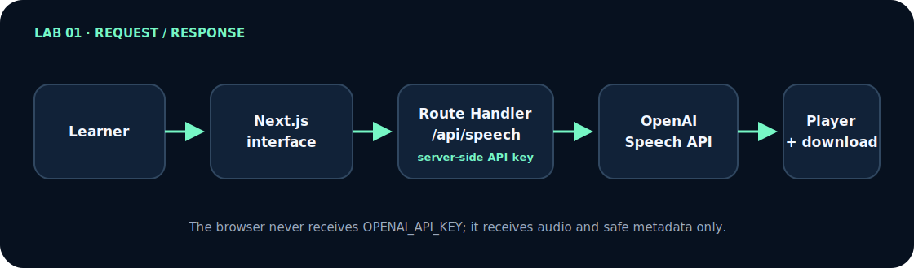

# Lab 01 — Text to Speech: step-by-step workshop

[Português](tutorial.md) · [Workshop index](../../../docs/README-en.md) · [Lab 02 →](../../lab-02-realtime-voice-agent/tutorial/tutorial-en.md)

This workshop does more than explain the architecture. You open a terminal, create the project, create every file, paste a complete implementation, run a checkpoint, and only then continue.

When you finish, you will have a Next.js application that:

- turns text into audio with `gpt-4o-mini-tts`;
- keeps `OPENAI_API_KEY` on the server;
- validates text, voice, format, instructions, and speed;
- forwards the audio stream;
- provides playback, cancellation, and download;
- handles errors without leaking internal details;
- has tests that make no paid requests;
- can be deployed to Vercel.

## Start in 5 minutes

<dl class="lab-meta-grid">
  <div><dt>Outcome</dt><dd>Text becomes playable, downloadable audio</dd></div>
  <div><dt>Full duration</dt><dd>2–3 hours</dd></div>
  <div><dt>Difficulty</dt><dd>Beginner</dd></div>
  <div><dt>Technologies</dt><dd>Next.js, TypeScript, Speech API, streaming</dd></div>
  <div><dt>Prerequisites</dt><dd>Node.js 22+, Git, and an OpenAI API account</dd></div>
  <div><dt>Cost</dt><dd>Voice requests are billed by usage; offline tests incur no API cost</dd></div>
</dl>

If you already have an API key and want to see the finished solution before building, open a terminal in your projects directory and run:

```bash
git clone --depth 1 https://github.com/glaucia86/openai-voice-playground.git
cd openai-voice-playground/labs/lab-01-text-to-speech
npm ci
cp .env.example .env.local
npm run dev
```

On Windows PowerShell, replace `cp .env.example .env.local` with `Copy-Item .env.example .env.local`. Before `npm run dev`, open `.env.local`, add your key after `OPENAI_API_KEY=`, and save. Visit <http://localhost:3000>, use one short sentence, and make only the request you intend to pay for.

<div class="quick-command" markdown="1">

### Would you rather build it?

- **With guidance (recommended):** use the [starter branch](https://github.com/glaucia86/openai-voice-playground/tree/workshop/lab-01-v1-starter) and the [first checkpoint](https://github.com/glaucia86/openai-voice-playground/tree/workshop/lab-01-v1-step-01-contract).
- **From an empty directory:** open [Chapter 1](en/01-preparation.md) and choose Path C.
- **Finished code:** inspect the [`main` implementation](https://github.com/glaucia86/openai-voice-playground/tree/main/labs/lab-01-text-to-speech) without replacing your work.

</div>

## See the outcome before building

<figure class="workshop-demo">
  
  <figcaption>A real, compressed Lab 01 recording. The flow receives a short text, generates audio, and presents playback and download controls; no credential or personal information is visible.</figcaption>
</figure>

The reduced-motion text equivalent is: the learner enters text, selects a voice and format, submits the request, waits through the processing state, and receives controls to play or download the audio.

## Architecture on one screen

<figure class="architecture-figure">
  
  <figcaption>Editable source: <a href="../../../docs/architecture/lab-01.mmd">Mermaid</a>. GitHub Pages uses the SVG for predictable, accessible rendering.</figcaption>
</figure>

The interface runs in the browser and sends only allowed fields to `/api/speech`. The Route Handler runs on the server, validates the body, applies origin, access, and quota checks, uses `OPENAI_API_KEY` to call the Speech API, and forwards the stream. The browser receives audio and safe metadata—never the standard key. Local limits help during the workshop; production still needs real authentication, distributed rate limiting, budgets, and content-free observability.

> **Comprehension prompt:** why does the browser receive audio but must never receive `OPENAI_API_KEY`?

## Choose a learning path

| Path | What you do | Recommendation |
| --- | --- | --- |
| **A — run and study** | clone `main` and inspect the finished solution | useful for seeing the result first |
| **B — build from the starter** | begin with a compilable scaffold and implement each slice | **recommended for this workshop** |
| **C — create from zero** | create directories, configuration, and dependencies too | useful for deep study or a longer class |

The [workshop guide](../../../docs/workshop-guide.md) explains how to preserve your work and inspect checkpoints with `git diff` and `git show`.

## Start here

Follow these chapters in order. Each one ends with objective completion evidence.

1. **[Prepare the account, terminal, and project](en/01-preparation.md)** — Choose a path, verify tools, protect the API key, and prove the base runs.
2. **[Build the application file by file](en/02-file-by-file-build.md)** — Create configuration, contract, backend, streaming, interface, and tests with the complete content of every file.
3. **[Run, diagnose, and deploy](en/03-run-test-deploy.md)** — Run every gate, perform a controlled smoke test, troubleshoot common failures, and publish.

> Want deeper reasoning? Read the **[Lab 01 architecture article](article-en.md)** after or alongside the hands-on chapters. The article explains why; the chapters above tell you exactly what to do.

## Recommended starter

Open a terminal in your projects directory and run:

```bash
git clone --branch workshop/lab-01-v1-starter \
  https://github.com/glaucia86/openai-voice-playground.git
cd openai-voice-playground
git switch -c my-lab-01-solution
npm ci --prefix labs/lab-01-text-to-speech
npm run check:lab01
```

The first gate must pass without an API key or OpenAI request. Then open [Chapter 1](en/01-preparation.md).

## Recovery checkpoints

| After completing | Reference | Compare |
| --- | --- | --- |
| initial base | `workshop/lab-01-v1-starter` | starting point |
| contract and schemas | `workshop/lab-01-v1-step-01-contract` | [view diff](https://github.com/glaucia86/openai-voice-playground/compare/workshop/lab-01-v1-starter...workshop/lab-01-v1-step-01-contract) |
| backend and streaming | `workshop/lab-01-v1-step-02-server` | [view diff](https://github.com/glaucia86/openai-voice-playground/compare/workshop/lab-01-v1-step-01-contract...workshop/lab-01-v1-step-02-server) |
| interface and tests | `workshop/lab-01-v1-step-03-interface` | [view diff](https://github.com/glaucia86/openai-voice-playground/compare/workshop/lab-01-v1-step-02-server...workshop/lab-01-v1-step-03-interface) |

Do not check out a checkpoint with unsaved changes. Commit your work on your own branch first, then use the reference for comparison.

> **Before continuing, confirm that:** you chose one of the three paths, understand that API use may cost money, have Node.js 22+, and can explain where the API key will stay.

## Final evidence

The lab is complete when both commands finish cleanly:

```bash
npm run check:lab01
git status -sb
```

The first command runs lint, TypeScript, tests, and a production build. The second should show only your branch, with no `.env.local`, `.next`, `node_modules`, or unexpected tracked files.

[Start Chapter 1 →](en/01-preparation.md)
