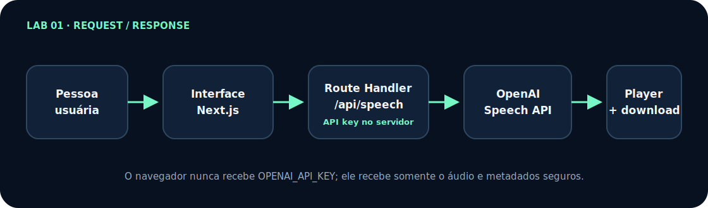

# Lab 01 — Text to Speech: workshop passo a passo

[English](tutorial-en.md) · [Índice dos workshops](../../../docs/README.md) · [Lab 02 →](../../lab-02-realtime-voice-agent/tutorial/tutorial.md)

Neste workshop você não recebe apenas uma explicação da arquitetura. Você abre o terminal, cria o projeto, cria cada arquivo, cola uma implementação completa, executa um checkpoint e só então avança.

Ao terminar, você terá uma aplicação Next.js que:

- transforma texto em áudio com `gpt-4o-mini-tts`;
- mantém `OPENAI_API_KEY` somente no servidor;
- valida texto, voz, formato, instruções e velocidade;
- encaminha o áudio em streaming;
- oferece player, cancelamento e download;
- trata erros sem vazar detalhes internos;
- possui testes que não fazem chamadas pagas;
- pode ser publicada na Vercel.

## Comece em 5 minutos

<dl class="lab-meta-grid">
  <div><dt>Resultado</dt><dd>Texto vira áudio reproduzível e baixável</dd></div>
  <div><dt>Tempo completo</dt><dd>2–3 horas</dd></div>
  <div><dt>Dificuldade</dt><dd>Iniciante</dd></div>
  <div><dt>Tecnologias</dt><dd>Next.js, TypeScript, Speech API, streaming</dd></div>
  <div><dt>Pré-requisitos</dt><dd>Node.js 22+, Git e conta da API OpenAI</dd></div>
  <div><dt>Custo</dt><dd>Chamadas de voz são cobradas conforme o uso; testes offline não geram custo</dd></div>
</dl>

Se você já possui uma API key e quer ver a solução final antes de construir, abra o terminal na pasta onde guarda projetos e execute:

```bash
git clone --depth 1 https://github.com/glaucia86/openai-voice-playground.git
cd openai-voice-playground/labs/lab-01-text-to-speech
npm ci
cp .env.example .env.local
npm run dev
```

No Windows PowerShell, substitua `cp .env.example .env.local` por `Copy-Item .env.example .env.local`. Antes de `npm run dev`, abra `.env.local`, coloque sua chave depois de `OPENAI_API_KEY=` e salve. Acesse <http://localhost:3000>, use uma frase curta e faça apenas o teste que pretende pagar.

<div class="quick-command" markdown="1">

### Prefere construir?

- **Com apoio (recomendado):** use a [branch starter](https://github.com/glaucia86/openai-voice-playground/tree/workshop/lab-01-v1-starter) e o [primeiro checkpoint](https://github.com/glaucia86/openai-voice-playground/tree/workshop/lab-01-v1-step-01-contract).
- **Desde uma pasta vazia:** abra o [Capítulo 1](pt/01-preparacao.md) e escolha o Caminho C.
- **Código final:** consulte a [implementação na `main`](https://github.com/glaucia86/openai-voice-playground/tree/main/labs/lab-01-text-to-speech) sem substituir seu trabalho.

</div>

## Veja o resultado antes de construir

<figure class="workshop-demo">
  
  <figcaption>Gravação real e comprimida do Lab 01. O fluxo recebe um texto curto, gera o áudio e apresenta player e download; nenhuma credencial ou informação pessoal aparece.</figcaption>
</figure>

Se você prefere movimento reduzido, a descrição equivalente é: a pessoa digita texto, escolhe voz e formato, envia o pedido, aguarda o estado de processamento e recebe controles para reproduzir ou baixar o áudio.

## Arquitetura em uma tela

<figure class="architecture-figure">
  
  <figcaption>Fonte editável: <a href="../../../docs/architecture/lab-01-pt-br.mmd">Mermaid</a>. O SVG é usado no GitHub Pages para manter a renderização previsível e acessível.</figcaption>
</figure>

A interface roda no navegador e envia somente os campos permitidos para `/api/speech`. A Route Handler roda no servidor, valida o corpo, aplica origem, acesso e quota, usa `OPENAI_API_KEY` para chamar a Speech API e encaminha o stream. O navegador recebe áudio e metadados seguros — nunca a chave padrão. No laboratório, limites locais ajudam no desenvolvimento; em produção ainda são necessários autenticação real, rate limit distribuído, orçamento e observabilidade sem conteúdo.

> **Pergunta de compreensão:** por que o navegador recebe o áudio, mas nunca deve receber `OPENAI_API_KEY`?

## Escolha como acompanhar

| Caminho | O que você faz | Recomendação |
| --- | --- | --- |
| **A — executar e estudar** | clona a `main` e abre a solução final | bom para conhecer o resultado primeiro |
| **B — construir pelo starter** | parte de uma base compilável e implementa cada fatia | **recomendado para acompanhar o workshop** |
| **C — criar do zero** | cria também pastas, configuração e dependências | bom para estudo aprofundado ou aula longa |

O [guia de acompanhamento](../../../docs/workshop-guide-pt-br.md) explica como preservar seu trabalho e consultar checkpoints com `git diff` e `git show`.

## Comece agora

Siga os capítulos na ordem. Cada um termina com uma condição objetiva de conclusão.

1. **[Prepare conta, terminal e projeto](pt/01-preparacao.md)** — Escolha o caminho, confira ferramentas, proteja a API key e prove que a base executa.
2. **[Construa a aplicação arquivo por arquivo](pt/02-construcao-arquivo-por-arquivo.md)** — Crie configuração, contrato, backend, streaming, interface e testes com o conteúdo completo de cada arquivo.
3. **[Execute, diagnostique e publique](pt/03-execucao-testes-deploy.md)** — Rode todos os gates, faça um smoke test controlado, resolva erros comuns e publique.

> Quer compreender as decisões com mais profundidade? Leia o **[artigo arquitetural do Lab 01](article.md)** depois ou em paralelo. O artigo explica os porquês; os capítulos acima dizem exatamente o que fazer.

## Starter recomendado

Abra o terminal na pasta onde guarda seus projetos e execute:

```bash
git clone --branch workshop/lab-01-v1-starter \
  https://github.com/glaucia86/openai-voice-playground.git
cd openai-voice-playground
git switch -c minha-solucao-lab-01
npm ci --prefix labs/lab-01-text-to-speech
npm run check:lab01
```

O primeiro gate deve passar sem API key e sem chamada à OpenAI. Depois, abra o [Capítulo 1](pt/01-preparacao.md).

## Checkpoints de recuperação

| Depois de concluir | Referência | Comparação |
| --- | --- | --- |
| base inicial | `workshop/lab-01-v1-starter` | ponto de partida |
| contrato e schemas | `workshop/lab-01-v1-step-01-contract` | [ver diff](https://github.com/glaucia86/openai-voice-playground/compare/workshop/lab-01-v1-starter...workshop/lab-01-v1-step-01-contract) |
| backend e streaming | `workshop/lab-01-v1-step-02-server` | [ver diff](https://github.com/glaucia86/openai-voice-playground/compare/workshop/lab-01-v1-step-01-contract...workshop/lab-01-v1-step-02-server) |
| interface e testes | `workshop/lab-01-v1-step-03-interface` | [ver diff](https://github.com/glaucia86/openai-voice-playground/compare/workshop/lab-01-v1-step-02-server...workshop/lab-01-v1-step-03-interface) |

Não faça checkout de um checkpoint com alterações não salvas. Primeiro faça commit na sua branch; depois use a referência para comparar.

> **Antes de continuar, confirme que:** você escolheu uma das três rotas, sabe que a API pode gerar custo, tem Node.js 22+ e consegue explicar onde a API key ficará.

## Evidência final

O laboratório está concluído quando estes comandos terminarem com código zero:

```bash
npm run check:lab01
git status -sb
```

O primeiro executa lint, TypeScript, testes e build. O segundo deve mostrar somente sua branch, sem `.env.local`, `.next`, `node_modules` ou arquivos inesperados versionados.

[Começar o Capítulo 1 →](pt/01-preparacao.md)
