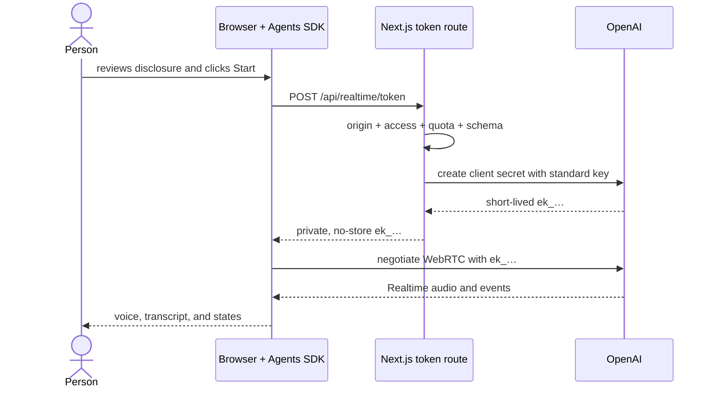

# Lab 02 — Realtime voice-agent architecture article with OpenAI Realtime, WebRTC, and Agents SDK

> A standalone, incremental guide to building a fluid speech-to-speech application without exposing the standard API key, confusing an ephemeral credential with authentication, or hiding the engineering decisions between the microphone and the model.

**Author:** Glaucia Lemos
**Project:** [OpenAI Voice Labs](https://github.com/glaucia86/openai-voice-playground)
**Lab source:** [`labs/lab-02-realtime-voice-agent`](https://github.com/glaucia86/openai-voice-playground/tree/main/labs/lab-02-realtime-voice-agent)
**Last technically validated:** July 19, 2026

**Language:** [Leia o artigo em português](article.md) · English

- **Track:** Module 02 of 02
- **Estimated time:** 3–4 hours
- **Prerequisite module:** none; Lab 01 is recommended but not required
- **Completion evidence:** the app runs and `npm run check:lab02` passes from the repository root

[Step-by-step workshop](tutorial-en.md) · [Portuguese article](article.md) · [← Module 01 — TTS](../../lab-01-text-to-speech/tutorial/tutorial-en.md) · [Workshop index](../../../docs/README.md)

---

## Before you begin

In [Lab 01](../../lab-01-text-to-speech/tutorial/tutorial-en.md), one bounded text request produced one audio resource. A live conversation is a different system.

The person may:

- start speaking before the agent finishes;
- pause without ending the turn;
- deny microphone permission;
- move between networks;
- mute the microphone;
- type when speaking is not possible;
- remain connected long enough to create unexpected cost;
- assume “nothing is stored” means audio never leaves the device.

This tutorial therefore does not add a record button to the previous architecture. It replaces request/response audio generation with a stateful Realtime session and makes these concerns explicit:

1. the standard API-key path;
2. the ephemeral client-secret path;
3. the WebRTC media path;
4. the conversation state machine;
5. turn detection and interruption;
6. session lifetime and cleanup;
7. data minimization;
8. cost and abuse controls;
9. the responsibilities you can test without a paid live call.

The validated model is `gpt-realtime-2.1`. The browser uses `@openai/agents` with WebRTC. The Next.js server uses the official `openai` SDK only to create a short-lived client secret.

Model availability and SDK contracts change. Check the official references at the end before moving this design into another project.

### How this guide is self-contained

You may start here without reading Module 00 or Lab 01. This article includes account and billing setup, API-key safety, the Realtime and WebRTC mental models, project creation, the credential exchange, session construction, testing, deployment, production gaps, and troubleshooting.

Every major step explains:

1. the observable behavior being added;
2. the architecture reason it exists;
3. the exact file and terminal location;
4. the checkpoint that proves the slice;
5. the remaining limits after the happy path works.

### Mental model

| Term | Meaning in this lab |
| --- | --- |
| Realtime API | a low-latency, bidirectional session for audio, text, and events |
| WebRTC | the browser transport for real-time media and data |
| Client secret | a short-lived bearer credential issued for session startup |
| Agents SDK | the client abstraction for agent, session, history, and events |
| Turn detection | the rules used to infer when speech starts and a turn ends |
| Barge-in | interrupting the agent by speaking over its response |
| Transcript | a textual UI aid, not the primary speech-to-speech medium |
| Session lifecycle | explicit authorization, connection, activity, failure, closing, and cleanup |

## Table of contents

0. [Prepare the account, machine, microphone, and project](#0-prepare-the-account-machine-microphone-and-project)
1. [Classify the interaction before choosing the API](#1-classify-the-interaction-before-choosing-the-api)
2. [Define the contract and vertical slices](#2-define-the-contract-and-vertical-slices)
3. [Model authorization and media as separate paths](#3-model-authorization-and-media-as-separate-paths)
4. [Create a reproducible base](#4-create-a-reproducible-base)
5. [Issue a short-lived client secret](#5-issue-a-short-lived-client-secret)
6. [Build the agent and session in the browser](#6-build-the-agent-and-session-in-the-browser)
7. [Treat the conversation as a state machine](#7-treat-the-conversation-as-a-state-machine)
8. [Design turns, interruption, mute, and text fallback](#8-design-turns-interruption-mute-and-text-fallback)
9. [Reconcile transcripts without storing audio](#9-reconcile-transcripts-without-storing-audio)
10. [Design privacy, errors, and accessibility](#10-design-privacy-errors-and-accessibility)
11. [Protect cost, abuse, and tools](#11-protect-cost-abuse-and-tools)
12. [Test your responsibilities and use Codex with a harness](#12-test-your-responsibilities-and-use-codex-with-a-harness)
13. [Deploy and validate a real session](#13-deploy-and-validate-a-real-session)
14. [Review the production gap](#14-review-the-production-gap)
15. [Troubleshooting](#15-troubleshooting)

---

## 0. Prepare the account, machine, microphone, and project

Choose one learning path:

- **Path A — run and investigate:** clone the finished app, run the gates, and inspect the flow with browser developer tools. Start here if Realtime, WebRTC, or Agents SDK is new to you.
- **Path B — build from the starter (recommended):** begin with working configuration, a page, and one test, then implement the contract, authorization path, and conversation slices.
- **Path C — rebuild absolutely from zero:** create the directory and every file. Choose this when scaffolding and tooling configuration are learning objectives too.

All three reach the same architecture. The [workshop guide](../../../docs/workshop-guide.md) explains how to inspect checkpoints without erasing your implementation.

A live session uses a microphone, network, audio, and a billable API connection. Run the first smoke test in a controlled environment, end the session when you finish, and never distribute one standard API key to workshop attendees.

### 0.1 Verify local requirements

```bash
node --version
npm --version
git --version
```

You need:

- Node.js 20 or newer;
- npm and Git;
- a current editor;
- a browser with WebRTC and microphone support;
- microphone permission at the operating-system and site level;
- headphones, recommended to prevent the microphone from capturing agent output;
- an OpenAI API project with access to `gpt-realtime-2.1` and API billing or credits;
- HTTPS in deployment; `localhost` is the browser development exception.

If the browser never offers microphone permission, inspect the OS and browser site settings first. Code cannot override a permission denied outside the page.

### 0.2 Understand ChatGPT and API billing

This application uses the [OpenAI API Platform](https://platform.openai.com/), not a ChatGPT subscription. ChatGPT Free, Plus, Pro, Business, and Enterprise are billed separately from API usage.

Before generating a key:

1. sign in to [platform.openai.com](https://platform.openai.com/);
2. select a learning project or create `openai-voice-labs`;
3. confirm API billing or available credits;
4. verify access to `gpt-realtime-2.1` and the transcription model;
5. configure budget alerts and keep the usage page visible during early tests.

Audio sessions consume resources while active. A budget alert is useful visibility, but it does not replace explicit session limits, identity, quotas, or a kill switch.

### 0.3 Create a project-specific API key

In the selected project, open **API Keys**, choose **Create new secret key**, and name it `voice-labs-local` or another environment-specific name. Prefer the minimum permissions compatible with the lab.

The complete key appears only at creation. Store it in a secret manager or directly in the local `.env.local` described next. Never send it through chat, email, screenshots, logs, or Git.

Every person and environment should have a distinct credential and usage trail. If a key is exposed, revoke it immediately. Removing the text from a commit does not invalidate a copied secret.

### 0.4 Understand the two credentials

This lab uses credentials with different scope and lifetime:

| Credential | Created by | Allowed location | Lifetime |
| --- | --- | --- | --- |
| `OPENAI_API_KEY` | API Platform | server and deployment secret store | until rotation or revocation |
| client secret `ek_…` | OpenAI, requested by your server | browser memory | short; 60 seconds to start |

The ephemeral secret does not make the standard key safe in frontend code. It replaces the need to send that key to the browser.

The client secret remains a bearer credential during its lifetime. The response must be `no-store`; the value must not be logged, persisted, replayed, or exposed to analytics.

### 0.5 Path A: clone and run the finished lab

```bash
git clone https://github.com/glaucia86/openai-voice-playground.git
cd openai-voice-playground/labs/lab-02-realtime-voice-agent
npm ci
```

Create the local environment file.

macOS, Linux, or Git Bash:

```bash
cp .env.example .env.local
```

PowerShell:

```powershell
Copy-Item .env.example .env.local
```

Edit `.env.local`:

```dotenv
OPENAI_API_KEY=replace_with_your_project_key
```

Leave `PLAYGROUND_ACCESS_TOKEN`, `APP_ORIGIN`, and Upstash values empty for the first local checkpoint. Production requires them and fails closed when they are absent.

Confirm that the file is ignored:

```bash
git check-ignore -v .env.local
```

Start the app:

```bash
npm run dev
```

Open <http://localhost:3000>. Before enabling the microphone, inspect health from another terminal:

```bash
curl http://localhost:3000/api/health
```

Expected safe metadata:

- `ok` and `configured` are `true`;
- model is `gpt-realtime-2.1`;
- transport is `webrtc`;
- client-secret TTL is 60 seconds;
- no API key or client secret appears.

Return to the browser, read the disclosure, select consent, click **Start live conversation**, allow the microphone, speak one short sentence, interrupt once, and explicitly end the session.

### 0.6 Path B: build from the recommended starter

From your projects directory:

```bash
git clone --branch workshop/lab-02-v1-starter \
  https://github.com/glaucia86/openai-voice-playground.git
cd openai-voice-playground
git switch -c my-lab-02-solution
npm ci --prefix labs/lab-02-realtime-voice-agent
npm run check:lab02
```

The first gate must pass without an API key, microphone, or billable session. The starter contains a bilingual page, a health check with `stage: "starter"`, pinned dependencies, and one initial test. Client-secret issuance, the agent, and the WebRTC session do not exist yet.

Creating `my-lab-02-solution` keeps the starter reference untouched. Read `START-HERE.md` on that branch too.

#### Lab 02 checkpoint map

| Stage | Read-only reference | Evidence | Compare |
| --- | --- | --- | --- |
| Starter | `workshop/lab-02-v1-starter` | `npm run check:lab02` | starting point |
| 01 — session contract | `workshop/lab-02-v1-step-01-session-contract` | schemas, instructions, and session limit pass | [view changes](https://github.com/glaucia86/openai-voice-playground/compare/workshop/lab-02-v1-starter...workshop/lab-02-v1-step-01-session-contract) |
| 02 — authorization | `workshop/lab-02-v1-step-02-authorization` | client-secret route, guards, and server tests pass | [view changes](https://github.com/glaucia86/openai-voice-playground/compare/workshop/lab-02-v1-step-01-session-contract...workshop/lab-02-v1-step-02-authorization) |
| 03 — conversation | `workshop/lab-02-v1-step-03-conversation` | full `npm run check:lab02` passes | [view changes](https://github.com/glaucia86/openai-voice-playground/compare/workshop/lab-02-v1-step-02-authorization...workshop/lab-02-v1-step-03-conversation) |
| Final solution | `main` | same lab code plus the published learning path | [open solution](https://github.com/glaucia86/openai-voice-playground/tree/main/labs/lab-02-realtime-voice-agent) |

Inspect a reference without replacing your files:

```bash
git fetch origin
git diff --stat HEAD..origin/workshop/lab-02-v1-step-01-session-contract
git show origin/workshop/lab-02-v1-step-01-session-contract:labs/lab-02-realtime-voice-agent/src/lib/schemas.ts
```

Commit your progress before investigating a checkpoint. Do not use `git reset --hard` as a workshop navigation mechanism.

### 0.7 Path C: create the application from zero

```bash
mkdir -p openai-voice-labs/labs/lab-02-realtime-voice-agent
cd openai-voice-labs/labs/lab-02-realtime-voice-agent
npm init -y
pwd
```

Confirm that the path ends in `labs/lab-02-realtime-voice-agent`.

Install runtime dependencies:

```bash
npm install next@15.5.20 react@19.2.7 react-dom@19.2.7 openai@^6.48.0 @openai/agents@^0.13.5 zod@^4.4.3 lucide-react@^1.25.0 @fontsource-variable/manrope@^5.2.8 @fontsource-variable/jetbrains-mono@^5.2.8 @upstash/ratelimit@2.0.8 @upstash/redis@1.38.0
```

Install development tools:

```bash
npm install --save-dev @types/node@^26.1.1 @types/react@^19.2.17 @types/react-dom@^19.2.3 oxlint@^1.74.0 vitest@^4.1.10 @vitest/coverage-v8@^4.1.10 typescript@5.8.2 typescript7@npm:typescript@7.0.2
```

Create the file tree:

```bash
mkdir -p scripts src/app/api/health src/app/api/realtime/token src/components src/lib src/types tests tutorial
touch .env.example .gitignore next.config.mjs tsconfig.json vitest.config.ts scripts/typecheck.mjs
touch src/app/globals.css src/app/layout.tsx src/app/page.tsx
touch src/app/api/health/route.ts src/app/api/realtime/token/route.ts
touch src/components/realtime-voice-agent.tsx src/components/voice-playground.tsx
touch src/middleware.ts src/lib/constants.ts src/lib/openai.ts src/lib/rate-limit.ts
touch src/lib/realtime-config.ts src/lib/request-body.ts src/lib/request-guard.ts
touch src/lib/schemas.ts src/lib/security-config.ts src/lib/session-lifetime.ts
```

Use these `package.json` scripts:

```json
{
  "scripts": {
    "dev": "next dev",
    "build": "next build",
    "start": "next start",
    "lint": "oxlint --deny-warnings src tests",
    "typecheck": "node scripts/typecheck.mjs --noEmit",
    "test": "vitest run",
    "test:watch": "vitest",
    "test:coverage": "vitest run --coverage",
    "check": "npm run lint && npm run typecheck && npm run test && npm run build"
  }
}
```

Protect secrets in `.gitignore`:

```gitignore
.env*
!.env.example
.next/
node_modules/
coverage/
*.tsbuildinfo
```

List empty names in `.env.example`:

```dotenv
OPENAI_API_KEY=
PLAYGROUND_ACCESS_TOKEN=
APP_ORIGIN=
UPSTASH_REDIS_REST_URL=
UPSTASH_REDIS_REST_TOKEN=
CLIENT_IP_HEADER=
```

### 0.7 Prove Next.js before adding Realtime

Create a minimal layout and page, run `npm run dev`, and verify a static title at <http://localhost:3000>. This isolates framework installation from microphone, SDK, and network failures.

The practical implementation order after that checkpoint is:

1. constants and schemas;
2. lazy server-side OpenAI client;
3. client-secret Route Handler;
4. token-route tests that never print the secret;
5. browser agent and session;
6. state machine and cleanup;
7. transcript, mute, interruption, and text fallback;
8. accessibility and disclosure;
9. hardening, complete gates, and deployment.

---

## 1. Classify the interaction before choosing the API

“Voice” is not an architecture. The interaction is.

| Need | Architecture | Dominant state |
| --- | --- | --- |
| text becomes audio | request-based Speech API | one request |
| a completed file becomes text | request-based Transcriptions API | one upload |
| microphone produces continuous captions | Realtime transcription | input session |
| person and model converse by voice | Realtime speech-to-speech | bidirectional session |

Our requirement is the fourth: low-latency listening and response, context across turns, and interruption.

This sequential loop is valid for some asynchronous workflows but does not provide natural barge-in:

```text
record → upload → transcribe → generate text → synthesize speech → play
```

In speech-to-speech Realtime, the model receives and produces audio within one session. Agents SDK organizes history and events; WebRTC carries browser media.

### Recorded decision

- **Model:** `gpt-realtime-2.1`.
- **Browser transport:** WebRTC.
- **Client orchestration:** `RealtimeAgent` and `RealtimeSession`.
- **Authorization:** ephemeral client secret issued through a Route Handler.
- **Turn detection:** `semantic_vad` with automatic response and interruption.
- **Input transcript:** `gpt-4o-mini-transcribe` for visual feedback.
- **Tools:** none in this slice.
- **Tracing:** disabled.
- **Audio in local history:** disabled.

Out of scope is equally important: no SIP, call recording, cross-session memory, RAG, MCP, individual authentication, or external action execution.

---

## 2. Define the contract and vertical slices

### Goal

Allow a person to start a live voice conversation, observe accessible state and transcripts, interrupt or mute, send text when necessary, and end the connection deliberately—without receiving the standard OpenAI API key.

### Constraints

- Next.js 15 App Router and strict TypeScript;
- Agents SDK in the client only for Realtime/WebRTC;
- `openai` SDK and `OPENAI_API_KEY` only on the server;
- enumerated model, voice, language, and microphone profile;
- conversation goal limited to 600 characters;
- no application logs containing conversation content;
- no paid API call in automated tests;
- no app persistence of audio or transcripts;
- visible AI-voice disclosure and explicit microphone consent.

### Vertical slices

| Slice | Observable behavior | Gate |
| --- | --- | --- |
| 0. Base | app starts with compatible SDKs and types | lint + type-check + build |
| 1. Authorization | server validates and returns a 60-second `ek_…` | schema + sanitized errors |
| 2. Connection | click opens WebRTC and updates state | controlled smoke test |
| 3. Conversation | one spoken turn and transcript cross the session | events + UI |
| 4. Control | mute, interruption, text, and closing work | keyboard + state checks |
| 5. Hardening | rate limit, origin, CSP, no-store, content-free logs | guard tests |
| 6. Delivery | article, READMEs, CI, deployment guidance | `npm run check` |

### Definition of done

- happy path and failures are designed;
- connection is cancellable;
- closing releases the session, request, and timer;
- voice and session settings lock after connection starts;
- transcript history does not contain base64 audio;
- `.env.local` remains ignored;
- documentation and code agree;
- lint, types, tests, coverage, and build pass.

---

## 3. Model authorization and media as separate paths

The most important diagram in this tutorial has two network paths.



### Authorization path

It passes through your server. This is where:

- the standard key exists;
- request and project policy are validated;
- quotas can be attributed;
- the model, voice, and audio policy are constrained;
- the ephemeral grant is issued.

### Media path

After authorization, WebRTC connects the browser to OpenAI for low-latency audio and events. Routing every audio frame through the Next.js function would add latency, egress, buffering, and another sensitive-data processor.

Direct media does not mean “no backend.” The backend still controls who may start, what configuration is allowed, and how often a grant may be issued.

**Checkpoint:** explain why `OPENAI_API_KEY` and `ek_…` have different risk, scope, storage, and lifetime.

---

## 4. Create a reproducible base

The project pins major versions in `package.json`, commits the lockfile, and uses `npm ci` in CI. It installs TypeScript 7 under an explicit alias while preserving framework compatibility.

The final source tree separates responsibilities:

```text
src/
├── app/api/health/route.ts
├── app/api/realtime/token/route.ts
├── components/realtime-voice-agent.tsx
├── components/voice-playground.tsx
├── lib/constants.ts
├── lib/openai.ts
├── lib/rate-limit.ts
├── lib/realtime-config.ts
├── lib/request-body.ts
├── lib/request-guard.ts
├── lib/schemas.ts
├── lib/security-config.ts
├── lib/session-lifetime.ts
└── middleware.ts
```

The server-side OpenAI client is lazy and reads `process.env.OPENAI_API_KEY` only when a route needs it. The client bundle never imports that module.

The schema accepts only enumerated voice, language, microphone profile, and a bounded optional goal. Validation happens before the paid client-secret call.

**Checkpoint:** `npm run typecheck` must pass without making a live request.

---

## 5. Issue a short-lived client secret

The token route is `src/app/api/realtime/token/route.ts`.

Its order is deliberate:

1. generate a request ID;
2. verify production security readiness;
3. verify origin and optional workshop access token;
4. consume an issuance quota;
5. bound and parse the JSON body;
6. validate the session request schema;
7. build trusted instructions;
8. ask OpenAI for a client secret;
9. return the minimum contract with `no-store` headers;
10. normalize and log failures without content.

The core provider call is:

```ts
const clientSecret = await openai.realtime.clientSecrets.create(
  {
    expires_after: {
      anchor: "created_at",
      seconds: CLIENT_SECRET_TTL_SECONDS,
    },
    session: {
      type: "realtime",
      model: REALTIME_MODEL,
      output_modalities: ["audio"],
      instructions: buildAgentInstructions(payload),
      max_output_tokens: 1_024,
      reasoning: { effort: "low" },
      tracing: null,
      audio: {
        input: {
          noise_reduction: { type: payload.microphoneProfile },
          transcription: {
            model: REALTIME_TRANSCRIPTION_MODEL,
            language: payload.language,
          },
          turn_detection: {
            type: "semantic_vad",
            eagerness: "auto",
            create_response: true,
            interrupt_response: true,
          },
        },
        output: { voice: payload.voice },
      },
    },
  },
  { signal: request.signal },
);
```

Return only what the browser needs:

```json
{
  "clientSecret": "ek_…",
  "expiresAt": 1234567890,
  "session": {
    "model": "gpt-realtime-2.1",
    "voice": "marin",
    "transport": "webrtc"
  }
}
```

Response headers include:

```text
Cache-Control: no-store, private
Pragma: no-cache
X-Request-Id: ...
```

### TTL does not close the connected session

The 60-second TTL bounds how long the grant may be used to start. It is not the workshop's active-session duration. The UI enforces a separate 15-minute session limit and closes explicitly.

### The goal is context, not policy

`buildAgentInstructions` places fixed safety and behavior instructions before the user-supplied goal. The goal is quoted as data and never receives permission to override server policy.

**Checkpoint:** test the route with a mocked OpenAI client. Assert shape and headers, but never print or snapshot the secret value.

---

## 6. Build the agent and session in the browser

Microphone access must follow a clear user gesture. Do not request it on page load.

The start flow is:

1. verify browser WebRTC and media support;
2. confirm disclosure consent;
3. create an `AbortController` and attempt number;
4. request a client secret from your server;
5. construct `RealtimeAgent` with trusted instructions;
6. construct `RealtimeSession` with locked configuration;
7. register event handlers;
8. connect with the ephemeral secret;
9. ignore stale completion if a newer attempt started;
10. move to connected/listening state.

The important session configuration is:

```ts
const agent = new RealtimeAgent({
  name: "OpenAI Voice Playground guide",
  instructions: buildAgentInstructions({ goal, language }),
});

const session = new RealtimeSession(agent, {
  model: REALTIME_MODEL,
  historyStoreAudio: false,
  tracingDisabled: true,
  config: {
    outputModalities: ["audio"],
    audio: {
      input: {
        noiseReduction: { type: microphoneProfile },
        transcription: { model: "gpt-4o-mini-transcribe", language },
        turnDetection: {
          type: "semantic_vad",
          eagerness: "auto",
          createResponse: true,
          interruptResponse: true,
        },
      },
      output: { voice },
    },
    reasoning: { effort: "low" },
    tracing: null,
  },
});

await session.connect({ apiKey: token.clientSecret, model: REALTIME_MODEL });
```

`apiKey` here is the SDK parameter name, but the value is the short-lived client secret—not `OPENAI_API_KEY`.

### Why settings lock

Voice and audio configuration are session-level decisions. Lock them after authorization starts. To change them, end the session and start a new one with a new grant.

### Cleanup is a feature

On explicit ending or component unmount:

- invalidate the current attempt;
- abort an in-flight token request;
- close the Realtime session;
- clear references and timers;
- reset mute, activity, and connection state.

Without deterministic cleanup, a page may leave the microphone or session active after the UI appears idle.

---

## 7. Treat the conversation as a state machine

A single `isLoading` boolean cannot describe live voice.

### Connection state

```ts
type ConnectionState =
  | "idle"
  | "authorizing"
  | "connecting"
  | "connected"
  | "error";
```

### Activity state

```ts
type ActivityState =
  | "ready"
  | "listening"
  | "hearing"
  | "thinking"
  | "speaking";
```

Keeping connection and conversational activity separate prevents impossible UI combinations and makes labels more useful.

### Event mapping

| SDK or transport event | UI transition |
| --- | --- |
| `history_updated` | reconcile transcript snapshot |
| `agent_start` | thinking |
| `audio_start` | speaking |
| `audio_stopped` | listening |
| `audio_interrupted` | listening |
| `input_audio_buffer.speech_started` | hearing |
| `input_audio_buffer.speech_stopped` | thinking |
| `error` | close and report stable error |

### Prevent connection races

An attempt counter and `AbortController` solve a common race:

1. attempt A requests a token;
2. the user ends and starts attempt B;
3. A finishes late;
4. without an attempt check, A can overwrite B or connect a stale session.

Every awaited boundary compares its captured attempt with the current one before committing state.

**Checkpoint:** start and immediately cancel several times. The app should never connect after the UI returned to idle.

---

## 8. Design turns, interruption, mute, and text fallback

### Semantic VAD

Voice activity detection decides when the system believes a person has started or finished speaking. `semantic_vad` uses more than a fixed silence interval and can better tolerate natural pauses, but it still requires real testing across accents, microphones, noise, and languages.

### Barge-in

With `interrupt_response: true`, new user speech can interrupt model audio. The UI also exposes an explicit interrupt action:

```ts
sessionRef.current?.interrupt();
```

This is essential conversational behavior, not a decorative control.

### Mute

Mute controls the session input track through the SDK:

```ts
session.mute(nextMuted);
```

Muting must have a visible and accessible state. It does not end the connection or stop all cost.

### Text fallback

When speaking is unavailable, send a typed message through the active session:

```ts
sessionRef.current.sendMessage(message);
```

The typed path shares the same context and output modality. It is an accessibility and resilience feature, not a second chat application.

### Explicit ending

The user must always have an obvious **End conversation** action. Automatic limits and error cleanup complement, but do not replace, explicit control.

---

## 9. Reconcile transcripts without storing audio

The Agents SDK emits the current history. Convert that canonical snapshot into UI entries instead of blindly appending every delta.

Why snapshot reconciliation?

- streaming items may be updated multiple times;
- interrupted output may change status;
- naive append creates duplicates;
- one canonical history makes the render deterministic.

The UI stores only the minimal derived text needed for the page. The session is configured with:

```ts
historyStoreAudio: false
```

That prevents audio payloads from being retained in the SDK's local history representation. It does not mean audio never enters memory or crosses the network; WebRTC must still capture, transmit, receive, and play it.

Similarly, “the application does not persist transcripts” means the app does not write them to its own database. It is not a universal statement about every processor, browser buffer, platform policy, or provider control. Document the full data flow for the production environment.

---

## 10. Design privacy, errors, and accessibility

### Disclosure and consent

Before requesting the microphone, explain:

- the voice is AI-generated;
- microphone audio is sent to OpenAI for the live session;
- this lab does not intentionally persist audio or transcript in an application database;
- the user can mute or end at any time;
- a session duration limit applies.

Consent must be explicit and reversible. A checkbox or clear acknowledgment before **Start** creates a deliberate boundary.

### Action-oriented errors

Different failures require different next steps:

| Failure | Useful action |
| --- | --- |
| microphone denied | change browser or OS permission |
| unsupported browser | use a WebRTC-capable browser |
| authorization rejected | verify the workshop access token |
| security incomplete | configure production variables |
| quota exceeded | wait or use the correct identity |
| client secret expired | request a fresh grant |
| connection failed | inspect network, HTTPS, and model access |
| session limit reached | start a new session deliberately |

Return stable codes and request IDs from your server. Do not forward raw provider errors to the browser.

### Accessible states

- labels remain visible outside placeholders;
- connection and activity use live regions;
- controls have names beyond icons;
- focus is visible;
- keyboard access covers start, mute, interrupt, text, and end;
- color is not the only signal;
- reduced-motion preferences are respected;
- headphones are recommended, not required.

---

## 11. Protect cost, abuse, and tools

The token route is billable and security-sensitive even though it returns an ephemeral value. The lab includes:

1. bounded JSON body;
2. strict enumerated schema;
3. same-origin checks;
4. optional workshop access token;
5. a separate authentication-attempt quota;
6. a token-issuance quota;
7. distributed Redis enforcement in production;
8. a 60-second grant TTL;
9. a 15-minute UI session limit;
10. `no-store` responses;
11. content-free application logs;
12. fail-closed production configuration.

### What is still missing for a public product

- individual authentication and authorization;
- per-user and per-organization budgets;
- trusted session ownership and revocation;
- concurrency and duration enforcement beyond client UI;
- anomaly detection and operational kill switch;
- retention and deletion workflows;
- regional and compliance decisions;
- explicit incident response.

### Client secrets can be replayed during their TTL

An ephemeral secret is safer than the standard key, but anyone who obtains it may use it while valid. Minimize the response, prevent caching, avoid logs and analytics, and issue only after guards.

### Tools change the threat model

This lab intentionally enables no external tools. A tool that reads or changes real systems requires:

- a strict input schema;
- server-side authorization;
- auditability;
- idempotency and cancellation;
- human approval for consequential actions;
- a clear distinction between conversation and permission.

Do not interpret a spoken instruction as authorization to perform a sensitive action.

---

## 12. Test your responsibilities and use Codex with a harness

Automated tests must not open a real microphone or make paid OpenAI calls. They prove your code:

- request schemas and size boundaries;
- security readiness in development and production;
- origin and access-token guards;
- rate-limit failure modes;
- client-secret request construction with a mocked SDK;
- stable error normalization;
- instruction construction and user-goal quoting;
- session-lifetime calculations;
- transcript transformation helpers where extracted.

Run:

```bash
npm run lint
npm run typecheck
npm test
npm run build
```

Or:

```bash
npm run check
```

From the repository root:

```bash
npm run check:lab02
```

### A focused Codex task

```text
Implement the session-lifetime boundary for Lab 02.

Context:
- the workshop allows at most 15 active minutes in the UI
- closing must release session, request, and timer resources
- tests must not open WebRTC or call OpenAI

Acceptance criteria:
- keep elapsed-time calculation in a pure helper
- close exactly at or above the configured limit
- expose an actionable session_limit_reached error
- add deterministic Vitest coverage with explicit timestamps
- run lint, type-check, and the focused test
```

`AGENTS.md` stores durable security rules, commands, documentation conventions, and definition of done. A task prompt supplies slice-specific acceptance criteria.

The harness loop is:

1. inspect the smallest relevant context;
2. implement one vertical slice;
3. run focused tests;
4. review the diff;
5. run the complete lab gate;
6. update behavior documentation;
7. record a clean handoff before context quality degrades.

Generated code is not proof. An understood diff plus passing gates is proof.

---

## 13. Deploy and validate a real session

### 13.1 Import the correct directory

In Vercel, set the project root to:

```text
labs/lab-02-realtime-voice-agent
```

### 13.2 Configure protected variables

```dotenv
OPENAI_API_KEY=...
PLAYGROUND_ACCESS_TOKEN=...
APP_ORIGIN=https://your-canonical-domain.example
UPSTASH_REDIS_REST_URL=...
UPSTASH_REDIS_REST_TOKEN=...
CLIENT_IP_HEADER=x-vercel-forwarded-for
```

Do not reuse the OpenAI key as the workshop token.

### 13.3 Require HTTPS and inspect CSP

Browsers require a secure context for microphone and WebRTC outside localhost. Verify the deployed security headers and ensure the CSP allows only the connections required by the app and Realtime transport.

### 13.4 Check health before audio

Open:

```text
https://your-domain.example/api/health
```

Confirm:

- `configured: true`;
- access token and distributed limit are required;
- model and transport metadata are correct;
- no credential value appears.

### 13.5 Run one controlled smoke test

1. use headphones and a short goal;
2. acknowledge disclosure;
3. start and allow the microphone;
4. speak one sentence;
5. verify hearing, thinking, speaking, and listening states;
6. interrupt once;
7. mute and unmute;
8. send one typed message;
9. end explicitly;
10. confirm the microphone indicator disappears;
11. inspect application logs for metadata only.

### 13.6 Operate the deployment

Track connection attempts, issuance failures, time-to-connect, session duration, error rate, and cost. Configure OpenAI usage alerts, key rotation, incident ownership, and a way to disable new session issuance.

---

## 14. Review the production gap

### Product and experience

- Is the agent's purpose narrow and disclosed?
- Are languages, voices, interruption, mute, and text fallback tested with users?
- Does the product define what happens after reconnecting or losing context?
- Is the 15-minute limit appropriate and enforced outside client UI when needed?

### Security and abuse

- Is identity real and trusted?
- Is secret issuance authorized per user?
- Are concurrency, duration, and spend bounded server-side?
- Does production fail closed when Redis or policy configuration is unavailable?
- Are tool calls separately authorized?

### Data

- Is the microphone-to-OpenAI data flow documented?
- Are transcript, identifiers, diagnostics, and provider controls classified?
- Are retention, deletion, access, and incident procedures explicit?
- Are logs and analytics free of conversation content and bearer credentials?

### Reliability and cost

- Are time-to-connect and turn latency measured?
- Are permission, network, provider, and quota failures distinguishable?
- Is reconnection bounded and honest about lost context?
- Are usage alerts and kill switches tested?

### Explicit trade-offs

| Decision | Benefit | Remaining cost |
| --- | --- | --- |
| WebRTC direct media | lower latency | browser/network complexity |
| ephemeral client secret | standard key stays server-side | grant remains replayable while valid |
| Agents SDK | structured session and history | SDK event contract must be monitored |
| semantic VAD | more natural turns | behavior varies by speech and environment |
| `historyStoreAudio: false` | avoids duplicated local audio history | audio still travels and is processed |
| no tools | smaller authorization surface | agent cannot perform external actions |
| UI session timer | reproducible workshop cost boundary | client alone is not strong enforcement |

---

## 15. Troubleshooting

### The browser does not request microphone permission

Confirm HTTPS or localhost, browser support, OS permission, and site permission. Clear a previous denial if necessary.

### `configured` is `false`

Stop the server, verify `.env.local` exists, save it, and restart. Never print the secret to diagnose presence.

### `401 unauthorized`

The app expects `PLAYGROUND_ACCESS_TOKEN`. Use the application token, never the OpenAI key.

### `403 cross_origin_request`

Match `APP_ORIGIN` to protocol, host, and port of the browser origin.

### `429 rate_limit_exceeded`

Wait for the quota window. In production, inspect the trusted client identity header and distributed limiter.

### `503 security_configuration_incomplete`

Production lacks a canonical origin, workshop token, Redis configuration, or trusted identity header. The failure is deliberate.

### Client secret expires before connection

Do not cache or reuse it. Request a fresh secret immediately before constructing the session and keep startup work small.

### WebRTC connection fails

Check HTTPS, model access, browser console, corporate proxy/firewall behavior, and whether the token response was cached or delayed.

### The agent hears its own voice

Use headphones, select the appropriate microphone profile, lower speaker volume, and test noise reduction. Do not present headphones as an accessibility requirement.

### Duplicate transcript lines

Reconcile the canonical `history_updated` snapshot. Do not append every partial delta as a new permanent entry.

### The microphone remains active after ending

Verify the end and unmount paths both close the session, abort the request, invalidate the attempt, and clear timers.

### The agent cannot perform an external action

That is intentional. No tools are enabled. Add tools only with schemas, server authorization, auditing, and human approval where consequences exist.

---

## Quick glossary

| Term | Practical explanation |
| --- | --- |
| Bearer credential | a secret usable by whoever possesses it while valid |
| Client secret | short-lived grant used by the browser to begin a Realtime session |
| Data channel | WebRTC channel for events and messages beyond media |
| Ephemeral | created for a narrow purpose with near-term expiration |
| ICE | WebRTC mechanisms that discover a viable network path |
| Media track | browser stream carrying captured or played audio |
| Semantic VAD | turn detection that considers semantic signals beyond fixed silence |
| Session | stateful connection holding context and events across turns |
| Snapshot reconciliation | replacing UI state from canonical history instead of blindly appending deltas |
| WebRTC | browser APIs and protocols for low-latency media and data |

## Conclusion

The agent looks simple when it works: click, speak, listen. The engineering challenge is making every transition deserve trust.

In this lab:

- the standard API key stayed on the server;
- the browser received a short-lived grant;
- WebRTC carried low-latency media;
- Agents SDK organized session and events;
- turns and interruption became explicit state;
- audio was not duplicated into local history;
- transcript remained an ephemeral UI aid;
- logs remained free of conversation content;
- external tools stayed out until real authorization exists;
- tests proved application contracts instead of an optimistic provider mock;
- documentation recorded limitations alongside the result.

That is the difference between a voice demo and an engineering foundation. A demo shows that the model speaks; a foundation shows who may start, what travels, how interruption works, how failure is handled, what it costs, and what remains before real users arrive.

## Official references

- OpenAI — [Realtime API](https://developers.openai.com/api/docs/guides/realtime)
- OpenAI — [Realtime over WebRTC](https://developers.openai.com/api/docs/guides/realtime-webrtc)
- OpenAI — [Realtime conversations](https://developers.openai.com/api/docs/guides/realtime-conversations)
- OpenAI — [GPT-Realtime-2.1 model](https://developers.openai.com/api/docs/models/gpt-realtime-2.1)
- OpenAI Agents SDK — [Voice agents](https://openai.github.io/openai-agents-js/guides/voice-agents/)
- OpenAI Agents SDK — [Realtime agents](https://openai.github.io/openai-agents-js/openai/agents-realtime/classes/realtimeagent/)
- OpenAI Agents SDK — [Realtime sessions](https://openai.github.io/openai-agents-js/openai/agents-realtime/classes/realtimesession/)
- OpenAI — [Managing projects in the API Platform](https://help.openai.com/en/articles/9186755-managing-projects-in-the-api-platform)
- OpenAI — [API key safety](https://help.openai.com/en/articles/5112595-best-practices-for-api-key-safety)
- OpenAI — [ChatGPT and API billing are separate](https://help.openai.com/en/articles/8156019-i-want-to-move-my-chatgpt-subscription-to-the-api)
- OpenAI — [Safety best practices](https://developers.openai.com/api/docs/guides/safety-best-practices)
- OpenAI — [Codex best practices](https://developers.openai.com/codex/learn/best-practices)
- MDN — [WebRTC API](https://developer.mozilla.org/docs/Web/API/WebRTC_API)
- MDN — [MediaDevices.getUserMedia](https://developer.mozilla.org/docs/Web/API/MediaDevices/getUserMedia)
- Vercel — [Environment variables](https://vercel.com/docs/environment-variables)
- Vercel — [Deployment protection](https://vercel.com/docs/deployment-protection)

---

[Step-by-step workshop](tutorial-en.md) · [Portuguese article](article.md) · [← Module 01 — TTS](../../lab-01-text-to-speech/tutorial/tutorial-en.md) · [Workshop index](../../../docs/README.md)
