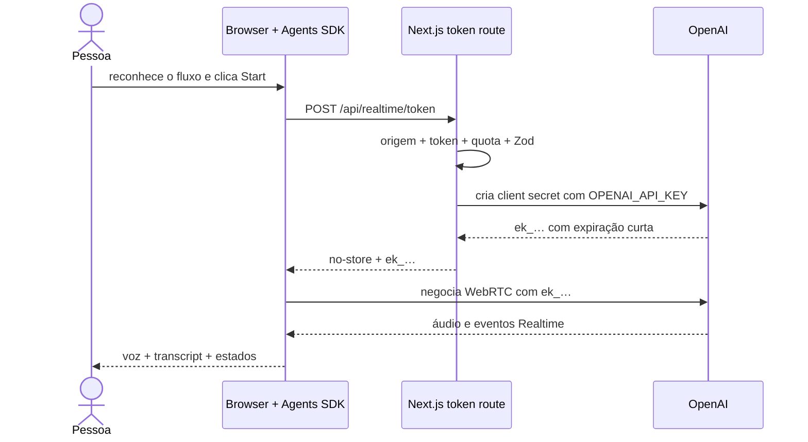
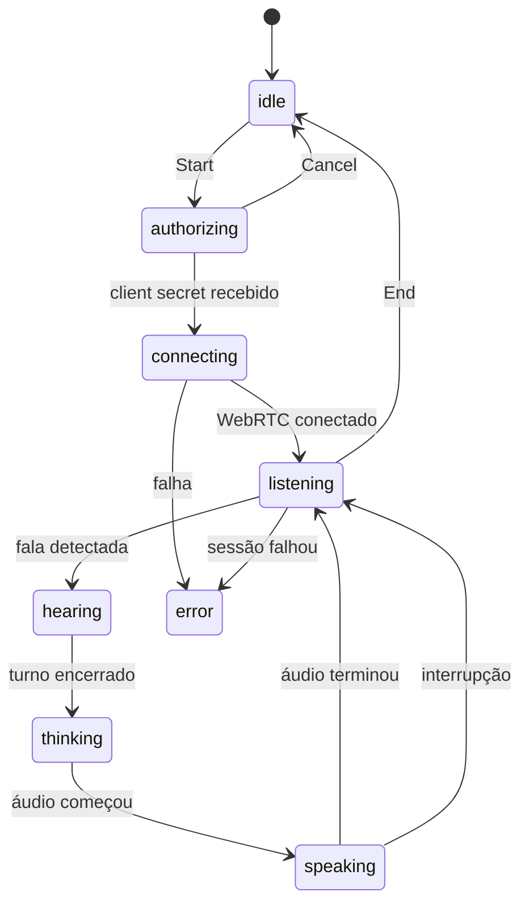
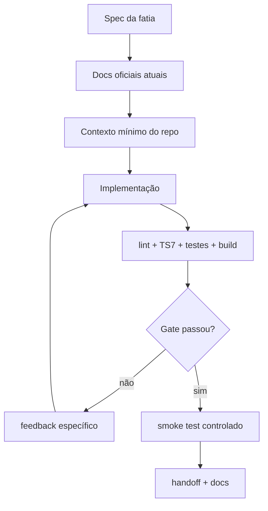

# Laboratório 02 — Artigo arquitetural do agente de voz com OpenAI Realtime, WebRTC e Agents SDK

> Um guia incremental para construir uma aplicação speech-to-speech fluida sem expor a chave padrão, sem confundir uma demonstração com um sistema pronto e sem esconder as decisões de engenharia que existem entre o microfone e o modelo.

**Autora:** Glaucia Lemos<br>
**Projeto:** [OpenAI Voice Labs](https://github.com/glaucia86/openai-voice-playground)<br>
**Código deste lab:** [`labs/lab-02-realtime-voice-agent`](https://github.com/glaucia86/openai-voice-playground/tree/main/labs/lab-02-realtime-voice-agent)<br>
**Última validação técnica:** 19 de julho de 2026

**Idioma:** Português · [Read in English](article-en.md)

- **Trilha:** Módulo 02 de 02
- **Tempo estimado:** 3–4 horas
- **Pré-requisito:** nenhum módulo anterior; o Módulo 01 é recomendado, mas não obrigatório
- **Evidência de conclusão:** aplicação executada e `npm run check:lab02` aprovado na raiz

[Workshop passo a passo](tutorial.md) · [English article](article-en.md) · [← Módulo 01 — TTS](../../lab-01-text-to-speech/tutorial/tutorial.md) · [Índice do workshop](../../../docs/README.md)

---

## Antes de começar

No [Laboratório 01](../../lab-01-text-to-speech/tutorial/tutorial.md), a unidade de trabalho era uma requisição delimitada: texto entrava, um arquivo de áudio saía, e a conexão terminava. Isso funciona muito bem para narração, acessibilidade, prévia de locução e conteúdo que pode esperar a geração.

Uma conversa ao vivo é outro sistema.

A pessoa pode:

- começar a falar antes de o agente terminar;
- fazer pausas que não significam fim de turno;
- negar permissão de microfone;
- trocar de rede;
- silenciar o microfone;
- digitar quando não puder falar;
- permanecer conectada tempo suficiente para atingir limites de sessão;
- pressupor que o app “não guarda nada” quando, na verdade, o áudio ainda precisa ser transmitido e processado.

Portanto, este tutorial não adiciona um botão de gravação ao projeto anterior. Ele substitui a arquitetura request/response por uma sessão Realtime e torna explícitos:

1. o caminho da credencial;
2. o caminho da mídia;
3. a máquina de estados da conversa;
4. turn detection e interrupção;
5. a vida útil da sessão;
6. minimização de dados;
7. controles de custo e abuso;
8. o que conseguimos testar sem fazer chamadas pagas.

O modelo usado nesta validação é `gpt-realtime-2.1`. O navegador usa o pacote `@openai/agents` e WebRTC. O servidor Next.js usa o SDK `openai` apenas para criar uma credencial efêmera.

Modelos e versões mudam. Consulte as referências oficiais ao final antes de copiar uma escolha para outro projeto.

### Como este tutorial se sustenta sozinho

Você pode chegar aqui sem ter lido o Módulo 00 ou o Laboratório 01. O artigo inclui a preparação da API, os conceitos de Realtime e WebRTC, a criação do projeto, o caminho da credencial, a construção da sessão, os testes, o deploy e o diagnóstico.

Cada etapa explicita:

1. o comportamento que será acrescentado;
2. a razão de arquitetura para ele existir;
3. o arquivo e o terminal corretos;
4. o checkpoint que prova a fatia;
5. os limites que permanecem depois do happy path.

O objetivo não é apenas reproduzir a interface final. É permitir que você explique por que há dois caminhos de rede, por que um client secret curto não é a API key, por que uma sessão é uma máquina de estados e por que “não persistir” não significa “o áudio nunca trafega”.

### Mapa mental do laboratório

| Conceito | Neste projeto significa |
| --- | --- |
| Realtime API | sessão bidirecional de baixa latência para eventos, texto e áudio |
| WebRTC | transporte do navegador para mídia e dados em tempo real |
| Client secret | credencial efêmera concedida pelo servidor para iniciar a sessão |
| Agents SDK | abstração que organiza agente, sessão, histórico e eventos no cliente |
| Turn detection | regra usada para inferir quando a pessoa começou ou terminou um turno |
| Barge-in | capacidade de interromper a resposta do agente falando por cima dela |
| Transcript | representação textual de apoio; não é a fonte primária da conversa speech-to-speech |
| Session lifecycle | sequência explícita de conexão, atividade, falha, encerramento e limpeza |

## Sumário

0. [Escolha como acompanhar e prepare o ambiente](#0-escolha-como-acompanhar-e-prepare-o-ambiente)
1. [Classifique a interação antes de escolher a API](#1-classifique-a-interação-antes-de-escolher-a-api)
2. [Escreva o contrato e as fatias verticais](#2-escreva-o-contrato-e-as-fatias-verticais)
3. [Modele dois caminhos: autorização e mídia](#3-modele-dois-caminhos-autorização-e-mídia)
4. [Crie uma base reproduzível](#4-crie-uma-base-reproduzível)
5. [Proteja a chave com um client secret efêmero](#5-proteja-a-chave-com-um-client-secret-efêmero)
6. [Construa o agente e a sessão no navegador](#6-construa-o-agente-e-a-sessão-no-navegador)
7. [Trate a conversa como uma máquina de estados](#7-trate-a-conversa-como-uma-máquina-de-estados)
8. [Projete turnos, interrupção, mute e texto alternativo](#8-projete-turnos-interrupção-mute-e-texto-alternativo)
9. [Reconcilie transcripts sem guardar áudio](#9-reconcilie-transcripts-sem-guardar-áudio)
10. [Desenhe privacidade, erros e acessibilidade](#10-desenhe-privacidade-erros-e-acessibilidade)
11. [Proteja custo, abuso e ferramentas](#11-proteja-custo-abuso-e-ferramentas)
12. [Teste responsabilidades do seu código e use Codex com um harness](#12-teste-responsabilidades-do-seu-código-e-use-codex-com-um-harness)
13. [Faça deploy na Vercel e valide a sessão real](#13-faça-deploy-na-vercel-e-valide-a-sessão-real)
14. [Revise os trade-offs antes de chamar de produção](#14-revise-os-trade-offs-antes-de-chamar-de-produção)

---

## 0. Escolha como acompanhar e prepare o ambiente

Este laboratório pode ser usado de três maneiras:

- **Caminho A — executar e investigar:** clone o projeto pronto, rode os checks e acompanhe o fluxo no debugger. Use este caminho se Realtime, WebRTC ou Agents SDK ainda são novos para você.
- **Caminho B — construir pelo starter (recomendado):** comece com configuração, página e teste funcionando, mas implemente contrato, autorização e conversa nas fatias do workshop.
- **Caminho C — reconstruir absolutamente do zero:** crie a pasta e todos os arquivos. Use quando scaffolding e configuração também forem objetivos da aula.

Os três chegam à mesma arquitetura. O [guia de acompanhamento](../../../docs/workshop-guide-pt-br.md) explica como consultar checkpoints sem apagar sua implementação.

Uma sessão Realtime usa microfone, rede, áudio e uma chamada faturável. Faça o primeiro teste em ambiente controlado, encerre a sessão ao terminar e nunca use uma chave de produção compartilhada por várias pessoas num workshop público.

### 0.1 Verifique os pré-requisitos

No terminal:

```bash
node --version
npm --version
git --version
```

Você precisa de:

- Node.js 20 ou superior;
- npm e Git;
- editor de código;
- navegador recente com WebRTC e permissão de microfone;
- fones de ouvido, recomendados para evitar que o microfone recapture a resposta;
- projeto OpenAI com acesso ao modelo Realtime e faturamento configurado;
- HTTPS no deploy; `localhost` é a exceção aceita pelos navegadores para desenvolvimento.

Se o navegador não oferecer microfone, verifique primeiro o sistema operacional e a permissão do site. Trocar código não corrige uma permissão negada pelo sistema.

#### 0.1.1 Diferencie ChatGPT, API e cobrança

Este app usa a [OpenAI API Platform](https://platform.openai.com/), não a assinatura do ChatGPT. Uma assinatura ChatGPT Free, Plus, Pro, Business ou Enterprise não adiciona automaticamente saldo à API; os dois produtos têm cobrança separada.

Antes de criar a chave:

1. entre em [platform.openai.com](https://platform.openai.com/);
2. selecione um projeto de estudo ou crie `openai-voice-labs`;
3. confirme faturamento ou créditos na conta da API;
4. verifique se `gpt-realtime-2.1` está permitido no projeto;
5. configure alertas de orçamento e acompanhe a página de uso durante os testes.

Sessões de áudio geram consumo enquanto estão ativas. O alerta de orçamento ajuda a observar o gasto, mas não substitui encerramento explícito, limite de duração, autenticação ou rate limit.

#### 0.1.2 Crie uma API key específica do projeto

No projeto selecionado, abra **API Keys**, escolha **Create new secret key** e use um nome como `voice-labs-local`. A chave completa aparece somente nesse momento. Guarde-a em um gerenciador de segredos ou diretamente no `.env.local` criado na próxima etapa.

Não envie a chave por mensagem, não a coloque em print e não a compartilhe com outra pessoa. Cada integrante ou ambiente deve ter sua própria credencial e seu próprio rastro de uso. Se houver exposição, revogue a chave imediatamente; remover o texto do Git não invalida uma credencial já copiada.

#### 0.1.3 Entenda as duas credenciais antes do código

Este laboratório usa duas credenciais com riscos diferentes:

| Credencial | Onde nasce | Onde pode existir | Vida útil |
| --- | --- | --- | --- |
| `OPENAI_API_KEY` | API Platform | servidor e secret store | até rotação ou revogação |
| client secret `ek_…` | rota server-side via OpenAI | memória do browser | curta, 60 segundos para iniciar |

O client secret não torna a API key “segura no frontend”; ele substitui a necessidade de enviá-la. Mesmo efêmero, continua sendo bearer credential: a rota usa `no-store`, não registra o valor e impõe guardas antes de emiti-lo.

### 0.2 Caminho A: execute o laboratório pronto

No diretório em que você guarda projetos:

```bash
git clone https://github.com/glaucia86/openai-voice-playground.git
cd openai-voice-playground/labs/lab-02-realtime-voice-agent
npm ci
```

Crie o arquivo de ambiente local. Em macOS, Linux ou Git Bash:

```bash
cp .env.example .env.local
```

No PowerShell:

```powershell
Copy-Item .env.example .env.local
```

Abra `.env.local` e preencha a chave de projeto:

```dotenv
OPENAI_API_KEY=cole_a_sua_chave_de_projeto_aqui
```

Mantenha `PLAYGROUND_ACCESS_TOKEN`, `APP_ORIGIN` e as variáveis Upstash vazias no primeiro teste local. O fallback em memória existe apenas para tornar esse checkpoint reproduzível. Em `NODE_ENV=production`, token, origem e Redis tornam-se obrigatórios e a API falha com `503` quando faltarem. Confirme a proteção do arquivo antes de executar:

```bash
git check-ignore -v .env.local
```

O Git deve mostrar a regra `.env*`. Se o comando não produzir saída, não continue: corrija `.gitignore`. Jamais use `git add -f` para contornar essa proteção.

Inicie o servidor:

```bash
npm run dev
```

Abra <http://localhost:3000>. Antes de ligar o microfone, abra outro terminal na mesma pasta e consulte:

```bash
curl http://localhost:3000/api/health
```

Resultado esperado: `ok` e `configured` iguais a `true`, modelo `gpt-realtime-2.1`, transporte `webrtc` e `clientSecretTtlSeconds` igual a `60`. O JSON não deve conter a API key nem um client secret.

Volte ao navegador, leia o aviso, clique em **Start live conversation** e aceite o microfone. Fale uma frase curta, aguarde a resposta, interrompa uma vez e encerre explicitamente. O primeiro smoke test termina aqui; não deixe a aba conectada sem necessidade.

### 0.3 Caminho B: construa a partir do starter recomendado

No diretório onde você guarda projetos:

```bash
git clone --branch workshop/lab-02-v1-starter \
  https://github.com/glaucia86/openai-voice-playground.git
cd openai-voice-playground
git switch -c minha-solucao-lab-02
npm ci --prefix labs/lab-02-realtime-voice-agent
npm run check:lab02
```

O primeiro gate deve passar sem API key, microfone ou sessão faturável. O starter contém uma página bilíngue, health check com `stage: "starter"`, dependências fixadas e um teste inicial. A emissão de client secret, o agente e a sessão WebRTC ainda não existem.

Criar `minha-solucao-lab-02` mantém a referência starter intacta. Leia também `START-HERE-PT-BR.md` naquela branch.

#### Mapa de checkpoints do Lab 02

| Etapa | Referência somente de leitura | Evidência | Comparação |
| --- | --- | --- | --- |
| Starter | `workshop/lab-02-v1-starter` | `npm run check:lab02` | ponto inicial |
| 01 — contrato de sessão | `workshop/lab-02-v1-step-01-session-contract` | schemas, instruções e limite de sessão passam | [ver mudanças](https://github.com/glaucia86/openai-voice-playground/compare/workshop/lab-02-v1-starter...workshop/lab-02-v1-step-01-session-contract) |
| 02 — autorização | `workshop/lab-02-v1-step-02-authorization` | rota de client secret, guardas e testes server-side passam | [ver mudanças](https://github.com/glaucia86/openai-voice-playground/compare/workshop/lab-02-v1-step-01-session-contract...workshop/lab-02-v1-step-02-authorization) |
| 03 — conversa | `workshop/lab-02-v1-step-03-conversation` | `npm run check:lab02` passa por completo | [ver mudanças](https://github.com/glaucia86/openai-voice-playground/compare/workshop/lab-02-v1-step-02-authorization...workshop/lab-02-v1-step-03-conversation) |
| Solução final | `main` | mesmo código do lab, acrescido da trilha publicada | [abrir solução](https://github.com/glaucia86/openai-voice-playground/tree/main/labs/lab-02-realtime-voice-agent) |

Consulte uma referência sem substituir seus arquivos:

```bash
git fetch origin
git diff --stat HEAD..origin/workshop/lab-02-v1-step-01-session-contract
git show origin/workshop/lab-02-v1-step-01-session-contract:labs/lab-02-realtime-voice-agent/src/lib/schemas.ts
```

Faça commit do seu progresso antes de investigar um checkpoint. Não use `git reset --hard` como mecanismo de acompanhamento.

### 0.4 Caminho C: crie uma aplicação vazia

Os comandos abaixo usam Bash, Git Bash ou WSL. No PowerShell, use `New-Item -ItemType Directory -Force` para diretórios e `New-Item -ItemType File` para arquivos.

```bash
mkdir -p openai-voice-labs/labs/lab-02-realtime-voice-agent
cd openai-voice-labs/labs/lab-02-realtime-voice-agent
npm init -y
pwd
```

Confirme que o caminho termina em `labs/lab-02-realtime-voice-agent`. Em seguida, instale as dependências de runtime:

```bash
npm install next@15.5.20 react@19.2.7 react-dom@19.2.7 openai@^6.48.0 @openai/agents@^0.13.5 zod@^4.4.3 lucide-react@^1.25.0 @fontsource-variable/manrope@^5.2.8 @fontsource-variable/jetbrains-mono@^5.2.8 @upstash/ratelimit@2.0.8 @upstash/redis@1.38.0
```

Instale as ferramentas de desenvolvimento:

```bash
npm install --save-dev @types/node@^26.1.1 @types/react@^19.2.17 @types/react-dom@^19.2.3 oxlint@^1.74.0 vitest@^4.1.10 @vitest/coverage-v8@^4.1.10 typescript@5.8.2 typescript7@npm:typescript@7.0.2
```

Crie a estrutura, ainda dentro do Lab 02:

```bash
mkdir -p scripts src/app/api/health src/app/api/realtime/token src/components src/lib src/types tests tutorial
touch .env.example .gitignore next.config.mjs tsconfig.json vitest.config.ts scripts/typecheck.mjs
touch src/app/globals.css src/app/layout.tsx src/app/page.tsx
touch src/app/api/health/route.ts src/app/api/realtime/token/route.ts
touch src/components/realtime-voice-agent.tsx src/components/voice-playground.tsx
touch src/middleware.ts src/lib/constants.ts src/lib/openai.ts src/lib/rate-limit.ts
touch src/lib/realtime-config.ts src/lib/request-body.ts src/lib/request-guard.ts
touch src/lib/schemas.ts src/lib/security-config.ts
```

Árvore esperada neste checkpoint:

```text
lab-02-realtime-voice-agent/
├── .env.example
├── .gitignore
├── package.json
├── package-lock.json
├── scripts/typecheck.mjs
├── src/
│   ├── app/
│   │   ├── api/health/route.ts
│   │   ├── api/realtime/token/route.ts
│   │   ├── globals.css
│   │   ├── layout.tsx
│   │   └── page.tsx
│   ├── components/
│   │   ├── realtime-voice-agent.tsx
│   │   └── voice-playground.tsx
│   ├── lib/
│   └── types/
├── tests/
└── tutorial/
```

No `package.json`, substitua somente `scripts` pelo bloco abaixo e preserve dependências e metadados:

```json
{
  "scripts": {
    "dev": "next dev",
    "build": "next build",
    "start": "next start",
    "lint": "oxlint --deny-warnings src tests",
    "typecheck": "node scripts/typecheck.mjs --noEmit",
    "test": "vitest run",
    "test:watch": "vitest",
    "test:coverage": "vitest run --coverage",
    "check": "npm run lint && npm run typecheck && npm run test && npm run build"
  }
}
```

Proteja segredos em `.gitignore`:

```gitignore
.env*
!.env.example
.next/
node_modules/
coverage/
*.tsbuildinfo
```

Em `.env.example`, liste nomes vazios — nunca a chave real:

```dotenv
OPENAI_API_KEY=
PLAYGROUND_ACCESS_TOKEN=
APP_ORIGIN=
UPSTASH_REDIS_REST_URL=
UPSTASH_REDIS_REST_TOKEN=
CLIENT_IP_HEADER=
```

Copie para `.env.local`, preencha somente a cópia e confirme com `git check-ignore -v .env.local`.

### 0.4 Prove o Next.js antes de adicionar Realtime

Em `src/app/layout.tsx`:

```tsx
import type { Metadata } from "next";
import "./globals.css";

export const metadata: Metadata = { title: "Voice Lab 02" };

export default function RootLayout({ children }: Readonly<{ children: React.ReactNode }>) {
  return (
    <html lang="pt-BR">
      <body>{children}</body>
    </html>
  );
}
```

Em `src/app/page.tsx`:

```tsx
export default function HomePage() {
  return <main><h1>Lab 02: Realtime Voice Agent</h1></main>;
}
```

Em `src/app/globals.css`:

```css
* { box-sizing: border-box; }
body { margin: 0; font-family: system-ui, sans-serif; }
main { max-width: 72rem; margin: 0 auto; padding: 2rem; }
```

Execute `npm run dev`, abra <http://localhost:3000> e confirme o título. Pare com `Ctrl+C`. Esse checkpoint isola o framework: qualquer falha adicionada depois pertence à integração, e não à instalação básica.

### 0.5 Ordem prática das próximas fatias

Não comece pela animação do microfone. A sequência segura é:

1. constantes e schemas;
2. cliente OpenAI preguiçoso no servidor;
3. rota de client secret e resposta sanitizada;
4. teste da rota sem imprimir o segredo;
5. construção de `RealtimeAgent` e `RealtimeSession` no browser;
6. máquina de estados e cleanup;
7. transcript, mute, interrupção e texto alternativo;
8. interface, acessibilidade e disclosure;
9. hardening, testes, build e deploy.

Ao final de cada fatia, use o checkpoint indicado. Se um comando falhar, confirme primeiro o diretório atual, o nome do arquivo e a primeira mensagem de erro. Reinstalar dependências sem diagnóstico pode esconder a causa e quebrar o lockfile.

---

## 1. Classifique a interação antes de escolher a API

“Voz” não define arquitetura. A interação define.

| Necessidade | Arquitetura | Estado predominante |
| --- | --- | --- |
| Texto vira áudio | Speech API request-based | uma requisição |
| Arquivo pronto vira texto | Transcriptions API request-based | um upload |
| Microfone produz legenda contínua | Realtime transcription | uma sessão de entrada |
| Pessoa e modelo conversam por voz | Realtime speech-to-speech | sessão bidirecional |

Nosso requisito é o quarto. Queremos que o modelo escute e responda com baixa latência, mantenha contexto entre turnos e possa ser interrompido.

Tentar simular isso com o seguinte loop cria uma experiência artificial:

```text
gravar arquivo → fazer upload → transcrever → gerar resposta → gerar TTS → reproduzir
```

O loop pode ser válido para um workflow assíncrono e auditável, mas não entrega barge-in natural. Também exige que nossa aplicação coordene mais APIs, buffers e estados intermediários.

Na arquitetura speech-to-speech, o modelo recebe e produz áudio dentro da mesma sessão. O Agents SDK mantém o histórico local e traduz eventos do transporte. WebRTC cuida do caminho de mídia no navegador.

### Decisão registrada

- **Modelo:** `gpt-realtime-2.1`.
- **Transporte no browser:** WebRTC.
- **Orquestração no cliente:** `RealtimeAgent` + `RealtimeSession`.
- **Autorização:** client secret efêmero criado por Route Handler.
- **Turn detection:** `semantic_vad` com resposta e interrupção automáticas.
- **Transcript de entrada:** `gpt-4o-mini-transcribe`, para feedback visual.
- **Ferramentas:** nenhuma nesta fatia.
- **Tracing:** desabilitado.
- **Áudio no histórico local:** desabilitado.

O que não decidimos também importa. Não há telefonia/SIP, gravação, memória entre sessões, RAG, MCP, autenticação individual ou execução de ações externas.

---

## 2. Escreva o contrato e as fatias verticais

Antes do código, escreva o comportamento observável.

### Objetivo

Permitir que uma pessoa inicie uma conversa de voz fluida, veja estados e transcripts acessíveis, interrompa ou silencie a sessão e encerre a conexão conscientemente, sem receber a chave padrão da OpenAI.

### Restrições

- Next.js 15 com App Router;
- TypeScript 7 em modo estrito;
- Agents SDK no cliente apenas para Realtime/WebRTC;
- SDK `openai` e `OPENAI_API_KEY` somente no servidor;
- modelo, voz, idioma e perfil de microfone enumerados;
- objetivo de conversa limitado a 600 caracteres;
- nenhum conteúdo em logs da aplicação;
- nenhuma chamada paga em teste automatizado;
- nenhuma persistência de áudio ou transcript pelo app;
- disclosure visível de voz gerada por IA;
- permissão de microfone somente depois de gesto explícito.

### Fatias verticais

| Fatia | Comportamento verificável | Gate |
| --- | --- | --- |
| 0. Base | Next sobe com SDKs e tipos compatíveis | lint + type-check + build |
| 1. Autorização | servidor valida configuração e devolve `ek_…` por 60s | schemas + erro sanitizado |
| 2. Conexão | clique abre sessão WebRTC e muda estado | smoke test controlado |
| 3. Conversa | fala, resposta e transcript atravessam um turno | evento + UI |
| 4. Controle | mute, barge-in, interrupção, texto e encerramento | teclado + estados |
| 5. Hardening | rate limit, origem, CSP, no-store e logs sem conteúdo | testes de guardas |
| 6. Entrega | artigo, READMEs, CI e Vercel | `npm run check` |

Essa ordem evita construir toda a animação antes de provar a fronteira de credencial. Também deixa um handoff útil se outra pessoa assumir a tarefa no meio.

### Definição de pronto

- happy path e falhas desenhados;
- conexão cancelável;
- encerramento limpa sessão, requisição e timer;
- a voz não muda durante uma sessão ativa;
- transcript não inclui base64 de áudio;
- `.env.local` continua ignorado e não rastreado;
- documentação e código concordam;
- lint, tipos, testes, coverage e build aprovados.

---

## 3. Modele dois caminhos: autorização e mídia

O diagrama mais importante deste tutorial possui dois fluxos.



### Caminho de autorização

Passa pelo servidor da aplicação. É onde:

- a chave padrão existe;
- a requisição é validada;
- quotas podem ser cobradas por identidade;
- políticas de produto definem voz/modelo;
- uma credencial efêmera é criada.

### Caminho de mídia

Depois da autorização, áudio e eventos trafegam por WebRTC entre browser e OpenAI. A aplicação não precisa retransmitir cada frame de áudio pela Function da Vercel.

Isso reduz um hop no caminho de baixa latência, mas traz consequências:

- logs do servidor do app não veem cada turno;
- regras de rede precisam permitir a conexão;
- observabilidade deve combinar eventos do cliente e métricas do provedor;
- a autorização precisa ocorrer antes de entregar uma credencial ao browser.

### Por que não colocar `OPENAI_API_KEY` no browser?

Porque qualquer variável `NEXT_PUBLIC_*` é entregue ao usuário. Ocultar a string no bundle, minificar ou buscar de um endpoint que devolve a chave padrão não muda esse fato.

O client secret não torna o navegador “confiável”. Ele reduz o alcance e a janela de uso da credencial. Continua sendo bearer: quem o possuir durante a validade pode usá-lo conforme as capacidades concedidas.

---

## 4. Crie uma base reproduzível

As versões validadas neste artigo são:

```json
{
  "dependencies": {
    "@openai/agents": "^0.13.5",
    "next": "15.5.20",
    "openai": "^6.48.0",
    "react": "19.2.7",
    "zod": "^4.4.3"
  },
  "devDependencies": {
    "typescript7": "npm:typescript@7.0.2",
    "vitest": "^4.1.10",
    "oxlint": "^1.74.0"
  }
}
```

Instale com lockfile:

```bash
npm install
```

O `package-lock.json` entra no Git. O `.env.local`, jamais.

```gitignore
.env*
!.env.example
```

O exemplo versionado informa nomes, não valores:

```dotenv
OPENAI_API_KEY=
PLAYGROUND_ACCESS_TOKEN=
APP_ORIGIN=
UPSTASH_REDIS_REST_URL=
UPSTASH_REDIS_REST_TOKEN=
CLIENT_IP_HEADER=
```

### TypeScript 7 e Next.js 15

O projeto usa o alias `typescript7` para executar o checker atual e mantém TypeScript 5.8 sob o nome literal `typescript` somente como adaptador do bootstrap do Next 15. Por isso:

```bash
npm run typecheck
```

executa `scripts/typecheck.mjs`, enquanto o build ignora a passagem duplicada do Next. O gate correto é:

```bash
npm run check
```

Trate essa decisão como temporária e documentada. Quando Next e TypeScript convergirem, remova o adaptador conscientemente, não por acidente durante um upgrade.

No caminho “do zero”, preencha `scripts/typecheck.mjs`:

```js
import { spawnSync } from "node:child_process";
import { existsSync } from "node:fs";
import { join } from "node:path";

const compilerPath = join(process.cwd(), "node_modules", "typescript7", "bin", "tsc");

if (!existsSync(compilerPath)) {
  console.error("TypeScript 7 não foi encontrado. Execute `npm install` antes do typecheck.");
  process.exit(1);
}

const result = spawnSync(process.execPath, [compilerPath, ...process.argv.slice(2)], {
  stdio: "inherit",
});

if (result.error) {
  console.error(`Não foi possível executar o TypeScript 7: ${result.error.message}`);
  process.exit(1);
}

process.exit(result.status ?? 1);
```

Em `tsconfig.json`, use a mesma política estrita dos dois labs:

```json
{
  "compilerOptions": {
    "target": "ES2022",
    "lib": ["dom", "dom.iterable", "esnext"],
    "allowJs": false,
    "skipLibCheck": true,
    "strict": true,
    "noUncheckedIndexedAccess": true,
    "exactOptionalPropertyTypes": true,
    "noEmit": true,
    "esModuleInterop": true,
    "module": "esnext",
    "moduleResolution": "bundler",
    "resolveJsonModule": true,
    "isolatedModules": true,
    "jsx": "preserve",
    "incremental": true,
    "plugins": [{ "name": "next" }],
    "paths": { "@/*": ["./src/*"] }
  },
  "include": ["next-env.d.ts", "**/*.ts", "**/*.tsx", ".next/types/**/*.ts"],
  "exclude": ["node_modules"]
}
```

Execute:

```bash
npm run typecheck
```

O checkpoint passa quando o comando termina com código zero e não gera JavaScript. Um erro em arquivo vazio costuma significar que o arquivo foi criado, mas o capítulo responsável pelo conteúdo ainda não foi concluído; implemente a fatia antes de exigir o gate completo.

---

## 5. Proteja a chave com um client secret efêmero

A rota está em:

```text
src/app/api/realtime/token/route.ts
```

O cliente controla somente:

```ts
const realtimeSessionRequestSchema = z.object({
  voice: z.enum(REALTIME_VOICE_IDS).default("marin"),
  language: z.enum(CONVERSATION_LANGUAGE_IDS).default("pt"),
  microphoneProfile: z.enum(MICROPHONE_PROFILE_IDS).default("near_field"),
  goal: z.string().trim().max(600).default(""),
}).strict();
```

Não aceitamos `model`, `apiKey`, `tools`, `tracing` ou TTL arbitrário. O produto decide esses campos.

### Guardas antes da chamada paga

```ts
const rateLimit = await guardApiRequest(request, "realtime-token");
const responseHeaders = rateLimitHeaders(rateLimit);
const payload = realtimeSessionRequestSchema.parse(
  await readJsonBody(
    request,
    4 * 1024,
    "The Realtime session request is too large.",
  ),
);
```

`guardApiRequest` aplica:

1. verificação fail-closed da configuração de produção;
2. bloqueio de cross-site explícito e `APP_ORIGIN` canônico;
3. quota de trinta tentativas por minuto **antes** da autenticação;
4. `PLAYGROUND_ACCESS_TOKEN`, obrigatório em produção;
5. quota de dez emissões por minuto e cliente.

No desenvolvimento, a quota usa uma `Map`. Em produção, `UPSTASH_REDIS_REST_URL` e `UPSTASH_REDIS_REST_TOKEN` são obrigatórios e coordenam todas as instâncias; falha do Redis bloqueia a emissão. O endereço é transformado em hash antes de virar chave. Na Vercel, usamos `x-vercel-forwarded-for`, que a plataforma sobrescreve; fora dela, `CLIENT_IP_HEADER` deve apontar para um header sobrescrito pelo proxy confiável.

`readJsonBody` lê o stream e soma os bytes reais. Logo, o limite de 4 KiB continua valendo sem `Content-Length` e em transferência chunked. `Origin` e IP ainda são defesa em profundidade, e token compartilhado não identifica uma pessoa: um SaaS precisa autenticação e quota por conta.

### Criação da credencial

O núcleo da rota:

```ts
const clientSecret = await openai.realtime.clientSecrets.create(
  {
    expires_after: {
      anchor: "created_at",
      seconds: 60,
    },
    session: {
      type: "realtime",
      model: "gpt-realtime-2.1",
      output_modalities: ["audio"],
      instructions: buildAgentInstructions(payload),
      max_output_tokens: 1_024,
      reasoning: { effort: "low" },
      tracing: null,
      audio: {
        input: {
          noise_reduction: { type: payload.microphoneProfile },
          transcription: {
            model: "gpt-4o-mini-transcribe",
            language: payload.language,
          },
          turn_detection: {
            type: "semantic_vad",
            eagerness: "auto",
            create_response: true,
            interrupt_response: true,
          },
        },
        output: { voice: payload.voice },
      },
    },
  },
  { signal: request.signal },
);
```

### A resposta mínima

```ts
return Response.json(
  {
    clientSecret: clientSecret.value,
    expiresAt: clientSecret.expires_at,
    session: {
      model: REALTIME_MODEL,
      voice: payload.voice,
      transport: "webrtc",
    },
  },
  {
    headers: {
      "Cache-Control": "no-store, private",
      "Pragma": "no-cache",
      "X-Request-Id": requestId,
    },
  },
);
```

Não devolvemos a chave padrão, instruções completas, configuração interna ou erro bruto do provedor. Também não registramos o client secret.

### O TTL não encerra a sessão

O TTL limita a janela em que o secret inicia sessões. Uma sessão já conectada pode continuar. Portanto:

- peça o secret imediatamente antes de conectar;
- não faça prefetch no carregamento da página;
- não salve em `localStorage`;
- não trate 60 segundos como limite de conversa;
- desenhe o limite real de sessão separadamente.

### O workshop encerra a UI após 15 minutos

`REALTIME_SESSION_LIMIT_SECONDS` vale `15 * 60`. Depois de `session.connect`, o componente inicia o relógio; quando atinge o limite, fecha `RealtimeSession`, libera microfone e mostra uma mensagem explícita:

```ts
const elapsed = Math.floor((Date.now() - startedAt) / 1_000);

if (elapsed >= REALTIME_SESSION_LIMIT_SECONDS) {
  endSession();
  setError({
    code: "session_limit_reached",
    message: "The 15-minute workshop session limit was reached.",
  });
}
```

Esse controle evita uma aba honesta esquecida e melhora UX, mas roda no navegador: uma pessoa pode modificar o cliente e manter o WebRTC. Para uma fronteira autoritativa de custo, combine autenticação real, limite de concorrência, budgets/alertas do projeto OpenAI e um backend stateful com [conexão sideband para controles server-side](https://developers.openai.com/api/docs/guides/realtime-server-controls). O client secret curto e o timer resolvem problemas diferentes.

---

## 6. Construa o agente e a sessão no navegador

O componente importa o surface específico:

```ts
import {
  RealtimeAgent,
  RealtimeSession,
  type RealtimeItem,
} from "@openai/agents/realtime";
```

O SDK `openai` padrão não entra nesse componente. A `OPENAI_API_KEY` também não.

### Peça autorização somente após gesto

O botão Start verifica suporte e chama a rota:

```ts
const response = await fetch("/api/realtime/token", {
  method: "POST",
  headers: {
    "Content-Type": "application/json",
    ...authorizationHeaders(accessToken),
  },
  body: JSON.stringify({ voice, language, microphoneProfile, goal }),
  cache: "no-store",
  signal: controller.signal,
});
```

Não chamamos `getUserMedia` no mount. A interface primeiro explica o fluxo, exige reconhecimento e só então conecta. Isso melhora consentimento, evita prompts inesperados e respeita políticas do browser.

### Construa o agente

```ts
const agent = new RealtimeAgent({
  name: "OpenAI Voice Playground guide",
  instructions: buildAgentInstructions({ goal, language }),
});
```

As instruções:

- fixam idioma inicial;
- pedem turnos curtos;
- favorecem interrupção natural;
- proíbem alegar humanidade;
- declaram que nenhuma ferramenta externa está habilitada;
- tratam o objetivo do usuário como contexto, não como permissão para ignorar regras anteriores.

Isso não é uma sandbox de segurança. Prompt é controle comportamental; autorização de ferramenta precisa existir no código e no backend.

### Construa a sessão

```ts
const session = new RealtimeSession(agent, {
  model: "gpt-realtime-2.1",
  historyStoreAudio: false,
  tracingDisabled: true,
  config: {
    outputModalities: ["audio"],
    audio: {
      input: {
        noiseReduction: { type: microphoneProfile },
        transcription: {
          model: "gpt-4o-mini-transcribe",
          language,
        },
        turnDetection: {
          type: "semantic_vad",
          eagerness: "auto",
          createResponse: true,
          interruptResponse: true,
        },
      },
      output: { voice },
    },
    reasoning: { effort: "low" },
    tracing: null,
  },
});
```

Registre listeners antes de conectar. Depois:

```ts
await session.connect({
  apiKey: token.clientSecret,
  model: "gpt-realtime-2.1",
});
```

No browser, o SDK escolhe WebRTC e configura entrada/saída de áudio. O client secret aparece apenas neste momento em memória.

### Voz é decisão de início de sessão

Depois da primeira saída de áudio, não prometa troca de voz no meio da conversa. O projeto desabilita configurações durante conexão/sessão e orienta encerrar e criar outra.

As vozes Realtime enumeradas nesta versão são:

```text
alloy, ash, ballad, coral, echo, sage, shimmer, verse, marin, cedar
```

`marin` é o default. Catálogos mudam; a lista explícita deve acompanhar documentação, teste e UI na mesma alteração.

---

## 7. Trate a conversa como uma máquina de estados

Uma única flag `isLoading` não descreve voz ao vivo.



O componente separa dois eixos:

```ts
type ConnectionState =
  | "idle"
  | "authorizing"
  | "connecting"
  | "connected"
  | "error";

type ActivityState =
  | "ready"
  | "listening"
  | "hearing"
  | "thinking"
  | "speaking";
```

`muted` é independente. O agente pode continuar falando enquanto o microfone está silenciado; por isso mute não deve destruir o estado de saída de áudio.

### Eventos do SDK

```ts
session.on("agent_start", () => setActivity("thinking"));
session.on("audio_start", () => setActivity("speaking"));
session.on("audio_stopped", () => setActivity("listening"));
session.on("audio_interrupted", () => setActivity("listening"));
session.on("history_updated", setHistory);
session.on("error", handleSessionError);
```

Eventos de transporte complementam a percepção de entrada:

```ts
if (event.type === "input_audio_buffer.speech_started") {
  setActivity("hearing");
}

if (event.type === "input_audio_buffer.speech_stopped") {
  setActivity("thinking");
}
```

### Corridas de conexão

A pessoa pode cancelar enquanto o token está sendo criado ou enquanto WebRTC negocia. O componente combina:

- `AbortController` para a chamada HTTP;
- contador de tentativa para invalidar promessas antigas;
- `session.close()` para liberar transporte;
- cleanup no unmount;
- timer iniciado apenas depois de conectar.

Sem isso, uma conexão antiga pode terminar depois do cancelamento e recolocar a UI em “connected”.

---

## 8. Projete turnos, interrupção, mute e texto alternativo

### Semantic VAD

Voice activity detection simples usa principalmente energia/silêncio. `semantic_vad` tenta estimar se a pessoa terminou a ideia. A consequência é um trade-off:

- mais natural em pausas como “hmm…”;
- possivelmente mais latência antes da resposta;
- ainda sujeito a erro em ruído, sotaque e contexto.

`eagerness: "auto"` deixa o modelo equilibrar. Um produto de call center pode preferir comportamento mais determinístico e medir tempos específicos.

### Barge-in

Com `interruptResponse: true`, fala detectada pode cancelar a resposta em andamento. A UI também oferece:

```ts
session.interrupt();
```

O botão é útil para acessibilidade, ruído e situações em que o VAD não percebeu a intenção.

Não chame apenas `audio.pause()` no elemento local. Isso silenciaria o browser, mas o modelo poderia continuar gerando áudio/tokens e manter estado diferente do usuário.

### Mute

```ts
session.mute(nextMuted);
```

Mute controla captura de entrada. Não encerra a sessão nem apaga histórico. A UI usa `aria-pressed` e texto visível para o estado.

### Texto alternativo

Uma conversa de voz precisa de escape para ambientes silenciosos, indisponibilidade temporária do microfone ou preferência do usuário:

```ts
session.sendMessage(message);
```

O campo existe apenas quando conectado, limita tamanho e compartilha o mesmo histórico da sessão.

### Encerramento explícito

```ts
function endSession() {
  requestController?.abort();
  session?.close();
  session = null;
  setMuted(false);
  stopTimer();
}
```

Não dependa apenas de fechar a aba. A pessoa precisa de um botão End evidente e feedback de que o microfone não está mais ativo.

---

## 9. Reconcilie transcripts sem guardar áudio

Configuramos transcrição de entrada para a UI. Isso não transforma transcript em verdade canônica.

`history_updated` entrega snapshots que podem conter itens em progresso. Mapeamos apenas mensagens de usuário/assistente:

```ts
function historyToTranscript(history: RealtimeItem[]) {
  return history.flatMap((item) => {
    if (item.type !== "message") return [];
    if (item.role !== "user" && item.role !== "assistant") return [];

    const text = item.content
      .map((content) => {
        if (content.type === "input_text" || content.type === "output_text") {
          return content.text;
        }
        if (content.type === "input_audio" || content.type === "output_audio") {
          return content.transcript ?? "";
        }
        return "";
      })
      .join(" ")
      .trim();

    if (!text) return [];
    return [{ id: item.itemId, role: item.role, text }];
  });
}
```

### Por que snapshot, não append ingênuo?

O mesmo item pode evoluir de parcial para completo. Se anexarmos toda atualização, duplicamos frases. Reconstruir a apresentação a partir do snapshot mantém o item identificado por `itemId`.

### `historyStoreAudio: false`

O SDK não mantém uma cópia local do base64 de áudio no histórico. Ainda existe áudio no transporte e processamento upstream; o que evitamos é duplicar dados no heap da página.

### Memória da página não é política de retenção completa

Este app não usa banco, `localStorage` ou analytics de conteúdo. Recarregar a página elimina a cópia da interface. Isso não responde sozinho:

- políticas e controles de retenção do provedor;
- captura por extensões/browser;
- gravação do sistema operacional;
- logs de rede corporativa;
- obrigação legal do produto real.

Documente cada fronteira sem prometer “zero retention” de forma genérica.

Segundo os [controles de dados da API da OpenAI](https://developers.openai.com/api/docs/guides/your-data), dados da API não são usados para treinamento por padrão. Nos controles padrão, logs de monitoramento de abuso podem conter conteúdo e ser retidos por até 30 dias. Controles como Modified Abuse Monitoring ou Zero Data Retention dependem de elegibilidade e compatibilidade do endpoint. “A aplicação não grava sua cópia” não significa automaticamente “o provedor não retém nada”.

---

## 10. Desenhe privacidade, erros e acessibilidade

### Disclosure e consentimento

A interface informa:

- voz gerada por IA;
- áudio do microfone será transmitido à OpenAI;
- a aplicação não grava sua cópia em banco;
- tratamento de dados do provedor é outra fronteira;
- permissão não é pedida antes do clique.

Um checkbox educativo não substitui consentimento válido no seu domínio. Serve para tornar o fluxo visível na demonstração.

### Erros orientados a ação

Mapeamentos do cliente:

| Falha | Mensagem de produto |
| --- | --- |
| browser sem WebRTC/microfone | explique requisito de browser |
| `NotAllowedError` | liberar permissão e tentar novamente |
| microfone ocupado | verificar outra aplicação |
| token `401` | conferir proteção da implantação |
| token `429` | aguardar quota |
| rede/WebRTC | verificar rede e criar nova sessão |
| erro inesperado | encerrar com segurança e permitir retry |

O erro server-side continua usando envelope estável:

```json
{
  "error": {
    "code": "upstream_rate_limit",
    "message": "The voice service is busy. Please try again shortly.",
    "requestId": "…"
  }
}
```

Nunca devolva stack, secret, nome de projeto ou mensagem bruta da OpenAI.

### Estados acessíveis

- `aria-live="polite"` anuncia atividade sem roubar foco;
- erro usa `role="alert"`;
- botões têm texto além do ícone;
- mute expõe `aria-pressed`;
- selects e textarea têm labels;
- transcript possui papéis visuais e textuais;
- foco usa outline de alto contraste;
- animações respeitam `prefers-reduced-motion`;
- texto permite enviar turno sem falar.

### Headphones como recomendação, não obrigação

Headphones reduzem eco e melhoram VAD, mas a aplicação oferece perfil `far_field` para microfone de laptop/sala. O perfil é escolha técnica baseada em posição do microfone, não em marca do dispositivo.

---

## 11. Proteja custo, abuso e ferramentas

Esconder a chave padrão resolve exposição de segredo. Não resolve gasto.

### Camadas incluídas

1. schema estrito e allowlists;
2. corpo limitado pelos bytes realmente lidos;
3. modelo fixo;
4. TTL de 60 segundos;
5. same-origin;
6. token compartilhado obrigatório em produção;
7. pré-limite de autenticação e quota distribuída no Upstash Redis;
8. fail closed quando a configuração ou o limitador está indisponível;
9. `max_output_tokens` por resposta;
10. reasoning `low`;
11. botão End, duração visível e encerramento cooperativo em 15 minutos;
12. CSP com nonce e `strict-dynamic`, sem `unsafe-inline` para scripts em produção;
13. ausência de tools.

### O que falta para público

- autenticação individual;
- quota por usuário/tenant, além da quota distribuída por cliente;
- limite de sessões concorrentes;
- orçamento e alertas no projeto OpenAI;
- detecção de automação e abuso;
- telemetria de sessão sem conteúdo;
- controle server-side autoritativo de sessão, expiração e reconexão planejada;
- feature flag e kill switch;
- segmentação entre ambientes/chaves;
- runbook de incidente e rotação.

### Client secret pode ser reutilizado durante o TTL

Não assuma que “efêmero” significa “uma vez”. Modele a rota como concessão curta e billable. Quanto mais longa a validade e mais capacidades na configuração, maior a superfície.

### Ferramentas mudam o modelo de risco

Este tutorial não habilita function tools nem MCP. Um agente que apenas conversa tem risco diferente de um agente que:

- envia e-mail;
- agenda reunião;
- altera pedido;
- consulta dado privado;
- executa código;
- movimenta dinheiro.

Antes de adicionar ferramenta, exija:

```text
schema estrito
→ autenticação do usuário
→ autorização por tenant/recurso
→ confirmação humana da ação consequente
→ idempotência
→ auditoria sem segredo
→ tratamento de retry
```

Instruir o modelo a “pedir confirmação” não substitui bloquear a execução no código.

---

## 12. Teste responsabilidades do seu código e use Codex com um harness

Os testes automatizados não abrem microfone nem gastam API. Eles verificam o que controlamos.

### Contrato de sessão

```ts
expect(realtimeSessionRequestSchema.parse({})).toEqual({
  voice: "marin",
  language: "pt",
  microphoneProfile: "near_field",
  goal: "",
});
```

Também testamos:

- rejeição de voz arbitrária;
- rejeição de `model` e `apiKey` extras;
- limite do objetivo;
- instruções por idioma;
- delimitação do objetivo do usuário;
- origem e token;
- tentativas inválidas limitadas antes da autenticação;
- configuração fail-closed de produção;
- corpo acima do limite mesmo sem `Content-Length`;
- rate limit e headers;
- normalização de erros;

No CI, cada laboratório roda `npm ci`, `npm audit --audit-level=high`, lint, TypeScript 7, cobertura e build. Dependabot propõe atualizações semanais e CodeQL executa análise estática com Actions fixadas por SHA. Nenhum desses gates abre microfone ou cria uma sessão paga.
- logs estruturados.

### Por que não mockar o mundo inteiro?

Um mock de WebRTC que sempre conecta prova pouco sobre browser, permissão, NAT e dispositivo. Separe:

```text
Unitário: schemas, instruções, guardas, erros
Componente: estados e controles com adapter de sessão (evolução recomendada)
Contrato controlado: token real em staging
E2E manual: browser + microfone + interrupção
Produção: métricas agregadas e alertas sem conteúdo
```

### Prompt incremental para Codex

```md
Objetivo:
Criar POST /api/realtime/token para uma sessão WebRTC.

Contexto:
- src/lib/openai.ts
- src/lib/request-guard.ts
- documentação oficial de client secrets Realtime
- contrato Zod da sessão

Restrições:
- OPENAI_API_KEY somente no servidor
- gpt-realtime-2.1 fixo
- TTL de 60 segundos
- semantic_vad e tracing null
- não registrar secret, goal ou instruções
- resposta no-store com request ID

Pronto quando:
- input arbitrário é rejeitado
- erro upstream é sanitizado
- lint, type-check e testes passam
- documentação explica que o secret continua bearer
```

Depois faça outra fatia para o cliente. Não peça “crie o agente completo e produção” em um único prompt.

### `AGENTS.md` como memória operacional

O arquivo registra:

- Agents SDK Realtime permitido no cliente;
- SDK padrão e chave proibidos no cliente;
- secret curto e no-store;
- áudio e conteúdo fora dos logs;
- tracing/history audio desabilitados;
- tools exigem autorização e aprovação;
- gates oficiais.

Isso reduz reinterpretação a cada sessão do Codex e ajuda revisão humana.

### Harness



Não confunda o agente que escreve código com o agente de voz da aplicação. Um participa do processo de engenharia; o outro é runtime do produto.

---

## 13. Faça deploy na Vercel e valide a sessão real

### 13.1 Importe o laboratório correto

Importe o repositório na Vercel e configure **Root Directory** como:

```text
labs/lab-02-realtime-voice-agent
```

Mantenha `main` como Production Branch. Assim, a Vercel instala, testa e compila apenas o projeto deste laboratório, embora os outros labs continuem no mesmo repositório.

### 13.2 Configure ambiente

```dotenv
OPENAI_API_KEY=...
PLAYGROUND_ACCESS_TOKEN=uma-frase-longa-e-aleatoria
APP_ORIGIN=https://seu-dominio.example
UPSTASH_REDIS_REST_URL=...
UPSTASH_REDIS_REST_TOKEN=...
```

Todas essas variáveis são obrigatórias em produção. Na Vercel, `CLIENT_IP_HEADER` fica ausente para selecionar o header protegido `x-vercel-forwarded-for`; fora da Vercel, configure-o com o header sobrescrito pelo seu proxy confiável. Use projetos/chaves separados para Preview e Production quando possível. Não disponibilize uma chave produtiva para toda branch de contributor.

### 13.3 Garanta HTTPS e CSP

Microfone fora de localhost exige contexto seguro. A CSP contém:

```text
connect-src 'self' https://api.openai.com wss://api.openai.com
```

`src/middleware.ts` cria um nonce por resposta e usa `script-src 'self' 'nonce-…' 'strict-dynamic'`; scripts não dependem de `unsafe-inline` em produção. O layout chama `headers()` para forçar renderização dinâmica, pois uma página estática não poderia receber um nonce novo. Isso reduz a superfície de injeção com o custo de abrir mão do HTML estático/CDN. `next.config.mjs` também envia HSTS em produção.

Evite liberar `connect-src *` quando analytics quebrar. Adicione somente origens necessárias e revise o fluxo de dados de cada uma.

### 13.4 Health check

Abra:

```text
https://seu-dominio.example/api/health
```

Ele informa:

- configuração presente;
- modelo;
- transporte;
- vozes;
- secret efêmero;
- VAD semântico;
- limites.

Ele nunca deve informar chave ou client secret.

### 13.5 Smoke test controlado

Use fala sem dado pessoal:

1. página carrega sem pedir microfone;
2. Start fica desabilitado antes do reconhecimento;
3. permissão aceita conecta;
4. permissão negada gera orientação;
5. fala curta aparece no transcript;
6. pausa intermediária não corta agressivamente;
7. falar durante resposta interrompe;
8. botão Interrupt também para a saída;
9. Mute impede nova entrada e mantém estado visível;
10. texto alternativo gera turno;
11. End encerra contador e conexão;
12. refresh não restaura transcript;
13. token errado produz `401`;
14. várias criações atingem o `429` distribuído e recebem `Retry-After`;
15. usando timer falso em teste, 15 minutos encerram a sessão e liberam o microfone;
16. teclado e mobile continuam utilizáveis.

Não automatize esse teste com a chave real em todo pull request. Crie um ambiente controlado, orçamento pequeno e execução explícita.

### 13.6 Operação mínima

Antes de compartilhar a URL:

- limite financeiro e alertas;
- identidade real ou proteção de deployment além do token compartilhado;
- quota por usuário e limite de concorrência além do rate limit distribuído;
- owner e rotação de chave;
- métricas de conexão, falha e duração sem conteúdo;
- alerta de aumento de secrets/sessões;
- política de dados e disclosure;
- teste de rede corporativa/mobile;
- kill switch.

---

## 14. Revise os trade-offs antes de chamar de produção

### Trade-offs explícitos

| Decisão | Benefício | Custo/limite |
| --- | --- | --- |
| WebRTC direto | menor latência e mídia fora da Function | app server não observa cada frame |
| client secret 60s | chave padrão não vai ao browser | continua bearer e pode ser reutilizado no TTL |
| Agents SDK | lifecycle/eventos/histórico prontos | bundle e abstração adicionais |
| speech-to-speech | conversa natural | menos pontos textuais determinísticos entre etapas |
| semantic VAD | turnos mais naturais | latência e decisão probabilística |
| transcript em memória | feedback e acessibilidade | não é registro canônico e some no refresh |
| `historyStoreAudio: false` | reduz cópia local de dado sensível | dificulta replay/debug local |
| tracing desabilitado | minimização de dados no tutorial | menos diagnóstico upstream |
| reasoning low | equilíbrio de latência/custo | pode não servir a tarefas complexas |
| nenhuma tool | superfície segura e didática | agente não executa ações externas |
| Redis em produção; memória local | coordena instâncias sem dificultar o primeiro exercício | quota de rede não substitui identidade |
| timer de sessão no cliente | encerra abas honestas e comunica custo | cliente modificado pode ignorá-lo; produção precisa controle server-side |
| CSP com nonce | remove `unsafe-inline` de scripts em produção | força renderização dinâmica |

### Armadilhas comuns

1. **Colocar a chave padrão no cliente.** Client secret existe justamente para evitar isso.
2. **Criar secret no carregamento.** Ele expira antes do gesto e aumenta concessões desnecessárias.
3. **Chamar secret efêmero de “seguro” sem qualificar.** É bearer durante a validade.
4. **Passar áudio pela Function sem requisito.** Adiciona latência e custo no caminho crítico.
5. **Usar apenas `isLoading`.** Conexão e atividade são eixos diferentes.
6. **Pausar áudio local para interromper.** Cancele a resposta na sessão.
7. **Trocar voz após áudio iniciar.** Encerre e abra nova sessão.
8. **Tratar transcript como verdade.** Ele pode ser parcial ou incorreto.
9. **Dizer “não armazenamos” sem delimitar quem.** App e provedor são fronteiras distintas.
10. **Logar eventos crus.** Eles podem carregar transcript, argumentos, IDs e detalhes do provedor.
11. **Habilitar tracing para “ver se funciona”.** Faça revisão de dados antes.
12. **Adicionar tool e confiar no prompt para autorização.** Enforcement pertence ao código.
13. **Confiar em rate limit local no serverless.** Use o Redis obrigatório de produção e teste indisponibilidade.
14. **Ignorar cancelamento durante handshake.** Promessas antigas ressuscitam estado.
15. **Esquecer limite de sessão.** Conversas longas precisam transição visível.

### Checklist de produção

#### Produto e UX

- [ ] Disclosure de IA está visível?
- [ ] Fluxo e finalidade do áudio estão claros antes da permissão?
- [ ] Existe alternativa por texto?
- [ ] Mute, interrupção, End e erros funcionam por teclado?
- [ ] Reduced motion e contraste foram testados?
- [ ] Sessão longa tem aviso, encerramento autoritativo e reconexão compreensível?

#### Segurança e abuso

- [ ] Identidade individual existe?
- [ ] A quota distribuída de rede foi complementada por tenant/usuário?
- [ ] Há limite de sessões simultâneas?
- [ ] Secret TTL/capacidades são mínimos?
- [ ] Chaves são separadas por ambiente, com rotação e owner?
- [ ] CSP foi validada sem wildcards?
- [ ] Há kill switch?

#### Dados

- [ ] Base legal/consentimento foram avaliados?
- [ ] Retenção do app e do provedor estão descritas separadamente?
- [ ] Região e subprocessadores são adequados?
- [ ] Transcript/áudio ficam fora de logs, suporte e analytics?
- [ ] Tracing e gravação têm política própria?
- [ ] Solicitação de deleção está definida onde aplicável?

#### Confiabilidade e custo

- [ ] Há métricas de token, conexão, erro, duração e concorrência?
- [ ] SLO de time-to-connect e latência de turno existe?
- [ ] Falhas de rede e permissão são diferenciadas?
- [ ] Reconexão tem backoff e limite?
- [ ] Orçamento e alertas estão configurados?
- [ ] Smoke test real usa ambiente controlado?

### Exercícios para a próxima evolução

1. Extraia um adapter de `RealtimeSession` e teste a máquina de estados em componentes.
2. Adicione autenticação e quota distribuída por usuário.
3. Meça time-to-connect, tempo até fala detectada e tempo até primeiro áudio.
4. Crie reconexão explícita com backoff e mensagem de contexto perdido.
5. Faça um experimento controlado entre `semantic_vad` e `server_vad`.
6. Adicione uma tool somente leitura com autorização server-side e auditoria.
7. Adicione aprovação humana para uma tool consequente e teste cancelamento/idempotência.
8. Crie avaliação de conversas sintéticas para concisão, idioma e disclosure.
9. Teste acessibilidade com Playwright/axe sem abrir microfone real no CI.
10. Documente uma arquitetura SIP separada para telefonia, sem fingir que browser e telefone são iguais.

---

## Conclusão

O agente parece simples quando funciona: clicar, falar e ouvir. A engenharia está em fazer cada transição merecer confiança.

Neste tutorial:

- a chave padrão ficou no servidor;
- o browser recebeu uma concessão curta;
- WebRTC carregou mídia de baixa latência;
- Agents SDK organizou sessão e eventos;
- turnos e interrupções viraram estados explícitos;
- áudio não foi duplicado no histórico local;
- transcript permaneceu apoio efêmero de interface;
- logs ficaram sem conteúdo;
- ferramentas externas ficaram fora até existir autorização real;
- testes provaram contratos próprios, não um mock otimista do provedor;
- documentação registrou limites junto do resultado.

Essa é a diferença central entre uma demo de voz e uma base de engenharia: a demo mostra que o modelo fala; a base mostra quem pode iniciar, o que trafega, como interrompe, como falha, quanto custa e o que ainda precisa existir antes de chegar a usuários reais.

---

## Glossário rápido

| Termo | Explicação prática |
| --- | --- |
| Bearer credential | segredo utilizável por quem o possuir durante sua validade |
| Client secret | concessão curta usada pelo browser para iniciar uma sessão Realtime |
| Data channel | canal WebRTC usado para eventos e mensagens além da mídia |
| Ephemeral | criado para uma finalidade curta e com expiração próxima |
| ICE | mecanismos usados pelo WebRTC para encontrar um caminho de rede entre participantes |
| Media track | fluxo de áudio capturado ou reproduzido pelo navegador |
| Semantic VAD | detecção de turno que considera sinais semânticos, não apenas silêncio fixo |
| Session | conexão stateful que mantém contexto e eventos entre vários turnos |
| Snapshot reconciliation | substituir o estado visual pelo histórico canônico em vez de anexar deltas cegamente |
| WebRTC | conjunto de protocolos e APIs para mídia de baixa latência no navegador |

---

## Referências oficiais

- OpenAI — [Realtime API](https://developers.openai.com/api/docs/guides/realtime)
- OpenAI — [Realtime WebRTC](https://developers.openai.com/api/docs/guides/realtime-webrtc)
- OpenAI — [Realtime conversations](https://developers.openai.com/api/docs/guides/realtime-conversations)
- OpenAI Agents SDK — [Voice agents](https://openai.github.io/openai-agents-js/guides/voice-agents/)
- OpenAI Agents SDK — [Realtime agents](https://openai.github.io/openai-agents-js/openai/agents-realtime/classes/realtimeagent/)
- OpenAI Agents SDK — [Realtime sessions](https://openai.github.io/openai-agents-js/openai/agents-realtime/classes/realtimesession/)
- OpenAI — [Models](https://developers.openai.com/api/docs/models)
- OpenAI — [Managing projects in the API Platform](https://help.openai.com/en/articles/9186755-managing-projects-in-the-api-platform)
- OpenAI — [API key safety](https://help.openai.com/en/articles/5112595-best-practices-for-api-key-safety)
- OpenAI — [ChatGPT and API billing are separate](https://help.openai.com/en/articles/8156019-i-want-to-move-my-chatgpt-subscription-to-the-api)
- OpenAI — [Safety best practices](https://developers.openai.com/api/docs/guides/safety-best-practices)
- OpenAI — [Enterprise privacy](https://openai.com/enterprise-privacy/)
- OpenAI — [Codex best practices](https://developers.openai.com/codex/learn/best-practices)
- MDN — [WebRTC API](https://developer.mozilla.org/docs/Web/API/WebRTC_API)
- MDN — [MediaDevices.getUserMedia](https://developer.mozilla.org/docs/Web/API/MediaDevices/getUserMedia)
- Vercel — [Environment variables](https://vercel.com/docs/environment-variables)
- Vercel — [Deployment protection](https://vercel.com/docs/deployment-protection)

---

[Workshop passo a passo](tutorial.md) · [English article](article-en.md) · [← Módulo 01 — TTS](../../lab-01-text-to-speech/tutorial/tutorial.md) · [Índice do workshop](../../../docs/README.md)
