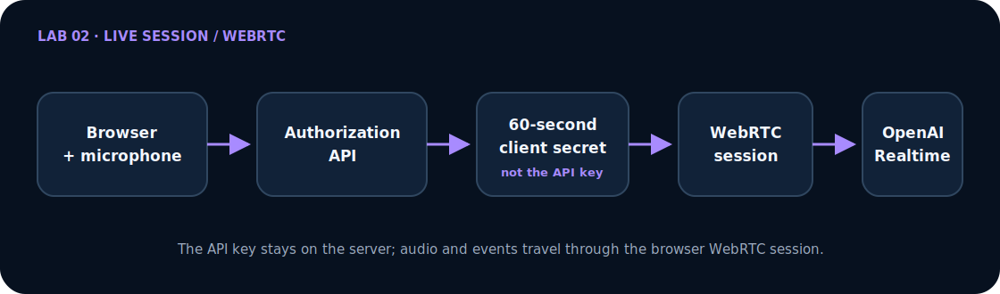

# Lab 02 — Realtime agent: step-by-step workshop

[Português](tutorial.md) · [Workshop index](../../../docs/README-en.md) · [← Lab 01](../../lab-01-text-to-speech/tutorial/tutorial-en.md)

This workshop builds a real speech-to-speech application through concrete actions: open the terminal, create the named file, add its complete content, run the checkpoint, and only then continue.

When you finish, you will have a Next.js application that:

- creates a short-lived Realtime client secret on the server;
- keeps `OPENAI_API_KEY` away from the browser;
- connects audio and events over WebRTC;
- handles connection, listening, thinking, speaking, mute, and interruption;
- provides text fallback and an in-memory transcript;
- explicitly ends and cleans up the session;
- has tests that open no billable session;
- can be deployed with HTTPS.

## Start in 5 minutes

<dl class="lab-meta-grid">
  <div><dt>Outcome</dt><dd>Live voice conversation with mute, interruption, and text</dd></div>
  <div><dt>Full duration</dt><dd>3–4 hours</dd></div>
  <div><dt>Difficulty</dt><dd>Intermediate</dd></div>
  <div><dt>Technologies</dt><dd>Next.js, Agents SDK, Realtime API, WebRTC</dd></div>
  <div><dt>Prerequisites</dt><dd>Node.js 22+, Git, OpenAI API, microphone, modern browser</dd></div>
  <div><dt>Cost</dt><dd>Realtime audio is billed by usage; offline gates incur no API cost</dd></div>
</dl>

If you already have an API key, a microphone, and active billing, run the finished solution:

```bash
git clone --depth 1 https://github.com/glaucia86/openai-voice-playground.git
cd openai-voice-playground/labs/lab-02-realtime-voice-agent
npm ci
cp .env.example .env.local
npm run dev
```

On Windows PowerShell, use `Copy-Item .env.example .env.local`. Fill `OPENAI_API_KEY=` before starting, visit <http://localhost:3000>, read the privacy notice, use headphones, and end the session explicitly. A live test consumes API resources.

<div class="quick-command" markdown="1">

### Would you rather build it?

- **With guidance (recommended):** use the [starter branch](https://github.com/glaucia86/openai-voice-playground/tree/workshop/lab-02-v1-starter) and the [first checkpoint](https://github.com/glaucia86/openai-voice-playground/tree/workshop/lab-02-v1-step-01-session-contract).
- **From an empty directory:** open [Chapter 1](en/01-preparation.md) and choose the complete path.
- **Finished code:** inspect the [`main` implementation](https://github.com/glaucia86/openai-voice-playground/tree/main/labs/lab-02-realtime-voice-agent) without replacing your work.

</div>

## See the outcome before building

<div class="workshop-demo demo-placeholder" role="img" aria-label="Reserved area for a real Lab 02 demonstration; recording is pending because it requires a credential, microphone, and API usage">
  <strong>Real demonstration pending—no result was fabricated</strong>
  <p>The recording must show consent, connection, speech, interruption, mute, a text message, and explicit ending with microphone release. It will be added after a controlled session with no personal data.</p>
  <a href="../../../docs/demo-recording-guide.md">Follow the safe recording plan →</a>
</div>

## Architecture on one screen

<figure class="architecture-figure">
  
  <figcaption>Editable source: <a href="../../../docs/architecture/lab-02.mmd">Mermaid</a>. The SVG keeps GitHub Pages rendering predictable.</figcaption>
</figure>

The server uses `OPENAI_API_KEY` only to validate the request and issue a short-lived client secret with `no-store`. The browser uses that temporary secret to negotiate a WebRTC session directly with the Realtime API; live audio and events do not continuously traverse the Next.js server. The client secret is still a bearer credential: issue it only when needed, never log it, and do not treat it as a replacement for production authentication, consent, distributed quotas, and session limits.

> **Comprehension prompt:** why does a 60-second client secret reduce risk without making the browser a trusted boundary?

## Choose a learning path

| Path | What you do | Recommendation |
| --- | --- | --- |
| **A — run and investigate** | clone `main` and inspect the finished solution | useful for meeting Realtime first |
| **B — build from the starter** | begin with a compilable scaffold and implement each slice | **recommended for this workshop** |
| **C — create from zero** | create directories, configuration, and dependencies too | useful for deep study or a longer class |

The [workshop guide](../../../docs/workshop-guide.md) explains how to preserve your work and inspect checkpoints without destructive commands.

## Start here

1. **[Prepare the account, terminal, microphone, and project](en/01-preparation.md)** — Choose a path, protect the API key, and prove the base runs without starting a session.
2. **[Build the application file by file](en/02-file-by-file-build.md)** — Create the contract, authorization, client secret, agent, WebRTC flow, state model, interface, and tests with complete files.
3. **[Run, diagnose, and deploy](en/03-run-test-deploy.md)** — Run the gates, perform a short smoke test, troubleshoot microphone/WebRTC, and publish over HTTPS.

> Read the **[Lab 02 architecture article](article-en.md)** before or after implementation for deeper reasoning. The article explains why; the chapters above direct your actions.

## Recommended starter

```bash
git clone --branch workshop/lab-02-v1-starter \
  https://github.com/glaucia86/openai-voice-playground.git
cd openai-voice-playground
git switch -c my-lab-02-solution
npm ci --prefix labs/lab-02-realtime-voice-agent
npm run check:lab02
```

The first gate must pass without an API key, microphone permission, or OpenAI session. Then open [Chapter 1](en/01-preparation.md).

## Recovery checkpoints

| After completing | Reference | Compare |
| --- | --- | --- |
| initial base | `workshop/lab-02-v1-starter` | starting point |
| session contract | `workshop/lab-02-v1-step-01-session-contract` | [view diff](https://github.com/glaucia86/openai-voice-playground/compare/workshop/lab-02-v1-starter...workshop/lab-02-v1-step-01-session-contract) |
| authorization and client secret | `workshop/lab-02-v1-step-02-authorization` | [view diff](https://github.com/glaucia86/openai-voice-playground/compare/workshop/lab-02-v1-step-01-session-contract...workshop/lab-02-v1-step-02-authorization) |
| conversation and interface | `workshop/lab-02-v1-step-03-conversation` | [view diff](https://github.com/glaucia86/openai-voice-playground/compare/workshop/lab-02-v1-step-02-authorization...workshop/lab-02-v1-step-03-conversation) |

Commit your branch before comparing. Checkpoints are reading references, not shortcuts for erasing your implementation.

> **Before continuing, confirm that:** you know when the microphone will activate, know how to end the session, chose a path, and can distinguish the standard API key from the short-lived client secret.

## Final evidence

```bash
npm run check:lab02
git status -sb
```

The first command runs lint, TypeScript, tests, and a production build without enabling the microphone or opening a paid connection. The second must confirm that no secret or generated artifact entered Git.

[Start Chapter 1 →](en/01-preparation.md)
