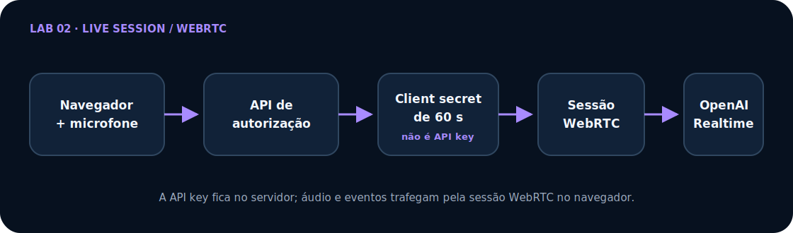

# Lab 02 — Agente Realtime: workshop passo a passo

[Read in English](tutorial-en.md) · [Índice dos workshops](../../../docs/README.md) · [← Lab 01](../../lab-01-text-to-speech/tutorial/tutorial.md)

Neste workshop você cria uma aplicação speech-to-speech real seguindo ações concretas: abra o terminal, crie o arquivo indicado, coloque o conteúdo completo, execute o checkpoint e só então avance.

Ao terminar, você terá uma aplicação Next.js que:

- cria um client secret Realtime curto no servidor;
- mantém `OPENAI_API_KEY` fora do navegador;
- conecta áudio e eventos por WebRTC;
- trata conexão, escuta, raciocínio, fala, mute e interrupção;
- oferece alternativa por texto e transcript em memória;
- encerra e limpa a sessão explicitamente;
- possui testes sem abrir uma sessão faturável;
- pode ser publicada com HTTPS.

## Comece em 5 minutos

<dl class="lab-meta-grid">
  <div><dt>Resultado</dt><dd>Conversa de voz ao vivo com mute, interrupção e texto</dd></div>
  <div><dt>Tempo completo</dt><dd>3–4 horas</dd></div>
  <div><dt>Dificuldade</dt><dd>Intermediário</dd></div>
  <div><dt>Tecnologias</dt><dd>Next.js, Agents SDK, Realtime API, WebRTC</dd></div>
  <div><dt>Pré-requisitos</dt><dd>Node.js 22+, Git, API OpenAI, microfone e navegador moderno</dd></div>
  <div><dt>Custo</dt><dd>Áudio Realtime é cobrado conforme o uso; gates offline não geram custo</dd></div>
</dl>

Se você já possui uma API key, microfone e cobrança ativa, execute a solução final:

```bash
git clone --depth 1 https://github.com/glaucia86/openai-voice-playground.git
cd openai-voice-playground/labs/lab-02-realtime-voice-agent
npm ci
cp .env.example .env.local
npm run dev
```

No Windows PowerShell, use `Copy-Item .env.example .env.local`. Preencha `OPENAI_API_KEY=` antes de iniciar, abra <http://localhost:3000>, leia o aviso de privacidade, use fones e encerre a sessão explicitamente. O teste real gera consumo da API.

<div class="quick-command" markdown="1">

### Prefere construir?

- **Com apoio (recomendado):** use a [branch starter](https://github.com/glaucia86/openai-voice-playground/tree/workshop/lab-02-v1-starter) e o [primeiro checkpoint](https://github.com/glaucia86/openai-voice-playground/tree/workshop/lab-02-v1-step-01-session-contract).
- **Desde uma pasta vazia:** abra o [Capítulo 1](pt/01-preparacao.md) e escolha o caminho completo.
- **Código final:** consulte a [implementação na `main`](https://github.com/glaucia86/openai-voice-playground/tree/main/labs/lab-02-realtime-voice-agent) sem substituir seu trabalho.

</div>

## Veja o resultado antes de construir

<div class="workshop-demo demo-placeholder" role="img" aria-label="Espaço reservado para uma demonstração real do Lab 02; gravação pendente porque exige credencial, microfone e consumo da API">
  <strong>Demonstração real pendente — nenhum resultado foi fabricado</strong>
  <p>A gravação precisa mostrar consentimento, conexão, fala, interrupção, mute, mensagem de texto e encerramento com liberação do microfone. Ela será adicionada quando houver uma sessão controlada e sem dados pessoais.</p>
  <a href="../../../docs/demo-recording-guide-pt-br.md">Siga o roteiro seguro de gravação →</a>
</div>

## Arquitetura em uma tela

<figure class="architecture-figure">
  
  <figcaption>Fonte editável: <a href="../../../docs/architecture/lab-02-pt-br.mmd">Mermaid</a>. O SVG mantém a renderização previsível no GitHub Pages.</figcaption>
</figure>

O servidor usa `OPENAI_API_KEY` apenas para validar o pedido e emitir um client secret curto com `no-store`. O navegador usa esse segredo temporário para negociar a sessão WebRTC diretamente com a Realtime API; áudio e eventos ao vivo não passam continuamente pelo servidor Next.js. O client secret continua sendo uma credencial bearer: deve ser emitido somente quando necessário, não pode ser logado e não substitui autenticação, consentimento, quotas distribuídas e limites de sessão em produção.

> **Pergunta de compreensão:** por que um client secret de 60 segundos reduz o risco, mas não transforma o navegador numa fronteira confiável?

## Escolha como acompanhar

| Caminho | O que você faz | Recomendação |
| --- | --- | --- |
| **A — executar e investigar** | clona a `main` e abre a solução final | bom para conhecer Realtime primeiro |
| **B — construir pelo starter** | parte de uma base compilável e implementa cada fatia | **recomendado para acompanhar o workshop** |
| **C — criar do zero** | cria também pastas, configuração e dependências | bom para estudo aprofundado ou aula longa |

O [guia de acompanhamento](../../../docs/workshop-guide-pt-br.md) explica como preservar seu trabalho e consultar checkpoints sem usar comandos destrutivos.

## Comece agora

1. **[Prepare conta, terminal, microfone e projeto](pt/01-preparacao.md)** — Escolha o caminho, proteja a API key e prove que a base executa sem abrir uma sessão.
2. **[Construa a aplicação arquivo por arquivo](pt/02-construcao-arquivo-por-arquivo.md)** — Crie contrato, autorização, client secret, agente, WebRTC, estados, interface e testes com arquivos completos.
3. **[Execute, diagnostique e publique](pt/03-execucao-testes-deploy.md)** — Rode os gates, faça um smoke test curto, diagnostique microfone/WebRTC e publique com HTTPS.

> Para compreender as decisões antes ou depois da implementação, leia o **[artigo arquitetural do Lab 02](article.md)**. O artigo explica os porquês; os capítulos acima conduzem suas ações.

## Starter recomendado

```bash
git clone --branch workshop/lab-02-v1-starter \
  https://github.com/glaucia86/openai-voice-playground.git
cd openai-voice-playground
git switch -c minha-solucao-lab-02
npm ci --prefix labs/lab-02-realtime-voice-agent
npm run check:lab02
```

O primeiro gate deve passar sem API key, permissão de microfone ou sessão OpenAI. Depois, abra o [Capítulo 1](pt/01-preparacao.md).

## Checkpoints de recuperação

| Depois de concluir | Referência | Comparação |
| --- | --- | --- |
| base inicial | `workshop/lab-02-v1-starter` | ponto de partida |
| contrato da sessão | `workshop/lab-02-v1-step-01-session-contract` | [ver diff](https://github.com/glaucia86/openai-voice-playground/compare/workshop/lab-02-v1-starter...workshop/lab-02-v1-step-01-session-contract) |
| autorização e client secret | `workshop/lab-02-v1-step-02-authorization` | [ver diff](https://github.com/glaucia86/openai-voice-playground/compare/workshop/lab-02-v1-step-01-session-contract...workshop/lab-02-v1-step-02-authorization) |
| conversa e interface | `workshop/lab-02-v1-step-03-conversation` | [ver diff](https://github.com/glaucia86/openai-voice-playground/compare/workshop/lab-02-v1-step-02-authorization...workshop/lab-02-v1-step-03-conversation) |

Faça commit na sua branch antes de comparar. Checkpoints são referências de leitura, não atalhos para apagar sua implementação.

> **Antes de continuar, confirme que:** você entende quando o microfone será ativado, sabe encerrar a sessão, escolheu uma rota e consegue distinguir a API key padrão do client secret curto.

## Evidência final

```bash
npm run check:lab02
git status -sb
```

O primeiro comando executa lint, TypeScript, testes e build sem ligar microfone ou abrir conexão paga. O segundo deve confirmar que nenhum segredo ou artefato foi adicionado ao Git.

[Começar o Capítulo 1 →](pt/01-preparacao.md)
