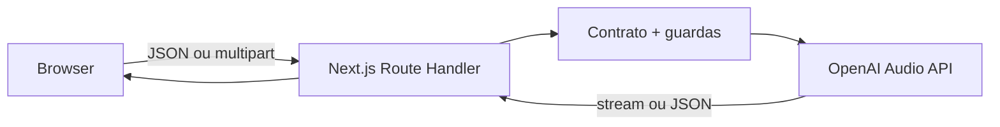
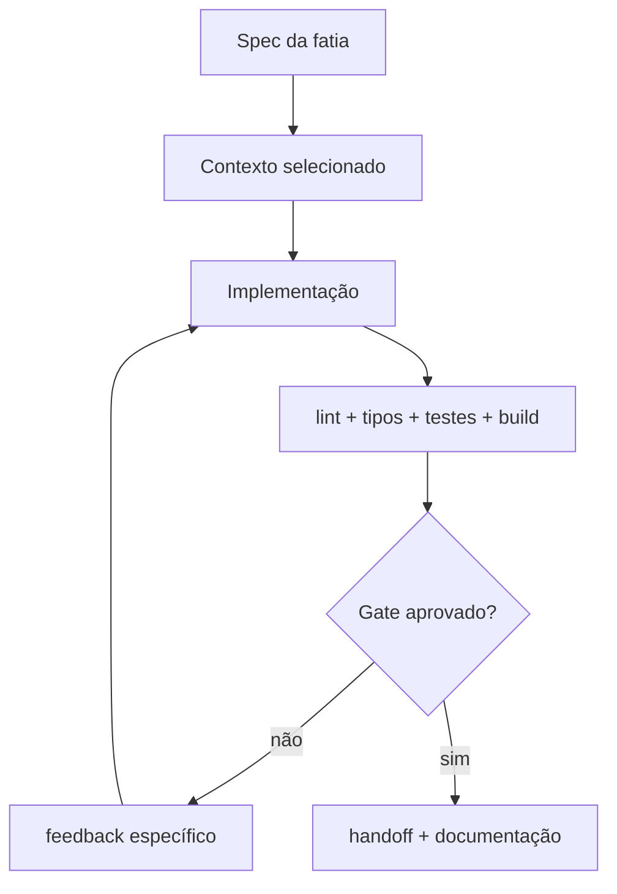

# Da ideia ao deploy: construindo um Voice Playground com OpenAI, Next.js 15 e TypeScript 7

> Um guia incremental sobre APIs de voz, fronteiras de segurança, streaming, testes, Codex e as decisões que separam uma demonstração bonita de uma implementação responsável.

**Autora:** Glaucia Lemos  
**Projeto:** [OpenAI Voice Playground](https://github.com/glaucia86/openai-voice-playground)  
**Última validação técnica:** 19 de julho de 2026

---

## Antes de começar

Este não é um artigo “copie quatro arquivos e diga que está pronto para produção”. A chamada mais curta para uma API de voz cabe em poucas linhas; o trabalho de engenharia está ao redor dela:

- onde a credencial fica;
- quais dados o cliente pode escolher;
- quais limites existem antes de a requisição gerar custo;
- como o sistema falha sem expor informações internas;
- quando streaming melhora de fato a experiência;
- o que é registrado e o que jamais deve aparecer nos logs;
- como outra pessoa — ou o Codex — consegue evoluir o código sem reaprender todas as decisões.

O objetivo é construir uma aplicação pequena com um processo que poderia existir em um time real. Ao final teremos:

1. texto para voz com `gpt-4o-mini-tts`;
2. voz para texto com `gpt-4o-mini-transcribe` e `gpt-4o-transcribe`;
3. gravação pelo navegador e upload de arquivos limitados;
4. API key somente no servidor;
5. validação, erros, rate limit, request IDs e logs sem conteúdo sensível;
6. interface responsiva, acessível e honesta sobre voz gerada por IA;
7. testes, CI, build e deploy na Vercel;
8. um fluxo reprodutível para trabalhar com Codex.

O código completo está no repositório, mas minha recomendação é seguir as fatias na ordem. O valor didático está justamente em ver o sistema ganhar capacidade e proteção ao mesmo tempo.

## Sumário

1. [Escolha a arquitetura antes da API](#1-escolha-a-arquitetura-antes-da-api)
2. [Defina o contrato e as fatias verticais](#2-defina-o-contrato-e-as-fatias-verticais)
3. [Crie uma base reproduzível](#3-crie-uma-base-reproduzível)
4. [Estabeleça a fronteira servidor–OpenAI](#4-estabeleça-a-fronteira-servidoropenai)
5. [Implemente texto para voz com streaming](#5-implemente-texto-para-voz-com-streaming)
6. [Consuma o stream no navegador sem mentir sobre a UX](#6-consuma-o-stream-no-navegador-sem-mentir-sobre-a-ux)
7. [Implemente transcrição de áudio limitado](#7-implemente-transcrição-de-áudio-limitado)
8. [Capture o microfone com a MediaRecorder API](#8-capture-o-microfone-com-a-mediarecorder-api)
9. [Projete erros, observabilidade e privacidade](#9-projete-erros-observabilidade-e-privacidade)
10. [Proteja custo e uso público](#10-proteja-custo-e-uso-público)
11. [Teste as regras, não a OpenAI](#11-teste-as-regras-não-a-openai)
12. [Use Codex como parte de um harness](#12-use-codex-como-parte-de-um-harness)
13. [Faça deploy na Vercel](#13-faça-deploy-na-vercel)
14. [O que ainda falta para o seu contexto de produção](#14-o-que-ainda-falta-para-o-seu-contexto-de-produção)

---

## 1. Escolha a arquitetura antes da API

“Aplicação de voz” pode significar produtos muito diferentes. Antes de escolher endpoint ou SDK, classifique a interação.

| Necessidade | Arquitetura mais adequada | Exemplo |
| --- | --- | --- |
| Texto delimitado vira arquivo de áudio | Speech API request-based | Narração, acessibilidade, prévia de locução |
| Arquivo pronto vira texto | Transcriptions API request-based | Nota de voz, reunião gravada, legenda pós-processada |
| Microfone envia deltas enquanto a pessoa fala | Realtime transcription | Legenda ao vivo, ditado contínuo |
| Modelo escuta, raciocina e responde por voz com baixa latência | Realtime voice session | Agente conversacional |

A própria visão geral de [Audio and speech](https://developers.openai.com/api/docs/guides/audio) separa APIs request-based de sessões Realtime: entradas delimitadas são mais simples; áudio ao vivo exige uma conexão de baixa latência e eventos parciais.

### Nossa decisão

O playground trabalha com duas interações delimitadas:

- uma string de até 4.096 caracteres para gerar voz;
- um arquivo ou uma gravação finalizada de até 25 MB para transcrever.

Portanto, usaremos a Speech API e a Transcriptions API. Não abriremos uma sessão Realtime somente para tornar o diagrama mais sofisticado.

Essa decisão reduz estado, custo operacional, tratamento de reconexão e superfície de erro. Também torna explícito o próximo passo: se o requisito mudar para legendas enquanto a pessoa fala, não devemos “esticar” o upload atual; devemos criar uma fatia própria baseada em [Realtime transcription](https://developers.openai.com/api/docs/guides/realtime-transcription).

### A fronteira principal



O navegador não chama `api.openai.com` diretamente. Ele chama nossa aplicação. A Route Handler:

1. autentica a implantação, se configurado;
2. valida origem e quota;
3. valida o corpo;
4. escolhe modelo e parâmetros permitidos;
5. chama a OpenAI com a chave do servidor;
6. devolve um contrato estável para a interface.

Essa camada não existe apenas para “esconder a chave”. Ela impede que o cliente transforme qualquer string em um nome de modelo, envie um arquivo arbitrariamente grande ou passe opções que o produto não decidiu suportar.

---

## 2. Defina o contrato e as fatias verticais

Antes de gerar arquivos, escreva uma definição curta de pronto.

### Objetivo

Permitir que uma pessoa experimente geração e transcrição de voz, entenda o caminho da requisição e receba feedback acessível em todos os estados relevantes.

### Restrições

- Next.js 15 e App Router;
- TypeScript 7 em modo estrito;
- SDK oficial `openai` no servidor;
- nenhuma credencial, transcrição ou gravação persistida;
- voz sintética identificada como gerada por IA;
- sem chamada paga em teste automatizado;
- deploy compatível com Vercel Functions.

### Definição de pronto

- happy path e erros desenhados;
- lint, type-check, testes e build aprovados;
- `.env.local` ignorado pelo Git;
- documentação coerente com o código;
- limitações de produção declaradas.

### Fatias verticais

Em vez de “fazer todo o backend” e depois “fazer todo o frontend”, entregamos capacidade verificável de ponta a ponta.

| Fatia | Comportamento observável | Gate |
| --- | --- | --- |
| 0. Base | Projeto sobe e `/api/health` informa configuração sem expor segredo | type-check + build |
| 1. TTS mínimo | Texto validado retorna MP3 pelo servidor | teste de schema + chamada manual |
| 2. TTS utilizável | Voz, instrução, formato, velocidade, stream e download | acessibilidade + cancelamento |
| 3. STT mínimo | Arquivo válido retorna transcrição | limites e allowlist testados |
| 4. Captura | Navegador grava WebM/MP4 e envia somente ao confirmar | teste em Chrome/Safari |
| 5. Hardening | token opcional, origem, quota, request ID, logs sanitizados | testes de guardas |
| 6. Entrega | README, tutorial, CI e Vercel | `npm run check` |

O ponto importante é que cada fatia atravessa interface, contrato, servidor e validação. Se o contexto acabar ou outra pessoa assumir, há um estado funcional e explicável para continuar.

---

## 3. Crie uma base reproduzível

### Versões usadas

O repositório fixa as versões principais no `package.json`:

```json
{
  "dependencies": {
    "next": "15.5.20",
    "openai": "^6.48.0",
    "react": "19.2.7",
    "zod": "^4.4.3"
  },
  "devDependencies": {
    "oxlint": "^1.74.0",
    "typescript": "5.8.2",
    "typescript7": "npm:typescript@7.0.2",
    "vitest": "^4.1.10"
  }
}
```

Usamos Node.js 20 ou superior. O `package-lock.json` entra no repositório e o CI usa `npm ci`. “Funcionou hoje na minha máquina com `latest`” não é reprodutibilidade.

### TypeScript 7 com Next.js 15: o detalhe que apareceu na validação

TypeScript 7 é a versão estável atual — a própria página de [instalação do TypeScript](https://www.typescriptlang.org/download/) informa a série 7.0. Todo o código do projeto é validado pelo compilador 7.0.2. Para gerar o bundle com Next.js 15, porém, precisamos registrar uma incompatibilidade real em vez de escondê-la.

Ferramentas auxiliares distribuídas com Next.js 15 foram publicadas antes da mudança interna do TypeScript 7. O parser TypeScript do preset ESLint falha antes de analisar nosso código; o carregador de `next.config.ts` usa uma API removida; e o bootstrap de build importa `typescript/lib/typescript.js` literalmente, mesmo com a checagem interna desabilitada. Instalar apenas o pacote 7 faz o Next tentar substituí-lo por 5.8 durante o build.

Adotamos uma toolchain dupla e explícita. O pacote canônico `typescript@5.8.2` existe somente para a infraestrutura interna do Next 15; o alias npm `typescript7` é a autoridade sobre o código. Um pequeno runner multiplataforma chama o binário correto sem depender de qual pacote ganhou o link `node_modules/.bin/tsc`:

```json
{
  "scripts": {
    "lint": "oxlint --deny-warnings src tests",
    "typecheck": "node scripts/typecheck.mjs --noEmit"
  },
  "devDependencies": {
    "typescript": "5.8.2",
    "typescript7": "npm:typescript@7.0.2"
  }
}
```

Trade-off: mantemos dois compiladores instalados e deixamos de usar algumas regras específicas do preset `next/core-web-vitals`. Isso aumenta um pouco as dependências, mas torna a fronteira honesta e verificável: `npm run typecheck` imprime e executa TypeScript 7; o pacote 5.8 nunca decide os tipos da aplicação. A configuração do framework fica em `next.config.mjs`, carregada pelo Node. Como o bundler do Next 15 também não interpreta corretamente o `paths` do TS 7, o alias `@` é declarado no callback `webpack`; o `tsconfig` continua sendo a fonte para o compilador e o editor. Desabilitamos o checker e o lint duplicados dentro de `next build`; `npm run check` e o CI exigem Oxlint e TS 7 antes do bundle. Rodar `npm run build` isoladamente não substitui esses gates. Quando o Next suportar integralmente TS 7, removemos o adaptador 5.8, o alias e o runner — compatibilidade deve ter prazo de validade.

### Strict não é decoração

O `tsconfig.json` ativa:

```json
{
  "compilerOptions": {
    "strict": true,
    "noUncheckedIndexedAccess": true,
    "exactOptionalPropertyTypes": true,
    "noEmit": true,
    "moduleResolution": "bundler"
  }
}
```

`exactOptionalPropertyTypes` encontrou, por exemplo, a diferença entre omitir `instructions` e enviar `instructions: undefined` ao SDK. O objeto final usa spread condicional. É uma correção pequena, mas traduz uma ideia importante: contrato opcional não é necessariamente igual a campo presente com valor indefinido.

### Segredo local

Copie o modelo:

```bash
cp .env.example .env.local
```

E preencha apenas localmente:

```dotenv
OPENAI_API_KEY=your_project_key
```

O `.gitignore` começa protegendo qualquer arquivo de ambiente e libera somente o exemplo:

```gitignore
.env*
!.env.example
```

Não use `NEXT_PUBLIC_OPENAI_API_KEY`. Variáveis com `NEXT_PUBLIC_` são incorporadas ao bundle do navegador pelo Next.js. Uma Route Handler não corrige uma chave que já foi publicada pelo frontend.

---

## 4. Estabeleça a fronteira servidor–OpenAI

### Um cliente centralizado e preguiçoso

`src/lib/openai.ts` cria o cliente somente quando uma rota realmente precisa dele:

```ts
import OpenAI from "openai";

const globalForOpenAI = globalThis as unknown as { openai?: OpenAI };

export function getOpenAIClient(): OpenAI {
  const apiKey = process.env.OPENAI_API_KEY;

  if (!apiKey) {
    throw new AppError(
      503,
      "configuration_error",
      "The voice service is not configured.",
    );
  }

  globalForOpenAI.openai ??= new OpenAI({
    apiKey,
    maxRetries: 2,
    timeout: 45_000,
  });

  return globalForOpenAI.openai;
}
```

A checagem explícita produz um erro de produto melhor que uma exceção genérica do SDK. Reutilizar a instância também evita recriar configuração a cada chamada em um processo já aquecido.

### Health check sem vazamento

`GET /api/health` responde se a aplicação está configurada, não qual é a chave:

```json
{
  "ok": true,
  "configured": true,
  "requiresAccessToken": false,
  "capabilities": {
    "speechModel": "gpt-4o-mini-tts",
    "streamedSpeech": true
  }
}
```

Evite “testar” configuração retornando os primeiros caracteres do segredo. Redação parcial continua sendo material sensível e costuma acabar em screenshot, log ou analytics.

### Contratos com Zod

O tipo TypeScript desaparece em runtime. A requisição HTTP precisa de validação real:

```ts
export const speechRequestSchema = z
  .object({
    text: z.string().trim().min(1).max(4_096),
    voice: z.enum(VOICE_IDS),
    format: z.enum(["mp3", "wav", "opus"]).default("mp3"),
    instructions: z.string().trim().max(4_096).optional().default(""),
    speed: z.coerce.number().min(0.25).max(4).default(1),
  })
  .strict();
```

O limite de 4.096 caracteres vem da referência de [Create speech](https://developers.openai.com/api/reference/resources/audio/subresources/speech/methods/create/). Repetimos esse limite no cliente por usabilidade e no servidor por segurança. O cliente ajuda; o servidor decide.

`strict()` rejeita campos extras. Se alguém enviar `model: "qualquer-modelo"` ou `apiKey: "…"`, isso não será aceito silenciosamente.

---

## 5. Implemente texto para voz com streaming

A documentação de [Text to speech](https://developers.openai.com/api/docs/guides/text-to-speech) recomenda `gpt-4o-mini-tts` para geração de voz atual e mostra que `instructions` pode controlar tom, ritmo, emoção, entonação e outros aspectos de entrega.

O núcleo de `POST /api/speech` é:

```ts
const payload = speechRequestSchema.parse(await request.json());
const openai = getOpenAIClient();

const speech = await openai.audio.speech.create(
  {
    model: "gpt-4o-mini-tts",
    input: payload.text,
    voice: payload.voice,
    ...(payload.instructions ? { instructions: payload.instructions } : {}),
    response_format: payload.format,
    speed: payload.speed,
    stream_format: "audio",
  },
  { signal: request.signal },
);
```

Note três decisões.

### 5.1 O cliente não escolhe o modelo livremente

O servidor fixa `gpt-4o-mini-tts`. Um seletor arbitrário parece flexível, mas transfere ao visitante uma decisão de capacidade, disponibilidade e custo que pertence ao produto. Quando houver uma razão para oferecer outro modelo, transforme isso em uma opção enumerada e testada.

### 5.2 Cancelamento atravessa a fronteira

O `AbortSignal` recebido pela Route Handler é enviado ao SDK. Cancelar a operação no navegador deixa de ser apenas esconder um spinner: a intenção de cancelamento chega à chamada de rede quando possível.

### 5.3 O servidor não transforma o áudio inteiro em Buffer

O antipadrão comum é:

```ts
// Evite no caminho de streaming:
const buffer = Buffer.from(await speech.arrayBuffer());
return new Response(buffer);
```

Isso espera o arquivo inteiro e mantém todos os bytes na memória da função. Em vez disso, devolvemos o corpo recebido:

```ts
if (!speech.body) {
  throw new AppError(502, "empty_audio_stream", "OpenAI returned an empty audio stream.");
}

return new Response(speech.body, {
  headers: {
    "Content-Type": CONTENT_TYPES[payload.format],
    "Cache-Control": "no-store",
    "X-Request-Id": requestId,
    "X-Model": "gpt-4o-mini-tts"
  },
});
```

O `ReadableStream` passa pela Route Handler sem buffer integral no servidor. A Speech API usa transferência em chunks. A documentação também explica os formatos: MP3 é geral, Opus é adequado a comunicação/streaming e WAV evita custo de decodificação, mas é maior.

### Divulgação obrigatória da voz sintética

A documentação de TTS afirma que a aplicação deve informar claramente que a voz ouvida é gerada por IA, não humana. Por isso a interface mostra “AI-generated voice” ao lado do resultado. Isso não deve ficar escondido nos termos de uso.

Também evitamos apresentar `instructions` como um campo de “clone qualquer pessoa”. O texto de ajuda orienta estilo de entrega e desestimula personificação de uma pessoa real. Em um produto, acrescente política, moderação e consentimento apropriados ao caso de uso.

---

## 6. Consuma o stream no navegador sem mentir sobre a UX

No cliente, `fetch` expõe `response.body` como `ReadableStream`:

```ts
const response = await fetch("/api/speech", {
  method: "POST",
  headers: {
    "Content-Type": "application/json",
    ...authorizationHeaders(accessToken),
  },
  body: JSON.stringify({ text, instructions, voice, format, speed }),
  signal: controller.signal,
});

const reader = response.body.getReader();
const chunks: ArrayBuffer[] = [];
let totalBytes = 0;

while (true) {
  const { done, value } = await reader.read();
  if (done) break;

  const copy = new Uint8Array(value.byteLength);
  copy.set(value);
  chunks.push(copy.buffer);
  totalBytes += value.byteLength;
  setReceivedBytes(totalBytes);
}

const blob = new Blob(chunks, { type: response.headers.get("content-type")! });
const audioUrl = URL.createObjectURL(blob);
```

### O que está sendo transmitido e o que ainda está sendo acumulado?

O servidor começa a encaminhar bytes sem esperar o arquivo completo. A interface consegue exibir progresso real de bytes recebidos. Porém, para compatibilidade entre formatos e navegadores, esta primeira versão monta um `Blob` completo antes de ligar a URL ao `<audio>`.

Portanto:

- há streaming de transporte OpenAI → servidor → navegador;
- não prometemos playback progressivo no componente atual;
- o servidor evita buffer integral;
- o navegador acumula o resultado para reprodução e download compatíveis.

Playback antes do fim exigiria uma implementação com Media Source Extensions, formato cuidadosamente escolhido e fallbacks por navegador — ou uma arquitetura Realtime. Não é impossível; apenas não é gratuito.

### Limpeza de memória

Object URLs precisam ser revogadas:

```ts
if (currentObjectUrlRef.current) {
  URL.revokeObjectURL(currentObjectUrlRef.current);
}
```

Também abortamos a requisição ao desmontar o componente. Microinteração bonita não compensa vazamento de memória em uma sessão longa.

### Estados que desenhamos

- configuração do servidor em verificação;
- chave ausente;
- token da implantação necessário;
- pronto para gerar;
- stream iniciado e bytes recebidos;
- cancelado;
- erro sanitizado com request ID;
- áudio pronto, player e download.

O `aria-live` anuncia o progresso sem roubar foco. Animações respeitam `prefers-reduced-motion`.

---

## 7. Implemente transcrição de áudio limitado

A documentação de [Speech to text](https://developers.openai.com/api/docs/guides/speech-to-text) informa:

- uploads de até 25 MB;
- formatos como MP3, MP4, MPEG, MPGA, M4A, WAV e WebM;
- `gpt-4o-mini-transcribe` para menor custo;
- `gpt-4o-transcribe` para maior precisão;
- `prompt` como contexto útil para termos e acrônimos;
- `language` em ISO-639-1 pode melhorar precisão e latência.

### Validação antes da chamada paga

Não confie no atributo `accept` do input. Ele só orienta o seletor do navegador.

No servidor:

```ts
const formData = await request.formData();
const file = formData.get("audio");

if (!(file instanceof File)) {
  throw new AppError(400, "audio_required", "Select or record an audio file first.");
}

if (file.size === 0) {
  throw new AppError(400, "empty_audio", "The selected audio file is empty.");
}

if (file.size > MAX_AUDIO_BYTES) {
  throw new AppError(413, "audio_too_large", "Audio files must be 25 MB or smaller.");
}
```

Validamos `Content-Length` antes de chamar `request.formData()` quando o header existe. Depois validamos o tamanho real do `File`, porque o header pode faltar ou não ser confiável.

MIME type também não é prova criptográfica do conteúdo. A allowlist de MIME + extensão reduz erros acidentais e payloads óbvios; um produto de maior risco deve inspecionar magic bytes, processar em ambiente isolado e considerar malware scanning.

### Chamada ao SDK

```ts
const transcription = await openai.audio.transcriptions.create(
  {
    file,
    model: fields.model,
    response_format: "json",
    ...(fields.language ? { language: fields.language } : {}),
    ...(fields.prompt ? { prompt: fields.prompt } : {}),
  },
  { signal: request.signal },
);
```

O prompt padrão sugere vocabulário como OpenAI, Codex, TypeScript e Next.js. Ele não instrui o modelo a “corrigir o que foi dito”. A finalidade é reduzir reconhecimento incorreto de nomes raros.

### Por que a transcrição desta fatia não usa streaming?

A API hoje permite streaming de eventos para um arquivo já concluído. Ainda assim, nossa entrada principal são notas curtas e o produto precisa do texto final antes de mostrar ações de cópia. O ganho percebido seria pequeno, e adicionaríamos parser SSE, reconciliação de deltas e mais estados de falha.

Se o requisito for arquivo longo com texto parcial útil, a decisão muda. Se for microfone contínuo, a decisão muda ainda mais: use uma sessão Realtime, não vários uploads curtos em loop.

O critério é valor para a interação, não a disponibilidade do parâmetro `stream: true`.

---

## 8. Capture o microfone com a MediaRecorder API

No navegador:

```ts
const stream = await navigator.mediaDevices.getUserMedia({
  audio: {
    echoCancellation: true,
    noiseSuppression: true,
  },
});
```

Escolhemos um formato suportado dinamicamente:

```ts
function pickRecordingMimeType(): string {
  const options = [
    "audio/webm;codecs=opus",
    "audio/mp4",
    "audio/webm",
  ];

  return options.find((option) => MediaRecorder.isTypeSupported(option)) ?? "";
}
```

Isso importa porque Safari e navegadores Chromium não têm exatamente a mesma preferência de container.

### Ciclo de vida da gravação

1. pedir permissão somente depois do clique;
2. acumular `Blob` chunks localmente;
3. parar automaticamente após dois minutos;
4. encerrar todas as tracks do `MediaStream`;
5. criar um `File` somente ao finalizar;
6. exibir o arquivo selecionado antes de enviar;
7. limpar timer, recorder e tracks ao desmontar.

A interface informa: a gravação permanece no browser até a pessoa mandar transcrever. Depois do envio, o app encaminha o arquivo à OpenAI e não o salva localmente. “Não persistir” não significa “não transmitir”; essa distinção precisa estar clara na política do produto.

### Erros de permissão são parte do fluxo

`NotAllowedError` não deve virar “Something went wrong”. A mensagem orienta a liberar o microfone ou usar upload. A mesma tela continua útil quando gravação não é suportada.

---

## 9. Projete erros, observabilidade e privacidade

### Envelope estável

O frontend recebe:

```json
{
  "error": {
    "code": "audio_too_large",
    "message": "Audio files must be 25 MB or smaller.",
    "requestId": "8d966daa-..."
  }
}
```

Erros do SDK são traduzidos. Não devolvemos `error.message` bruto da OpenAI, stack trace, nome de projeto, detalhes de autenticação ou payload original.

Mapeamentos importantes:

| Origem | Resposta do produto |
| --- | --- |
| Zod | `400 invalid_request` |
| JSON inválido | `400 invalid_json` |
| arquivo grande | `413 audio_too_large` |
| formato bloqueado | `415 unsupported_audio` |
| quota local | `429 rate_limit_exceeded` |
| rate limit da OpenAI | `429 upstream_rate_limit` |
| credencial upstream inválida | `503 upstream_authentication_error` |
| outro erro upstream | `502 upstream_error` |

### Request ID

Cada rota gera um UUID, devolve `X-Request-Id` e inclui o mesmo valor no erro. Assim, suporte consegue correlacionar relato e log sem pedir ao usuário que publique o texto ou o áudio.

### Logue metadados, não conteúdo

Exemplo de evento:

```json
{
  "timestamp": "2026-07-19T03:00:00.000Z",
  "event": "transcription.completed",
  "requestId": "8d966daa-...",
  "route": "transcribe",
  "durationMs": 1840,
  "status": 200,
  "model": "gpt-4o-mini-transcribe",
  "inputSize": 381204,
  "outputSize": 412
}
```

Não entram:

- texto enviado ao TTS;
- instruções de voz;
- nome do arquivo;
- transcript;
- bytes de áudio;
- API key;
- access token.

Mesmo o tamanho pode ser sensível em alguns domínios. O schema de log deve passar pela sua análise de risco, e acesso/retenção precisam ser controlados.

### Privacidade de API não substitui governança do produto

A [página de privacidade empresarial da OpenAI](https://openai.com/enterprise-privacy/) informa que dados da API não são usados para treinamento por padrão. Ainda assim, a sua organização precisa avaliar retenção aplicável, região, consentimento, base legal, dados de crianças, dados biométricos/voz e termos do caso de uso.

Um README não é DPIA, política de privacidade ou parecer jurídico.

---

## 10. Proteja custo e uso público

Uma chave escondida no servidor ainda pode ser consumida por uma rota pública. “A chave não vazou” e “ninguém consegue gastar minha quota” são problemas diferentes.

### Camadas incluídas

1. **Same-origin check** — bloqueia requisições cross-site explícitas de browser.
2. **Limite de corpo** — rejeita JSON e multipart grandes antes do trabalho caro, quando possível.
3. **Allowlist** — modelo, voz, formato e idioma são enumerados.
4. **Rate limit local** — dez chamadas por minuto por rota/endereço em cada processo.
5. **Token opcional** — `PLAYGROUND_ACCESS_TOKEN` protege workshops e demos privadas.
6. **Timeout/retries limitados** — o SDK usa timeout de 45 segundos e duas tentativas.
7. **No-store** — respostas sensíveis não devem ser armazenadas por caches intermediários.

### O rate limiter local não é distribuído

Uma `Map` funciona como proteção didática e reduz acidentes em uma instância. Em serverless:

- instâncias não compartilham memória;
- cold starts criam mapas vazios;
- IP pode representar proxy ou grupo de usuários;
- headers podem ser forjados fora da infraestrutura confiável.

Para produto público, use armazenamento compartilhado, quota por identidade, proteção contra automação e limites de orçamento no projeto OpenAI.

### Token compartilhado também não é identidade

Se `PLAYGROUND_ACCESS_TOKEN` estiver configurado, o health check informa apenas que o token é necessário. A pessoa digita o valor, que fica no estado React e vai no header `Authorization`. Não usamos `localStorage`.

Isso é suficiente para uma audiência conhecida em um workshop. Não oferece revogação individual, papel, auditoria por usuário ou MFA. Para isso, implemente autenticação real.

### Headers de segurança

`next.config.mjs` adiciona CSP, `X-Content-Type-Options`, política de referrer, restrição de framing, COOP/CORP e uma `Permissions-Policy` que libera microfone somente para a própria origem.

Headers reduzem superfície, mas precisam ser testados junto com analytics, fontes, CDN e ferramentas reais do produto. Copiar uma CSP pronta e depois adicionar `*` quando algo quebra elimina seu valor.

---

## 11. Teste as regras, não a OpenAI

Testes automatizados deste repositório não consomem a API. Eles testam nossa responsabilidade:

- defaults e limites do schema de TTS;
- rejeição de voz e campos extras;
- código de idioma;
- janela e headers do rate limiter;
- origem e token de acesso;
- parser do envelope de erro;
- formatação de bytes.

Exemplo:

```ts
it("blocks a request after the limit", () => {
  checkRateLimit("speech:client", {
    limit: 1,
    windowMs: 1_000,
    now: 100,
  });

  const blocked = checkRateLimit("speech:client", {
    limit: 1,
    windowMs: 1_000,
    now: 200,
  });

  expect(blocked).toEqual({
    allowed: false,
    limit: 1,
    remaining: 0,
    resetAt: 1_100,
  });
});
```

### Pirâmide de validação

```text
Durante a fatia:    teste focado + type-check
Antes do commit:    lint + type-check + testes
Antes do deploy:    coverage + build de produção
Depois do deploy:   health check + smoke test manual controlado
```

Comandos:

```bash
npm run lint
npm run typecheck
npm test
npm run test:coverage
npm run build
```

O CI usa `npm ci` e uma chave fictícia somente para o build. Nenhuma rota é executada durante o build; se isso mudar, o teste precisa continuar impedindo uma chamada paga acidental.

### O que testar em integração depois

Para um time com ambiente de staging e orçamento controlado, adicione poucos contract tests contra a API real:

- TTS curto retorna content type e bytes válidos;
- transcrição de fixture sintética conhecida mantém qualidade mínima;
- modelo sem permissão produz erro mapeado;
- latência e tamanho ficam abaixo de SLOs definidos.

Esses testes não devem rodar em todo pull request sem controle de custo e flakiness.

---

## 12. Use Codex como parte de um harness

Codex ajudou a acelerar implementação e validação, mas o processo não foi “crie um app bonito”. Um agente precisa de objetivo, contexto, restrições e definição de pronto. A documentação de [Codex best practices](https://developers.openai.com/codex/learn/best-practices) recomenda exatamente esses quatro elementos e orienta usar `AGENTS.md` como instrução durável do repositório.

### Prompt de uma fatia, não do universo

Exemplo para implementar TTS:

```md
Objetivo:
Implementar POST /api/speech e um cliente mínimo que gere áudio.

Contexto:
- src/lib/constants.ts
- src/lib/schemas.ts
- documentação oficial de Create speech

Restrições:
- OPENAI_API_KEY somente no servidor
- modelo fixo gpt-4o-mini-tts
- texto máximo de 4096 caracteres
- não registrar texto ou instruções
- encaminhar o ReadableStream sem Buffer integral
- erro sanitizado com request ID

Pronto quando:
- MP3 é reproduzível no navegador
- cancelamento usa AbortSignal
- schema e erros possuem testes
- lint, type-check e testes passam
```

Esse prompt reduz ambiguidade sem despejar o repositório inteiro no contexto.

### `AGENTS.md` como memória operacional

O arquivo na raiz registra:

- mapa do repositório;
- comandos oficiais;
- proibições de segurança;
- convenções de TypeScript e UI;
- diferença entre streaming de TTS e Realtime;
- definition of done.

Isso evita repetir “nunca logue transcript” em toda tarefa e torna revisão humana mais objetiva. Se uma regra mudar, atualize o arquivo; não confie na memória de uma conversa antiga.

### Context Engineering aplicado

Forneça apenas o conjunto de contexto necessário à fatia:

- contrato e constantes;
- rota vizinha como padrão;
- trecho exato da documentação oficial;
- teste que demonstra a regra;
- erro atual, se houver.

Não entregue 40 screenshots, toda a documentação da OpenAI e o `node_modules`. Contexto demais também degrada decisão.

### Harness Engineering aplicado

O harness deste projeto não é um framework mágico. É o sistema ao redor da geração:



O agente gera uma proposta; o harness produz evidência.

### Como lidar com APIs atuais

Não peça ao Codex para “lembrar quais vozes existem”. Peça para consultar a fonte atual e registrar a referência. APIs, modelos e SDKs mudam.

Para este projeto, fontes de verdade incluem:

- [Audio and speech](https://developers.openai.com/api/docs/guides/audio);
- [Text to speech](https://developers.openai.com/api/docs/guides/text-to-speech);
- [Speech to text](https://developers.openai.com/api/docs/guides/speech-to-text);
- [TypeScript SDK reference](https://developers.openai.com/api/reference/typescript/);
- [Create speech API reference](https://developers.openai.com/api/reference/resources/audio/subresources/speech/methods/create/);
- [Create transcription API reference](https://developers.openai.com/api/reference/resources/audio/subresources/transcriptions/methods/create/).

### Handoff limpo

Ao terminar uma fatia, registre:

```md
Estado:
- POST /api/speech implementado e stream validado.

Decisões:
- modelo fixo no servidor;
- MP3 default; WAV e Opus enumerados;
- browser acumula Blob por compatibilidade.

Validação:
- npm run lint ✅
- npm run typecheck ✅
- npm test ✅

Próxima fatia:
- upload e transcrição limitados.

Riscos abertos:
- rate limit ainda é process-local.
```

Esse resumo é mais útil que compactar toda a conversa automaticamente e torcer para a próxima janela reconstruir as decisões.

---

## 13. Faça deploy na Vercel

### 13.1 Importe o repositório

Na Vercel, crie um projeto a partir de:

```text
https://github.com/glaucia86/openai-voice-playground
```

O framework será detectado como Next.js.

### 13.2 Configure variáveis

Em **Project Settings → Environment Variables**:

```dotenv
OPENAI_API_KEY=...
PLAYGROUND_ACCESS_TOKEN=uma-frase-longa-e-aleatoria
APP_ORIGIN=https://seu-dominio.example
```

`OPENAI_API_KEY` é obrigatório. Os outros são opcionais, mas recomendo acesso protegido para demos públicas. A documentação de [Environment variables na Vercel](https://vercel.com/docs/environment-variables) explica que variáveis ficam fora do código e são criptografadas em repouso.

Escolha conscientemente os ambientes:

- Production;
- Preview;
- Development.

Uma chave de produção não precisa estar disponível em todo preview criado por qualquer branch. Prefira projetos/chaves separados e permissões mínimas.

### 13.3 Faça o deploy

O pipeline executa:

```bash
npm ci
npm run lint
npm run typecheck
npm run test:coverage
npm run build
```

### 13.4 Valide sem expor segredo

Abra:

```text
https://seu-dominio.example/api/health
```

Confirme:

```json
{
  "ok": true,
  "configured": true
}
```

Depois execute smoke tests curtos:

1. TTS com uma frase sem dado pessoal;
2. cancelamento durante geração;
3. gravação curta com consentimento;
4. arquivo maior que o limite rejeitado antes do upstream;
5. token incorreto produz `401`;
6. request ID aparece em falha;
7. layout e teclado em viewport móvel.

### 13.5 Configure operação

Antes de divulgar a URL:

- orçamento e alerta no projeto OpenAI;
- Deployment Protection ou autenticação;
- distributed rate limit;
- logs e alertas sem conteúdo;
- política de retenção da plataforma;
- domínio e `APP_ORIGIN` corretos;
- plano de rotação de chave;
- owner para incidente e abuso.

---

## 14. O que ainda falta para o seu contexto de produção

“Production-minded” descreve os padrões incorporados. “Pronto para a sua produção” depende de requisitos que nenhum template conhece.

### Checklist de decisão

#### Produto e UX

- [ ] O usuário entende quando áudio é enviado?
- [ ] A voz sintética é claramente identificada?
- [ ] Existe consentimento para gravar terceiros?
- [ ] Cancelamento e retry são compreensíveis?
- [ ] Teclado, leitor de tela, contraste e reduced motion foram testados?

#### Segurança e abuso

- [ ] Há autenticação individual?
- [ ] A quota é por usuário/tenant e distribuída?
- [ ] Existe limite financeiro no projeto OpenAI?
- [ ] Upload passa por inspeção adequada ao risco?
- [ ] Chaves têm escopo, rotação e owner?
- [ ] CSP e proxy headers foram validados no ambiente real?

#### Dados e compliance

- [ ] Base legal e consentimento estão definidos?
- [ ] Retenção e deleção estão documentadas?
- [ ] Regiões e subprocessadores foram avaliados?
- [ ] Dados de voz sensíveis são permitidos?
- [ ] Logs, suporte e analytics evitam conteúdo?

#### Confiabilidade e custo

- [ ] Há SLO de latência e erro?
- [ ] Retry não multiplica custo indevidamente?
- [ ] Circuit breaker ou degradação foi considerado?
- [ ] Métricas diferenciam erro local e upstream?
- [ ] Existe teste de contrato controlado?

### Trade-offs que ficaram explícitos

| Decisão | Benefício | Limite assumido |
| --- | --- | --- |
| Route Handlers server-side | chave isolada e contrato controlado | servidor vira ponto de custo e latência |
| modelo fixo para TTS | previsibilidade | menos experimentação arbitrária |
| mini/full enumerados no STT | escolha simples de custo/qualidade | catálogo não é dinâmico |
| stream no servidor + Blob no browser | memória menor no servidor e player compatível | playback só após completar |
| upload request-based | implementação simples e robusta | sem deltas ao vivo |
| rate limit em memória | zero infraestrutura para tutorial | não protege múltiplas instâncias |
| access token compartilhado | protege workshop rapidamente | não substitui identidade |
| Oxlint + `tsc` + config `.mjs` | compatibilidade com TS 7 | gates separados; build isolado não faz type-check |

### Armadilhas comuns

1. **Chamar a OpenAI diretamente do browser com a chave.** Não faça isso.
2. **Validar apenas no formulário.** Qualquer cliente pode chamar a rota.
3. **Aceitar nome de modelo arbitrário.** Isso entrega decisão de custo ao visitante.
4. **Converter stream em Buffer no servidor.** Você perde o benefício antes de o cliente receber um byte.
5. **Dizer “Realtime” porque existe uma animação.** Realtime envolve sessão e deltas, não um spinner.
6. **Logar prompt para “debugar depois”.** Esse atalho vira incidente de privacidade.
7. **Confundir MIME type com validação completa de arquivo.** Ele pode ser forjado.
8. **Acreditar que serverless compartilha memória.** O rate limiter local não é global.
9. **Não revogar Object URLs nem parar tracks.** A aba continua consumindo recursos.
10. **Chamar erro bruto do provedor de mensagem amigável.** Ele pode vazar detalhes e acoplar o frontend.
11. **Usar Codex sem definition of done.** Código gerado não é evidência de conclusão.
12. **Congelar o artigo e atualizar apenas dependências.** Documentação divergente ensina o comportamento errado.

### Exercícios para evoluir o projeto

1. Adicione Media Source Extensions e compare time-to-first-audio por navegador.
2. Crie uma fatia Realtime transcription com WebRTC e deltas acessíveis.
3. Substitua o rate limiter local por Redis e teste concorrência.
4. Adicione autenticação e budget por usuário.
5. Crie um teste de contrato com áudio sintético e WER máximo aceitável.
6. Instrumente OpenTelemetry sem registrar conteúdo.
7. Faça um scorecard de acessibilidade com Playwright e axe.
8. Implemente fila para arquivos próximos do limite e compare custo/latência.

---

## Conclusão

A chamada à API foi a parte fácil. O aprendizado relevante está em transformar uma capacidade poderosa em um comportamento limitado, observável e revisável.

Neste projeto:

- a OpenAI fica atrás de uma fronteira server-side;
- os contratos são menores que a capacidade total do provedor;
- streaming é usado onde reduz buffer, com a limitação do player declarada;
- transcrição request-based permanece simples porque a entrada é delimitada;
- segurança, custo, acessibilidade e disclosure aparecem na experiência;
- Codex participa de um loop com contexto, regras e gates;
- documentação registra tanto as escolhas quanto o que ainda não foi resolvido.

Esse é o padrão que vale carregar para outros projetos de IA: não demonstrar apenas que o modelo responde, mas mostrar que o sistema ao redor dele merece confiança.

---

## Referências oficiais

- OpenAI — [Audio and speech](https://developers.openai.com/api/docs/guides/audio)
- OpenAI — [Text to speech](https://developers.openai.com/api/docs/guides/text-to-speech)
- OpenAI — [Speech to text](https://developers.openai.com/api/docs/guides/speech-to-text)
- OpenAI — [Realtime transcription](https://developers.openai.com/api/docs/guides/realtime-transcription)
- OpenAI — [TypeScript SDK reference](https://developers.openai.com/api/reference/typescript/)
- OpenAI — [Create speech reference](https://developers.openai.com/api/reference/resources/audio/subresources/speech/methods/create/)
- OpenAI — [Create transcription reference](https://developers.openai.com/api/reference/resources/audio/subresources/transcriptions/methods/create/)
- OpenAI — [Codex best practices](https://developers.openai.com/codex/learn/best-practices)
- OpenAI — [Enterprise privacy](https://openai.com/enterprise-privacy/)
- TypeScript — [Installation](https://www.typescriptlang.org/download/)
- Vercel — [Environment variables](https://vercel.com/docs/environment-variables)
